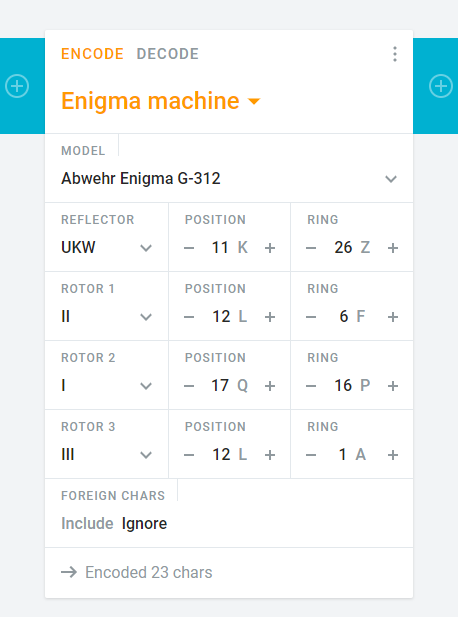

# Scheiße
**Category:** [Cryptography](../README.md)

**Points:** 10

**Description:**

A german messenger was caught during WW2

He was carrying a piece of paper that read: qbhbh zrmua gfbld ocqbv

He was nice enough to give us all we wanted, except the decoded message, he needs a special machine for that, and we don't have it.

He DID give us the settings for the machine.

The settings for this machine are:

Model: G-312

Reflector: UKW 11/26

Rotor 1: 2/12/6

Rotor 2: 1/17/16

Rotor 3: 3/12/1

The flag is ONE word, no spaces. do NOT translate the flag!

**This flag is not in the usual format, you can enter it with or without the brixelCTF{flag} format**

## Write-up
> TL;DR: The steps will describe the way we got to the answer for our own learning records. If you just want to know what the answer was, jump to the [solution](#solution)

### Steps
The fact that the description mentions German encryption during World War II, and requiring a 'special machine' to decode the message immediately suggested Enigma.

At first we started to look around to see what we could learn about how Enigma worked, but it soon became apparent that there was a lot to learn if we wanted to solve it ourselves, so we started to look for an emulator.

Early searches weren't promising as many emulators only implement limited versions (usually M3), and in most we couldn't see how to set the rotors and reflector given the above settings.

As we hadn't seen it mentioned anywhere, we bagan to wonder if the model was a real model, or something to use to work out the cipher, but checking [Wikipedia](https://en.wikipedia.org/wiki/Enigma_machine), in the [Models](https://en.wikipedia.org/wiki/Enigma_machine#Models) section we can see that there is a 'G' model, though the article suggests it has four rotors. In the [Surviving machines](https://en.wikipedia.org/wiki/Enigma_machine#Surviving_machines) section, there is also a bit about the G-312 machine, kept in the Bletchley Park museum, being stolen. So the above model definitely exists.

### Solution
After finding that the G-312 was a real model of Enigma machine, we finally found an emulator at [Cryptii](https://cryptii.com/pipes/enigma-machine).

To set this up, if Enigma isn't already selected, select it in the Encode/Decode section by selecting the orange down arrow next to the existing encoder type.

Select the model in the model section (Abwehr Enigma G-312), then it will show one reflector and three rotors. Use the information in the description to set the reflector (type UKW, position 11, ring 26) and the rotors (for example, the numbers for the first rotor mean select II (2) for rotor 1, with position 12 and ring 6). The image below shows the settings

Then copy the coded text above into the left-hand text box (you can leave the type as plaintext) and the flag appears in the right-hand text box (including the text 'der flag ist...').

> Note: The Enigma encryption/decryption is symmetric given the same rotor/reflector settings, so it doesn't matter whether you choose Encode or Decode, or Plaintext or Ciphertext in any of the settings.
