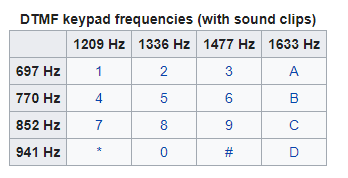
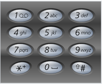

# Lost Evidence
**Category:** [Forensics](../README.md)

**Points:** 30

**Description:**

A buddy of mine is in serious trouble. He works for the feds and accidentally deleted a pendrive containing crucial evidence

Can you get it back and tell us what the evidence is?

We need to know what the suspect bought


The flag is in this format: brixelCTF{name_of_product_bought}

**Files:** evidence.zip

## Write-up
> TL;DR: The steps will describe the way we got to the answer for our own learning records. If you just want to know what the answer was, jump to the [solution](#solution)

### Steps
We downloaded the attached file and unzipped it. It contained a file named *evidence.img*, which we assume is a disk image of the original pendrive mentioned in the description.

We loaded the image into [Autopsy](https://www.sleuthkit.org/autopsy/) and looked for carved (recovered) files.

> Note: [Autopsy](https://www.sleuthkit.org/autopsy/) may be a little heavyweight for this task as we only needed to recover deleted file, not analyse the whole disk, so maybe [Disk Drill](https://www.cleverfiles.com/data-recovery-software.html) would have been more appropriate.

There were two recovered files on the disk named `f0000000.wav` and `f0016976.wav`. These were saved from [Autopsy](https://www.sleuthkit.org/autopsy/).

When we listened to the two files, they seemed to be the same, so we compared them at the command line:
```
> cmp f0000000.wav f0016976.wav
>
```
There was no difference between the files, so we concentrated on `f0000000.wav`.

Listening to the *wav*, the file contained a recorded phone banking session. Towards the end, the user (Mr. Dorfmeister) enters a message using the touch tones of the phone. This is probably what we need to decode to find the product bought.

We found some software for reading touch ([DTMF](https://en.wikipedia.org/wiki/Dual-tone_multi-frequency_signaling)) tones called [dtmf-decoder](https://github.com/ribt/dtmf-decoder). This converts the touch tone sounds from an audio file into the numbers pressed. Each press of the key creates two, simultaneous tones, which the software can interpret to work out which key is pressed. The table below shows the tones to determine each key:



Following the instructions on the GitHub page, we installed [dtmf-decoder](https://github.com/ribt/dtmf-decoder) and ran it against the *wav* file we had. It produced a string of of numbers:
```
> dtmf f0000000.wav
/usr/local/bin/dtmf:26: WavFileWarning: Chunk (non-data) not understood, skipping it.
  fps, data = wavfile.read(file)
21255555242400546669160D912533256698C500001*847499033366677740844360*302226662A222444663830227778844#AD2221213113123A22
```
Did the initial `WavFileWarning` suggest something else hidden in the file? Running `exiftool` over the file gave us:
```
> exiftool f0000000.wav
ExifTool Version Number         : 11.88
File Name                       : f0000000.wav
Directory                       : .
File Size                       : 8.3 MB
File Modification Date/Time     : 2020:12:27 23:46:43+00:00
File Access Date/Time           : 2020:12:27 23:46:43+00:00
File Inode Change Date/Time     : 2020:12:27 23:47:50+00:00
File Permissions                : rwxrwxrwx
File Type                       : WAV
File Type Extension             : wav
MIME Type                       : audio/x-wav
Encoding                        : Microsoft PCM
Num Channels                    : 1
Sample Rate                     : 44100
Avg Bytes Per Sec               : 88200
Bits Per Sample                 : 16
Title                           : Dorfmeister case phonetap
Artist                          : The Feds
Duration                        : 0:01:38
``` 
Nothing useful there, so we also tried `steghide`, but that returned nothing either, so we went back to interpreting the message inside the *wav* file. 

The initial output above was a long string of characters, so it was difficult to determine where the message starts and ends. It also include some letters (A and D) that don't seem to fit with the rest. We ran `dtmf` again, but this time with the `-v` switch which shows where, in relation to the rest of the sound, each button press occurred:
```
> dtmf -v f0000000.wav
/usr/local/bin/dtmf:26: WavFileWarning: Chunk (non-data) not understood, skipping it.
  fps, data = wavfile.read(file)
0:00 .........................
0:01 .........................
0:02 2222222222...1111111111.2
0:03 222222222........55555555
0:04 5........5555555555......
0:05 ..55.5555.5.....2..444444
0:06 444.....22222222....44444
0:07 4444....0000000000.......
0:08 .........................
0:09 .........................
0:10 .........................
0:11 .........................
0:12 ....0....................
0:13 .........................
0:14 .........................
0:15 .........................
0:16 .........................
0:17 .......5555555....4444444
0:18 ......666666.....666666..
0:19 ....666666......999999...
0:20 .........................
0:21 .........................
0:22 .........................
0:23 ......................111
0:24 111....66666...000000..D.
0:25 99999....................
0:26 .........................
0:27 .........................
0:28 .........................
0:29 .........................
0:30 .........................
0:31 .........................
0:32 .........................
0:33 .........................
0:34 .........................
0:35 .........................
0:36 .........................
0:37 ......................1..
0:38 ......................222
0:39 222......................
0:40 .........................
0:41 .........................
0:42 ........................5
0:43 5555555.......33333333...
0:44 ...33333333......22222222
0:45 5......6666666.......6666
0:46 6666................9....
0:47 8........................
0:48 .........................
0:49 .........................
0:50 .........................
0:51 ....C........5555555.....
0:52 00000000.....0000000.....
0:53 .0.00000.................
0:54 .........................
0:55 .........................
0:56 .........................
0:57 .........................
0:58 ....................11111
0:59 11.........*.............
1:00 .........................
1:01 .........................
1:02 .........................
1:03 .........................
1:04 .........................
1:05 .....88888...44447..4444.
1:06 ....9999...9999...00000..
1:07 .33333...3333....3333....
1:08 6666....6666....6666..777
1:09 77...77777....77774..0000
1:10 ...88888...4444....4444..
1:11 ..333360*33333...00000...
1:12 2222....2222....2222....6
1:13 666...6666....6666...2222
1:14 .A..22222...2222...22222.
1:15 ...4444...4444...4444....
1:16 .666....6666....3333.88.3
1:17 333...00000...2222....222
1:18 2...77777...7777....7777.
1:19 ...8888....8888...4444...
1:20 .4444.............#######
1:21 #.............A..........
1:22 .........................
1:23 .........................
1:24 .........................
1:25 .........................
1:26 .........................
1:27 .........................
1:28 .........................
1:29 ............D.....222222.
1:30 2........................
1:31 .........................
1:32 .........................
1:33 .........................
1:34 .......................2.
1:35 ..1213................1.1
1:36 .....3.1...............2.
1:37 ......3..................
1:38 .AA....2.2.
```
The repeating sequences with no dots in between are a single continuous tone sampled multiple times by the software. From the above we can see where the phone number was entered, the account number and pin were entered, where selections were made, and the transfer details. There is then a large block where the message is entered. From this we determined:
```
Phone number: 2125554240
Account number: 546669
4-digit pin: 1609
Pressed 2 for transfers
Account number to send money to: 533266
Amount sent: $5000
Pressed 1 to add personal message
Keys for message: 8449903336667770844330222666222244466330227778844
Break the message at 0 (space):
84499 333666777 84433 22266622224446633 227778844

Each press moves one letter further on the key pressed, so message reads:
thx for the cocaine bruh
```
We worked out the message by looking at an old [phone keypad](https://en.wikipedia.org/wiki/Telephone_keypad):



and checking what letter the number of presses on each key gave us (for example, *777* give us *r*).

### Solution
Running the supplied pendrive image through [Autopsy](https://www.sleuthkit.org/autopsy/) gave us 2 carved (recovered) files. These two files were identical, so we just used one of them (`f0000000.wav`).

Listening to the *wav* file, it was a recording of telephone banking transaction. This recording included telephone touchpad tones (or [DTMF](https://en.wikipedia.org/wiki/Dual-tone_multi-frequency_signaling) signals), part of which was a message. 

To interpret these tones, we used [dtmf-decoder](https://github.com/ribt/dtmf-decoder). This gave us a series of numbers corresponding to the text. By using the `-v` option, we could see which part of the call was the message. We could then convert the numbers entered as text using an old telephone keypad for reference and seeing how many times each key was pressed. The number of presses determined which of the letters on that numbered key were entered.

The final message gave us the word we needed to enter as the flag.
