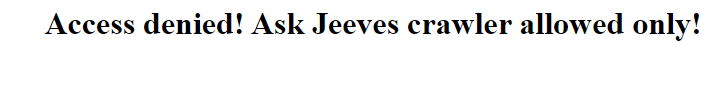

# Browser check
**Category:** [Internet](../README.md)

**Points:** 10

**Description:**

I found this weird website, but it will only allow 'ask jeeves crawler' to enter?

Can you get me in?

http://timesink.be/browsercheck/

## Write-up
When visiting the website above, you see:



We need to fool this webpage into thinking we're the [AskJeeves](https://www.ask.com/) spider bot. A quick [Google](https://www.google.com) search shows us that the AskJeeves bot identifies itself as `Mozilla/2.0 (compatible; Ask Jeeves/Teoma; +http://sp.ask.com/docs/about/tech_crawling.html)` (see [here](https://developers.whatismybrowser.com/useragents/parse/716287-ask-jeeves-crawler)).

We can use this information and `curl` to fool the website:
```
> curl --user-agent "Mozilla/2.0 (compatible; Ask Jeeves/Teoma; +http://sp.ask.com/docs/about/tech_crawling.html)" http://timesink.be/browsercheck/
<html><body><div align="center"><h1>congratulations</h1>the flag is '<flag was here>'</div></body></html>
```
This gave us the flag!
