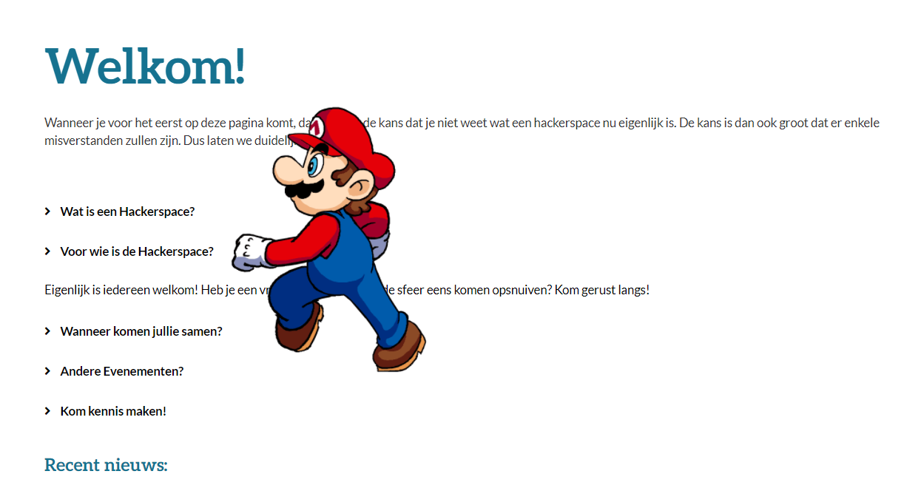

# Hidden Code
**Category:** [Internet](../README.md)

**Points:** 5

**Description:**
Something strange happens on the [brixel website](https://www.brixel.be/) when you enter the konami code

flag = the character you see floating by

**This flag is not in the usual format, you can enter it with or without the brixelCTF{flag} format**

## Write-up
We looked up the Konami code on [Google](https://www.google.com), and found it to be `Up, Up, Down, Down, Left, Right, Left, Right, B, A`.

We went to the above website, and using the arrow keys and a and b keys, entered the code. Then a character walked across the screen:

This gave us the flag.
