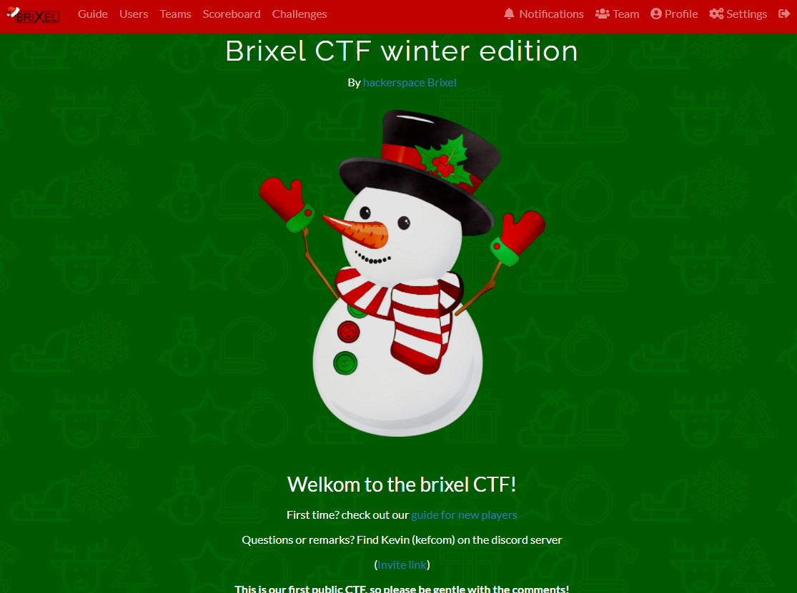
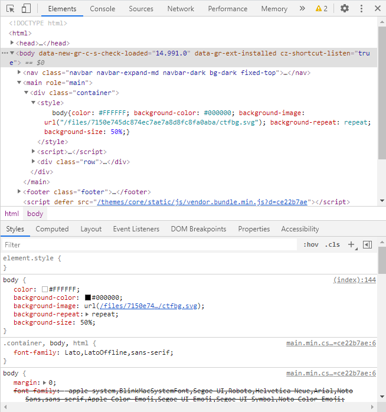

# Hiding In The Background
**Category:** [Internet](../README.md)

**Points:** 10

**Description:**

Like our CTF homepage?

There is a little secret hiding in (or rather behind) the background

## Write-up
Going to the Brixel CTF [homepage](https://ctf.brixel.space/) we can see text, a snowman and a green background image:



We right clicked on the background, and selected *Inspect...* to open the developer tools (this was in the [Brave](https://brave.com/) browser - the same tools as in any [Chromium](https://www.chromium.org/Home) based browser).

Here we scroll to find the inclusion of the background. This then shows that where we clicked, the background was inherited from body, so we clicked on the link to the body, and scrolled again to find the background:



Here we can change the styling and turn the background image off to see what's behind it. We can also change the background colour from black to white to see any hidden text.

Neither of these things showed anything on the webpage behind the image, so we download the background image to have a closer look at that.

The image was an SVG image, so we could load it into Inkscape and look at its components. However, before we did, we decided to search the SVG image text (SVG is simply an XML description of how to draw the image), and see if the flag was in there:
```
> grep "brixelCTF{" ctfbg.svg
         style="fill:#000000;fill-opacity:1;stroke-width:0.264583">brixelCTF{<flag was here>}</tspan></text>
```
Luckily, this gave us the flag!
