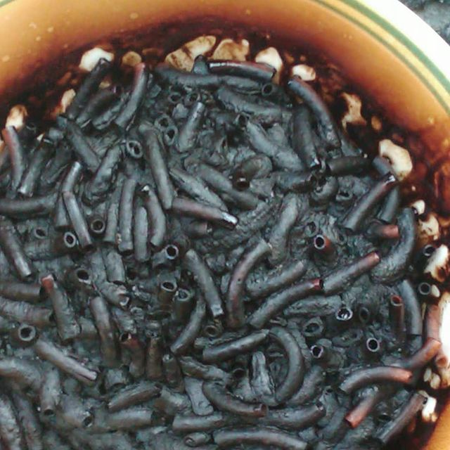

# Manhunt #3
**Category:** [OSINT](../README.md)

**Points:** 5

**Description:**

Ah, now you know his name, good. Can you tell me his favorite food?

**This flag is not in the usual format, you can enter it with or without the brixelCTF{flag} format**

This is part of a series, more challenges will be unlocked once you solve this one. While most challenges will be OSINT, some of them may not be.

## Write-up
After the previous two CTFs in the Manhunt series, we had the name Johnny Dorfmeister and his [LinkedIn](https://www.linkedin.com/in/johnny-dorfmeister-1135a6179/) and [Twitter](https://twitter.com/johnnydorfmeis1) accounts. Nothing in either of those gave us his favourite food.

We decided to search for other social media accounts, so searched his name on [Facebook](https://www.facebook.com/), but found nothing. However, searching his name on [Instagram](https://www.instagram.com/) gave us [this account](https://www.instagram.com/johnnydorfmeister/) containing a series of pictures .

Looking through the pictures, we found this one:

which has the description:
> People use this to post about their food, right? I tried to make my favorite food macaroni in the microwave today. It did not go so well, but i'll enjoy it nevertheless!

This gives us his favourite food to use as the flag.
