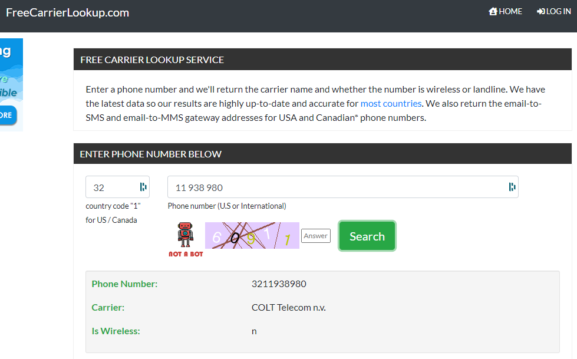

# Physical Pentest Setup
**Category:** [OSINT](../README.md)

**Points:** 10

**Description:**

So we're going to try to install a 'bug' at the local police office of the city of Halen (BE)

The plan is to disguise ourselves as technicians of their telecom provider, but who is that?

**❗ do NOT call them to get the information, you can find everything you need online! It's a criminal offence to bother them with nonsense like this and you could get in trouble for it. 📵**

**This flag is not in the usual format, you can enter it with or without the brixelCTF{flag} format**

**Replace all spaces with underscores (_) while entering the flag!**

## Write-up
We spent a lot of time on this trying to search for any story on Halen Police Station (or Limburg Regional Police) changing their telecom provider.

We went to [their website](https://www.politie.be/5907/) and downloaded various newletters and reports.

None of these got us anywhere, so we won't go into details about the searches.

We finally found it's possible to do a carrier search given a phone number. We got the phone number from the [Halen Police website](https://www.politie.be/5907/contact/commissariaten/wijkkantoor-halen) and did a search using [this website](https://freecarrierlookup.com/).

This gave us the answer we needed for the flag.