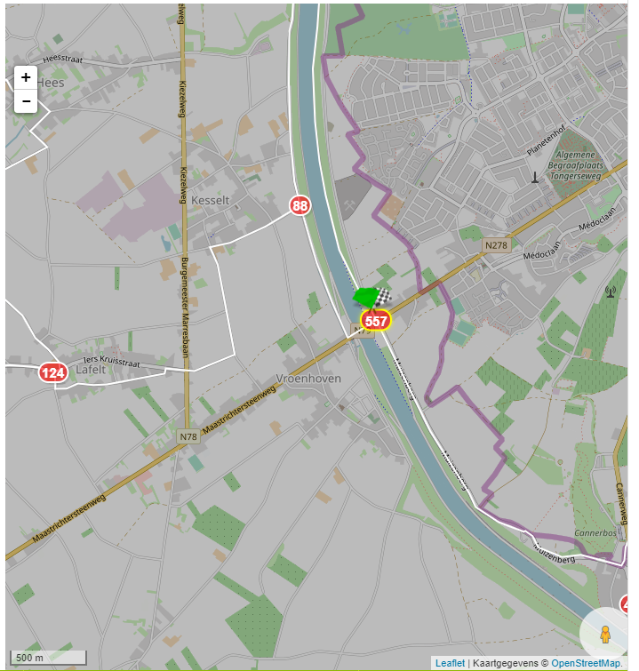
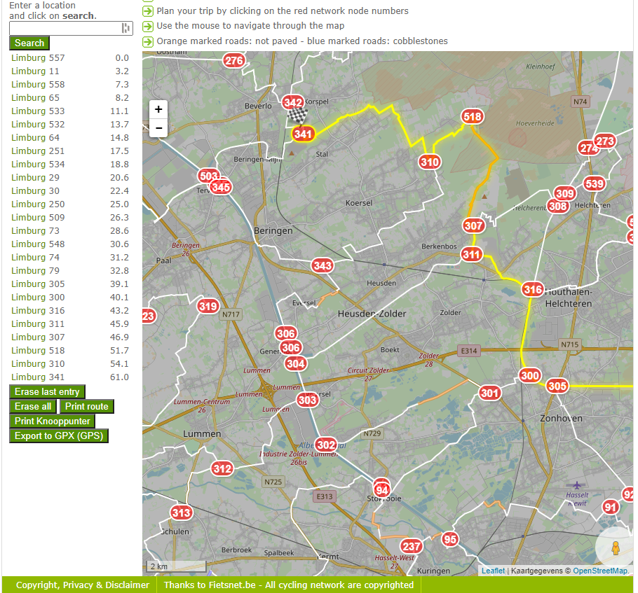

# Visit Limburg #1
**Category:** [OSINT](../README.md)

**Points:** 10

**Description:**

Welcome to Limburg! This beatiful province of Belgium offers so much to see and do!

Let's say you want to take a nice bike ride from one side to the other, but don't want to drive too much on roads where there are a lot of cars driving.

For this purpose we have a bike network! It tries to guide you as much as possible over smaller roads and bike paths where cars are not allowed to drive.

Let's start here: [Google maps link](https://www.google.com/maps/place/Maastrichtersteenweg+201,+3770+Riemst/@50.8333603,5.637255,15.25z/data=!4m5!3m4!1s0x47c0e88b020d50a5:0x81a9e3b139856acb!8m2!3d50.8316796!4d5.6442194) and end here: [Google maps link](https://www.google.com/maps/place/Steenstortstraat,+3581+Beringen/@51.078121,5.2380936,16.5z/data=!4m5!3m4!1s0x47c13016b7f3699f:0xcf71d3a220658e79!8m2!3d51.0784705!4d5.2415842).

The flag is the sum of all the nodes you pass on your trip (including the start and end nodes!)

Happy cycling!

**This flag is not in the usual format, you can enter it with or without the brixelCTF{flag} format**

## Write-up
Clicking on the links above takes us to places on [Google Maps](https://www.google.co.uk/maps). We tried planning a route on [Google Maps](https://www.google.com/maps/dir/Maastrichtersteenweg+201,+3770+Riemst,+Belgium/Steenstortstraat,+3581+Beringen,+Belgium/@50.9644144,5.2962569,14z/data=!4m14!4m13!1m5!1m1!1s0x47c0e88b020d50a5:0x81a9e3b139856acb!2m2!1d5.6442194!2d50.8316796!1m5!1m1!1s0x47c130127423d8f1:0xb39bf96634d90017!2m2!1d5.2370231!2d51.0771019!3e1) using these locations, and the cycling setting, but it didn't really show us any 'nodes' mentioned in the description.

To try an find an alternative, we searched *belgium cycle path nodes* in [Google](https://www.google.com/) and the first result was [fietsroute.org](https://www.fietsroute.org/Cycle-Networks.php). On that site was a [Cycle Node Planner](https://www.fietsroute.org/cycle-node-planner)

Referencing the locations we found on [Google Maps](https://www.google.co.uk/maps), we zoomed into the map on the planner and found the node we thought was nearest to the start location (node 557) and clicked on it to start our planning there:

We did the same with the end node (node 341) and this shows a list of all nodes passed through on that route:

Now we can simply add up all these nodes, and we find the flag!

