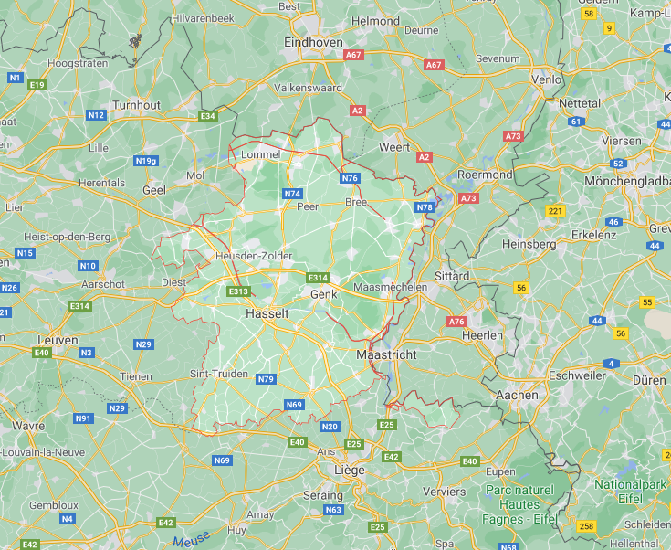
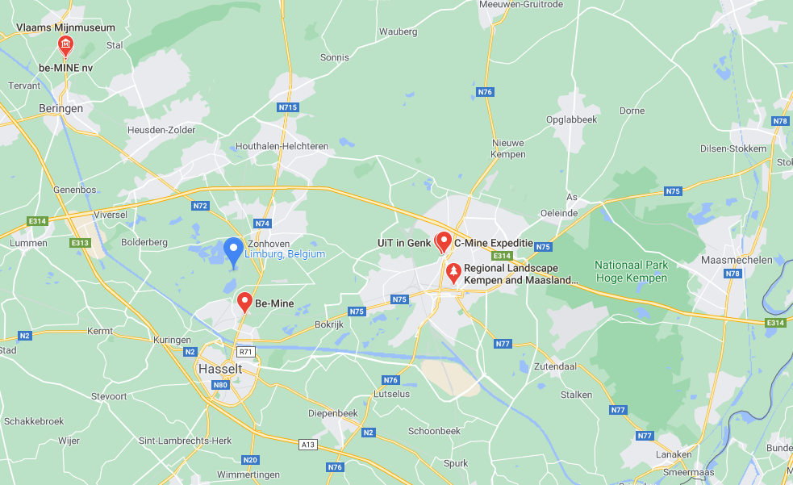
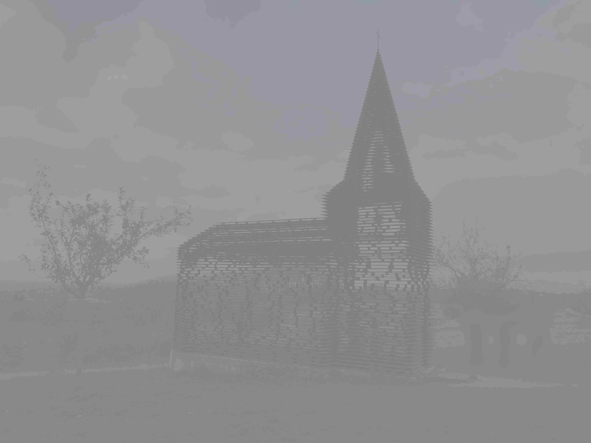
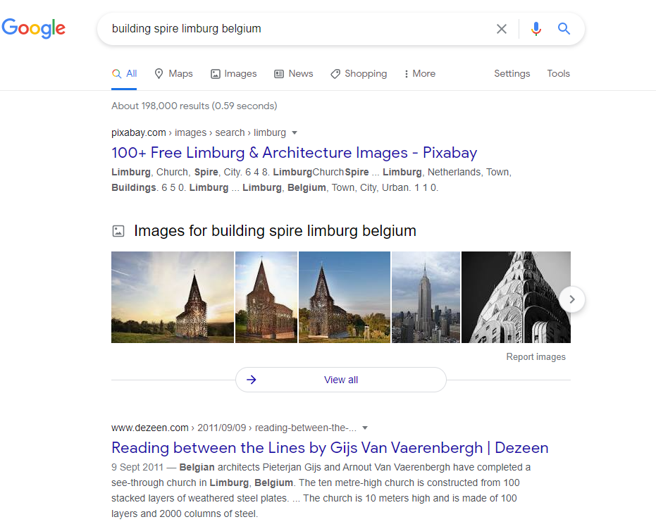
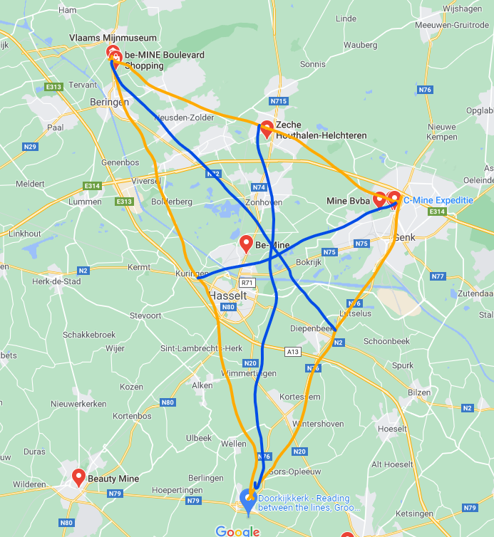
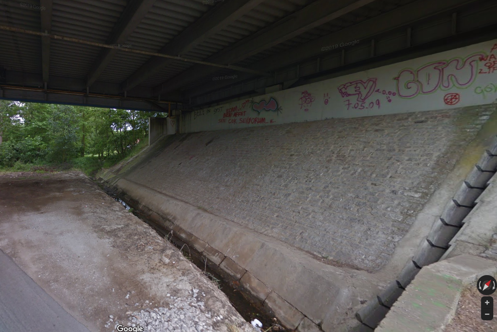

# Visit Limburg #2
**Category:** [OSINT](../README.md)

**Points:** 20

**Description:**

I'm supposed to meet up with my buddy who supplies me with Twilight cd's but he's very cryptic about the meeting location.

He told me he will meet under a bridge that sits in the middle of a triangle of 3 locations.

The first two locations are the two mineshafts of the coalmines in the province that are the furthest appart from each other.

The third location is where the provided (hazy) picture was taken

Please provide the date that was written under the bridge (format #.##.## where # is a digit) in 2013

**This flag is not in the usual format, you can enter it with or without the brixelCTF{flag} format**

**Files:** image.png

## Write-up
We need to find these locations to create a triangle and find the centre. First we searched for *Limburg Belgium* in [Google maps](https://www.google.com/maps/place/Limburg,+Belgium/@50.9964996,4.8852586,9z/data=!3m1!4b1!4m5!3m4!1s0x47c093293d669c7d:0x361339c2cc01dc8b!8m2!3d50.9738973!4d5.3419677). This showed an outline around Limburg:

We then clicked the *Nearby* button, and searched for *mines*. This added some points on the map:

The furthest apart mines gave us *C-Mine Expeditie* (we discounted *Regional Landscape Kempen and Maasland...* as it wasn't obviously a mine) and *Vlaams Mijnmuseum* (or *be-MINE nv*).

For the third point of the triangle, we were given this image:

At first I did a reverse image search, but this just brought up lots of buildings pictured in the mist.

I tried an image search for *building spire limburg belgium*, and the results were:

It we look at the image we were given, we can see that the building was see-through, so it seems the image results seem to be the building we want. This building is called 'Reading between the lines', so we searched that in maps, and it is near Borgloon.

We drew a triangle between the mines and the 'Reading between the lines' building, and added the perpendiculars to define the centre (sorry about the bad artistry!):

Zooming in to the rough centre of the triangle, we can see a couple of bridges over the river. We went onto Street View, and looked under the bridges in turn, taking Street View back to 2013. When we were under the bridge labelled *tuikabelbrug Godsheide*. When under this bridge in Street View with 2013 selected, you can see the date:

This can be used for the flag.
