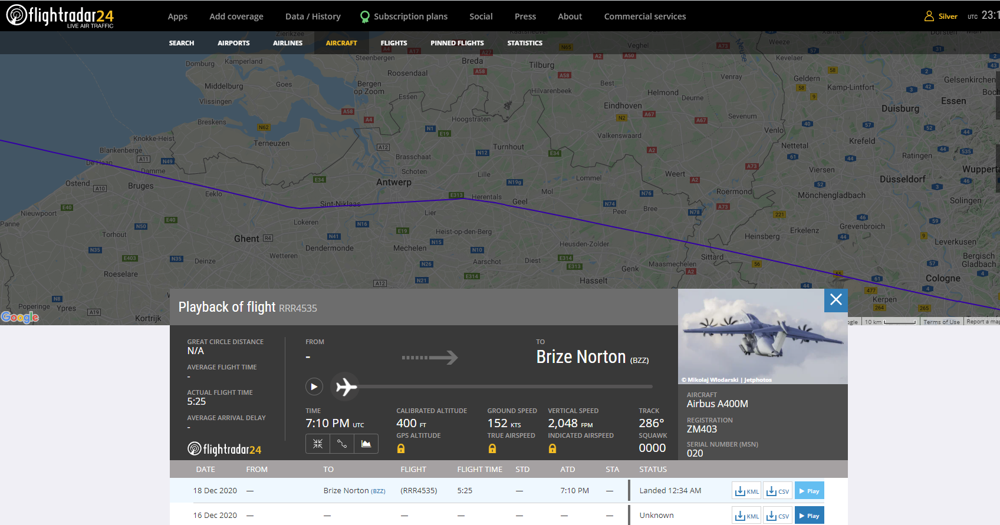

# Visit Limburg #3
**Category:** [OSINT](../README.md)

**Points:** 25

**Description:**

While hiking on the BE-MINE hill on 18 December 2020 I noticed a big cargo plane with 4 props flying over, it looked like it had military markings.

I tried to find out what plane it was but failed. Can you help me out? I bet it came from one of the military airbases nearby.

I need the registration number, model, and month & year of registration.

Syntax: brixelCTF{registrationnumber+model+month(MM)+year(YY)}

## Write-up
With this one we started looking at historic flight data on [Flight Radar 24](https://www.flightradar24.com/), watching for flights that flew over the Be-MINE hill. Most were commercial flights, but they also included an RAF military transport craft:

We spent a little time investigating this aircraft, but in the end discounted it because, looking at the path, it didn't seem to come from an airport nearby to Be-MINE. Also, it flew over just before midnight, and the description says "While hiking...",  which sounds more like a daytime thing.

Next we looked for what cargo planes the Belgian military had. The main aircraft seemed to be the [Lockheed C-130 Hercules](https://en.wikipedia.org/wiki/Lockheed_C-130_Hercules). We found [this website](http://belmilac.wikifoundry.com/page/Lockheed+C-130H+Hercules) that listed those aircraft with their registration numbers.

We searched for any details of each of those aircraft in turn and ended up finding [this site](https://www.jetphotos.com/photo/keyword/ch-09) while searching for registration number CH-09. It shows photos from a flight of CH-09 on the 18th December 2020. It seems this could be the aircraft we want, but we still don't have the registration date.

Searching Google for *CH-09 c130 registration details*, the second entry in the list was [this record of the flight](https://www.radarbox.com/data/registration/CH-09) of CH-09 on the 18th December. It flew in the right area, so confirms we're on the right track, but we still don't have the registration date.

Going back and looking at a couple of other sites that resulted from our previous search, we found [this news story](https://ivanconinx.be/2020/12/18/belgian-air-force-retires-ch-09-one-of-its-remaining-lockheed-c-130h-hercules-transport-aircraft/), talking about the flight, and stating that it was delivered in February 1973. We guessed this could be the registration date. Luckily, we were right!

Putting all the details together as described in the description gave us the flag!
