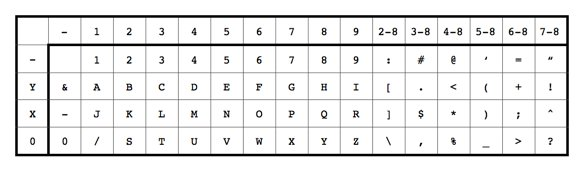

# Punchcard
**Category:** [Old Tech](../README.md)

**Points:** 10

**Description:**

I found this old punchcard

it seems to be classified

can you figure out what's on there?

**Files:** punchcard.png

## Write-up
The attached image was a punchcard:

Looking online to find out how a punchcard is interpreted, we found this [site](https://craftofcoding.wordpress.com/2017/01/28/read-your-own-punch-cards/) that explains how the positions of the holes for each column can be turned into letters, numbers and other characters. It contained this helpful image:

What this table shows is that if the top row in the blank area at the top of the card is punched, look along the Y row in the table. For example, holes on the punchcard in the Y position and over the number 1 would indicate 'A'.

If the second row in the blank area is punched, look along the X row in the table. For example, if there are holes in the X position and the number 8, this would indicate 'Q'.

If the 0 is punched over, then read along the 0 row in the table. If 0 is punched and the number 5 is also punched, then it's a 'V'.

The row indicated by '-' means that none of Y, X or 0 are punched. So if none of those are punched and 6 is punched, it indicates the number 6.

The column indicated by '-' means that no numbers (above 0) are punched. So only the Y position punched indicates '&', and a column with no holes at all indicates a space.

Using this knowledge, we worked our way through the punchcard. For example, the first column indicates 'T' (0 and 3), the second column indicated 'H' (Y and 8), the third column indicates 'E' (Y and 5) and the fourth is a space.

After converting the first few columns, we had the flag.

> Note: We found out afterwards that there are websites to convert a punchard automatically, but where's the fun in that? We learned how to read a punchcard!
