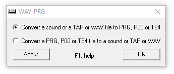
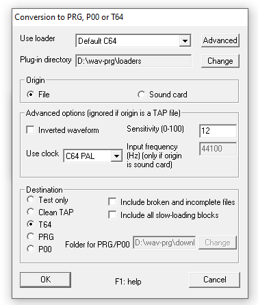
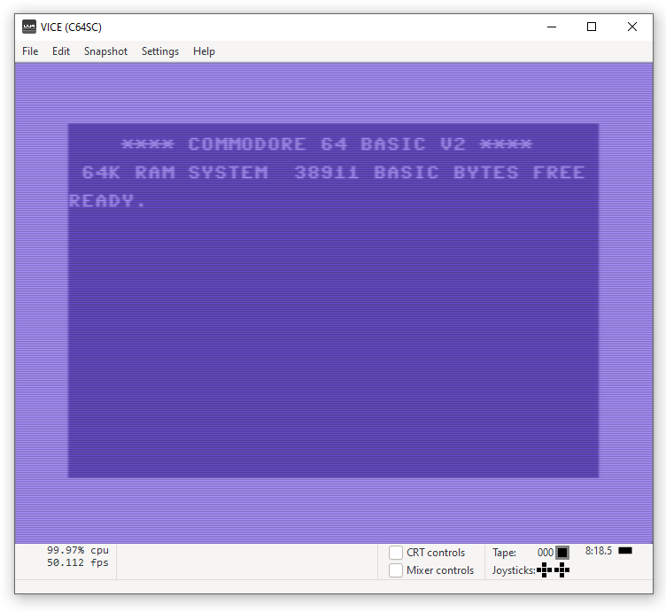

# The Tape
**Category:** [Old Tech](../README.md)

**Points:** 20

**Description:**

I found this cassette tape from the '80s. I bet it has some cool games on it or something.

Better start looking for someone who grew up in that era... :)

**This flag is not in the usual format, you can enter it with or without the brixelCTF{flag} format**

**Files:** CTF-TAPe.wav

## Write-up
The clues for this are in the description. A cassette tape from the 80's with cool games on. This suggests a computer tape containing code. The fact that the file to download emphasises the the *TAP* of *TAPe* suggests this is a *TAP* file, used to hold Commodore C64 or ZX Spectrum data.

A quick listen to the file and comapring it against the sounds of C64 and Spectrum tapes, points to this being a C64 tape. This means we need a C64 emulator and a way to convert a *wav* file to something the emulator can read so we can test it.

On searching for a program to convert *wav* files to C64 file, we found [WAV-PRG and Audiotap](http://wav-prg.sourceforge.net/). From there we downloaded both [WAV-PRG](http://wav-prg.sourceforge.net/wavprg.html) to do the conversion, and [Audiotap](http://wav-prg.sourceforge.net/audiotap.html) to add the support for *wav* files.

When running WAV-PRG, we see the opening screen:

We want to convert our *wav* file to *T64*, which is loadable by the emulator, so we leave the first option selected and pick *OK*. The conversion dialog then pops up:

We selected *T64* as the destination, left the origin as *File*, and left everything else as the defaults. Clicking *OK* lets us select the *wav* file that was download from the challenge. It then converts the file and lets us choose where to save the *T64* file. We then clode WAV-PRG.

The emulator we downloaded was [Vice](https://vice-emu.sourceforge.io/). We unzipped this, then went to the *bin* directory and ran the *x64sc.exe* program:

From this we pick *File | Attach a tape image* which allows us to browse to our newly converted *t64* file. Once selected, we then click *Autostart*, and the file is loaded and run.

The flag was displayed by the running program.
