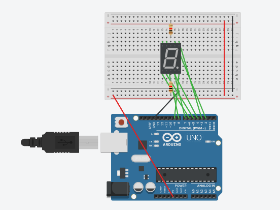

# An Arduino Project
**Category:** [Programming](../README.md)

**Points:** 15

**Description:**

I once made this arduino program but forgot what it does.

Unfortunately I lost the schematic that comes with it.

Maybe you can get it running?

This flag is not in the usual format, you can enter it with or without the brixelCTF{flag} format

**Files:** arduino_project.ino

## Write-up
The downloaded *ino* file contained the code:
```cpp
int msg[] = {9,0,9,0,9,0,9,0,7,8,3,4,0,7,6,5,4,3,2,0,7,8,6,5,4,2,0,2,3,4,0,7,2,3,8,4,5,0,2,3,4,5,6,7,8,0,7,6,0,7,2,3,8,4,5,0,2,3,4,5,6,7,0,2,3,8,4,5,0,2,3,8,4,5,0,2,3,8,6,5,0};

void setup()
{
  pinMode(2, OUTPUT); //A
  pinMode(3, OUTPUT); //B
  pinMode(4, OUTPUT); //C
  pinMode(5, OUTPUT); //D
  pinMode(6, OUTPUT); //E
  pinMode(7, OUTPUT); //F
  pinMode(8, OUTPUT); //G
  pinMode(9, OUTPUT); //DP
  //COMMON = 5V with 1K resistor
}

void loop()
{
  for (byte i = 0; i < (sizeof(msg)/ sizeof(msg[0])); i++) {
    if(msg[i] > 0) {
      digitalWrite(msg[i],LOW);
        }else{
            delay(500);
            reset();
    }
    }
}

void reset()
{
  for(int p = 2; p < 10;p++)
  {
    digitalWrite(p,HIGH);   
  }
  delay(500);
}
```
Looking at the `setup()` function, it looks like it refers to a seven-segment display (the letters A though G and the DP are the usual pin setups for 7-segment displays). The line `//COMMON = 5V with 1K resistor` shows that the 7-segment display is *common anode*. This means that a segment is lit if its pin is `LOW`.

We wrote some code to emulate the seven segement display:
```cpp
#include <iostream>
#include <vector>

// Segments will be:
// =====
// |   |
// =====
// |   |
// ===== *
void setSegment(unsigned int val, std::vector<std::vector<unsigned char>> &segment, bool &dp)
{
  switch (val)
  {
    case 0:
      segment.clear();
      for (unsigned int i=0; i<5; ++i)
      {
        std::vector<unsigned char> v = {' ', ' ', ' ', ' ', ' '};
        segment.push_back(v);
      }
      dp = false;
      break;
    case 2:
      segment[0][0] = '=';
      segment[0][1] = '=';
      segment[0][2] = '=';
      segment[0][3] = '=';
      segment[0][4] = '=';
      break;
    case 3:
      segment[1][4] = '|';
      break;
    case 4:
      segment[3][4] = '|';
      break;
    case 5:
      segment[4][0] = '=';
      segment[4][1] = '=';
      segment[4][2] = '=';
      segment[4][3] = '=';
      segment[4][4] = '=';
      break;
    case 6:
      segment[3][0] = '|';
      break;
    case 7:
      segment[1][0] = '|';
      break;
    case 8:
      segment[2][0] = '=';
      segment[2][1] = '=';
      segment[2][2] = '=';
      segment[2][3] = '=';
      segment[2][4] = '=';
      break;
    case 9:
      dp = true;
      break;
    default:
      std::cout << "Invalid value: " << val << " skipped\n";
  }
}

void displaySegment(const std::vector<std::vector<unsigned char>> &segment, bool dp)
{
  for (std::size_t i = 0; i<segment.size(); i++)
  {
    std::vector<unsigned char> v = segment[i];
    std::cout << "  ";
    for (std::size_t j = 0; j<v.size(); j++)
    {
      std::cout << v[j];
    }
    if (i==4 && dp) std::cout << " *";
    std::cout << "\n";
  }
}

int main()
{
  const int msg[] = {9,0,                      // .
                              9,0,             // .
                              9,0,             // .
                              9,0,             // .
                              7,8,3,4,0,       // FGBC     4
                              7,6,5,4,3,2,0,   // FEDCBA   0
                              7,8,6,5,4,2,0,   // FGEDCA   6
                              2,3,4,0,         // ABC      7
                              7,2,3,8,4,5,0,   // FABGCD   9
                              2,3,4,5,6,7,8,0, // ABCDEFG  8
                              7,6,0,           // FE       1
                              7,2,3,8,4,5,0,   // FABGCD   9
                              2,3,4,5,6,7,0,   // ABCDEF   0
                              2,3,8,4,5,0,     // ABGCD    3
                              2,3,8,4,5,0,     // ABGCD    3
                              2,3,8,6,5,0};    // ABGED    2

  std::vector<std::vector<unsigned char>> segment;
  bool dp = false;

  setSegment(0, segment, dp);
  displaySegment(segment, dp);
  for (unsigned int i = 0; i < (sizeof(msg)/sizeof(msg[0])); i++)
  {
    unsigned int val = msg[i];
    if (val == 0)
    {
      displaySegment(segment, dp);
    }
    setSegment(val, segment, dp);
  }
  return 0;
}
```
When run, the code outputs what would be shown on a 7-segment display:
```


        *


        *


        *


        *

  |   |
  =====
      |

  =====
  |   |

  |   |
  =====
  =====
  |
  =====
  |   |
  =====
  =====
      |

      |

  =====
  |   |
  =====
      |
  =====
  =====
  |   |
  =====
  |   |
  =====

  |

  |

  =====
  |   |
  =====
      |
  =====
  =====
  |   |

  |   |
  =====
  =====
      |
  =====
      |
  =====
  =====
      |
  =====
      |
  =====
  =====
      |
  =====
  |
  =====
```
This gave us `....406798190332` but entering this as the flag failed. We double checked the code (hence the comments next to the `msg` array entries), but we came up with the same results.

To see if we made a mistake, we decided to actually build the circuit and run the provided code. We did this in [Tinkercad](https://www.tinkercad.com/):



You can see this circuit and run the simulation [here](https://www.tinkercad.com/things/9bh5oHXIx33).

Building the circuit and running it made it more obvious that the four dots at the beginning were just there to separate the endless loop of numbers displayed, so you knew where the sequence started.

This means our original C++ code was actually correct, and the flag was the result without the four decimal points at the beginning.
