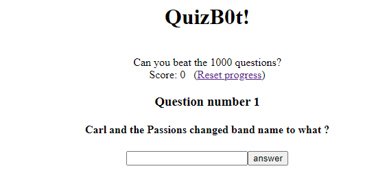
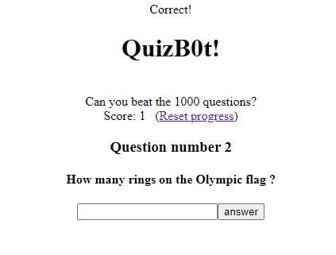
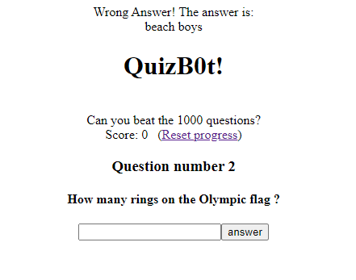

# Quizbot
**Category:** [Programming](../README.md)

**Points:** 30

**Description:**
Legend has it there's a flag at the end when you have a perfect score

http://timesink.be/quizbot

## Write-up
> TL;DR: The steps will describe the way we got to the answer for our own learning records. If you just want to know what the answer was, jump to the [solution](#solution)

### Steps
When you follow the link above, you get a page asking you to answer a question:



Entering an answer give you this page if it's correct:



Or this page if it's incorrect:



From the incorrect answer, we can see it tells you the correct answer, and still moves to the next questions. This means we can try to scrape the answers from the page, and then go through a second time and post the correct answers in the form.

Let's see what `curl` give us:
```
$ curl http://timesink.be/quizbot/
<div align="center"><h1>QuizB0t!</h1><br>Can you beat the 1000 questions?<br>Score: 0&nbsp;&nbsp;&nbsp;(<a href="index.php?resetscore">Reset progress</a>)<br></div>
<div align="center">
<h3>Question number 1</h3>
<h4>Carl and the Passions changed band name to what ?</h4>
<form method="POST" action="index.php"><input type="text" name="insert_answer" id="insert_answer"><input type="submit" name="submit" value="answer"></form>
</div>
```

That gives us the page. We can see the value that needs to be set as the answer is *insert_answer*, so let's answer the first question:
```
$ curl --data "insert_answer=beach%20boys" http://timesink.be/quizbot/
<div align="center">Correct!</div>
<div align="center"><h1>QuizB0t!</h1><br>Can you beat the 1000 questions?<br>Score: 1&nbsp;&nbsp;&nbsp;(<a href="index.php?resetscore">Reset progress</a>)<br></div>
<div align="center">
<h3>Question number 2</h3>
<h4>How many rings on the Olympic flag ?</h4>
<form method="POST" action="index.php"><input type="text" name="insert_answer" id="insert_answer"><input type="submit" name="submit" value="answer"></form>
</div>
```
Great! That give us the 'Correct' page. Now let's answer the second question:
```
$ curl --data "insert_answer=five" http://timesink.be/quizbot/
<div align="center">Wrong Answer! The answer is: </div><div id="answer" align="center">beach boys</div>
<div align="center"><h1>QuizB0t!</h1><br>Can you beat the 1000 questions?<br>Score: 0&nbsp;&nbsp;&nbsp;(<a href="index.php?resetscore">Reset progress</a>)<br></div>
<div align="center">
<h3>Question number 2</h3>
<h4>How many rings on the Olympic flag ?</h4>
<form method="POST" action="index.php"><input type="text" name="insert_answer" id="insert_answer"><input type="submit" name="submit" value="answer"></form>
</div>
```
Now we see the 'Wrong answer' page, and can see the correct answer is shown in a *div* with the id of *answer*. This also means it assumes it's always the first question - there must be a cookie. Let's view the headers:
```
$ curl -v http://timesink.be/quizbot/
*   Trying 52.166.178.208:80...
* TCP_NODELAY set
* Connected to timesink.be (52.166.178.208) port 80 (#0)
> GET /quizbot/ HTTP/1.1
> Host: timesink.be
> User-Agent: curl/7.68.0
> Accept: */*
>
* Mark bundle as not supporting multiuse
< HTTP/1.1 200 OK
< Cache-Control: no-store, no-cache, must-revalidate
< Pragma: no-cache
< Content-Length: 435
< Content-Type: text/html; charset=UTF-8
< Expires: Thu, 19 Nov 1981 08:52:00 GMT
< Vary: Accept-Encoding
< Server: Apache
< Set-Cookie: PHPSESSID=292b4f5df6dd605b2e650c1c724a9fac; path=/
< X-Powered-By: PHP/7.4.9
< Date: Thu, 31 Dec 2020 12:58:38 GMT
<
<div align="center"><h1>QuizB0t!</h1><br>Can you beat the 1000 questions?<br>Score: 0&nbsp;&nbsp;&nbsp;(<a href="index.php?resetscore">Reset progress</a>)<br></div>
<div align="center">
<h3>Question number 1</h3>
<h4>Carl and the Passions changed band name to what ?</h4>
<form method="POST" action="index.php"><input type="text" name="insert_answer" id="insert_answer"><input type="submit" name="submit" value="answer"></form>
</div>
* Connection #0 to host timesink.be left intact
```

Yes. There's a PHP session cookie. Let's save that and try to answer two questions:
```
$ curl -c cookie-jar.txt http://timesink.be/quizbot/
<div align="center"><h1>QuizB0t!</h1><br>Can you beat the 1000 questions?<br>Score: 0&nbsp;&nbsp;&nbsp;(<a href="index.php?resetscore">Reset progress</a>)<br></div>
<div align="center">
<h3>Question number 1</h3>
<h4>Carl and the Passions changed band name to what ?</h4>
<form method="POST" action="index.php"><input type="text" name="insert_answer" id="insert_answer"><input type="submit" name="submit" value="answer"></form>
</div>

$ curl -b cookie-jar.txt --data "insert_answer=beach%20boys" http://timesink.be/quizbot/
<div align="center">Correct!</div>
<div align="center"><h1>QuizB0t!</h1><br>Can you beat the 1000 questions?<br>Score: 1&nbsp;&nbsp;&nbsp;(<a href="index.php?resetscore">Reset progress</a>)<br></div>
<div align="center">
<h3>Question number 2</h3>
<h4>How many rings on the Olympic flag ?</h4>
<form method="POST" action="index.php"><input type="text" name="insert_answer" id="insert_answer"><input type="submit" name="submit" value="answer"></form>
</div>

$ curl -b cookie-jar.txt --data "insert_answer=five" http://timesink.be/quizbot/
<div align="center">Correct!</div>
<div align="center"><h1>QuizB0t!</h1><br>Can you beat the 1000 questions?<br>Score: 2&nbsp;&nbsp;&nbsp;(<a href="index.php?resetscore">Reset progress</a>)<br></div>
<div align="center">
<h3>Question number 3</h3>
<h4>What colour is vermilion a shade of ?</h4>
<form method="POST" action="index.php"><input type="text" name="insert_answer" id="insert_answer"><input type="submit" name="submit" value="answer"></form>
</div>
```
Great! Now we can write a script to test we can get the initial value, then answer the second wrong (with blank) and strip out the correct answer. This will show we have all the components to get the answers. The script do do this is:
```bash
#!/usr/bin/bash

URL=http://timesink.be/quizbot/
cjar=cookie-jar.txt

# Make sure we have the session cookie we need
curl -c $cjar $URL 2>&1

# Answer the first question correctly
curl -b $cjar --data "insert_answer=beach%20boys" $URL

# Answer the second question incorrectly (with a blank)
page=$(curl -s -b $cjar --data "insert_answer=" $URL)
echo $page

# Strip out the correct answer and also replace any spaces with %20
ans=$(echo $page| grep 'id="answer"' | cut -d '>' -f 4 | sed 's/<\/div//' | sed 's/ /%20/g')

echo Answer: $ans
```

This script gives us:
```
./get_flag.sh
<div align="center"><h1>QuizB0t!</h1><br>Can you beat the 1000 questions?<br>Score: 0&nbsp;&nbsp;&nbsp;(<a href="index.php?resetscore">Reset progress</a>)<br></div>
<div align="center">
<h3>Question number 1</h3>
<h4>Carl and the Passions changed band name to what ?</h4>
<form method="POST" action="index.php"><input type="text" name="insert_answer" id="insert_answer"><input type="submit" name="submit" value="answer"></form>
</div>
<div align="center">Correct!</div>
<div align="center"><h1>QuizB0t!</h1><br>Can you beat the 1000 questions?<br>Score: 1&nbsp;&nbsp;&nbsp;(<a href="index.php?resetscore">Reset progress</a>)<br></div>
<div align="center">
<h3>Question number 2</h3>
<h4>How many rings on the Olympic flag ?</h4>
<form method="POST" action="index.php"><input type="text" name="insert_answer" id="insert_answer"><input type="submit" name="submit" value="answer"></form>
</div>
<div align="center">Wrong Answer! The answer is: </div><div id="answer" align="center">five</div> <div align="center"><h1>QuizB0t!</h1><br>Can you beat the 1000 questions?<br>Score: 1&nbsp;&nbsp;&nbsp;(<a href="index.php?resetscore">Reset progress</a>)<br></div> <div align="center"> <h3>Question number 3</h3> <h4>What colour is vermilion a shade of ?</h4> <form method="POST" action="index.php"><input type="text" name="insert_answer" id="insert_answer"><input type="submit" name="submit" value="answer"></form> </div>
Answer: five
```
Now that all that seems to work, we want to save the page output in a file (so we can make sure we see any differences and capture the last page) as well as the answers and run it for 1000 questions:
```bash
#!/usr/bin/bash

URL=http://timesink.be/quizbot/
cjar=cookie-jar.txt

# Make sure we have the session cookie we need
curl -s -c $cjar $URL > output.txt

for i in {1..1000}
do
  page=$(curl -s -b $cjar --data "insert_answer=" $URL)
  echo $page >> output.txt
  # Strip out the correct answer and also replace any spaces with %20
  ans=$(echo $page | grep 'id="answer"' | cut -d '>' -f 4 | sed 's/<\/div//' | sed 's/ /%20/g')
  echo $ans >> answers.txt
  echo Done $i
done
```
After running this, the last line in the *answers.txt* file contained:
```
<div align="center">Wrong Answer! The answer is: </div><div id="answer" align="center">el greco</div> You failed to defeat the mighty QuizB0t, you can try again by refreshing the page.<br>better luck next time.
```
So we definitely got to the end and got all the answers. Now let's add the code to read them back, put them in as the answer to each question and we should be done.

### Solution
After completing the tests above we were ready to write a script to solve this. The script will run through the 1000 questions, scrape the answers from each 'incorrect' page, then restart and answer the questions correctly. The final script is:
```bash
#!/usr/bin/bash

URL=http://timesink.be/quizbot/
cjar=cookie-jar.txt

# Make sure we have the session cookie we need
curl -s -c $cjar $URL > output.txt

for i in {1..1000}
do
  page=$(curl -s -b $cjar --data "insert_answer=" $URL)
  echo $page >> output.txt
  # Strip out the correct answer and also replace any spaces with %20 and
  # apostrophe with %27
  ans=$(echo $page | grep 'id="answer"' | cut -d '>' -f 4 | sed 's/<\/div//' | sed 's/ /%20/g' | sed "s/'/%27/g")
  echo $ans >> answers.txt
  echo Got answer $i: $ans
done

# Read the answers file back in, and answer every question correctly!
# Restart by getting a new cookie
curl -s -c $cjar $URL >> output.txt
while read ans
do
  echo Trying $ans
  page=$(curl -s -b $cjar --data "insert_answer=$ans" $URL)
  echo $page >> output.txt
done < answers.txt
```
Apart from having to run it a few times because of server glitches, the above script worked and the final line in the output file gave us the flag!
