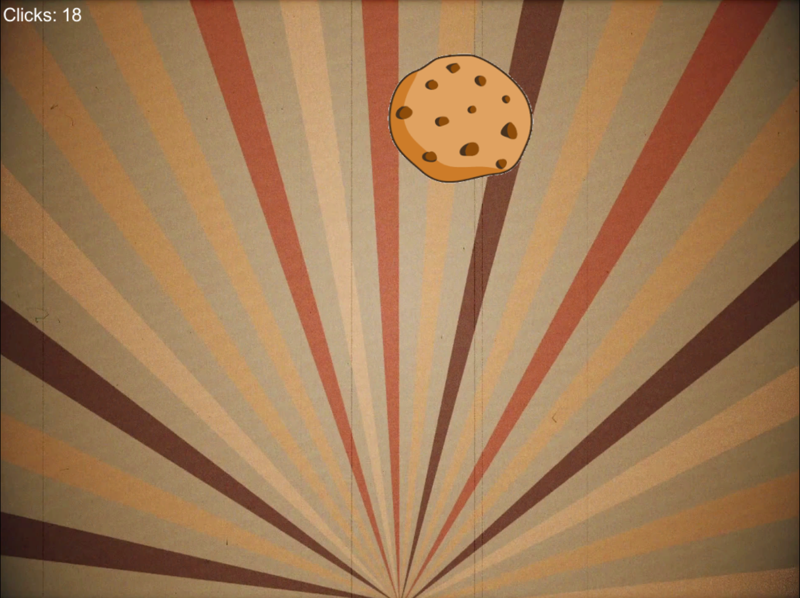
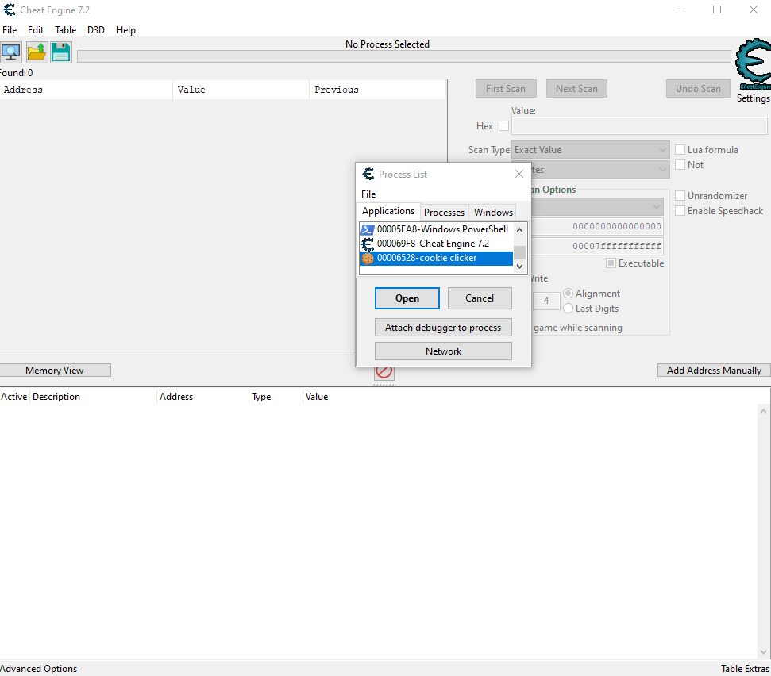
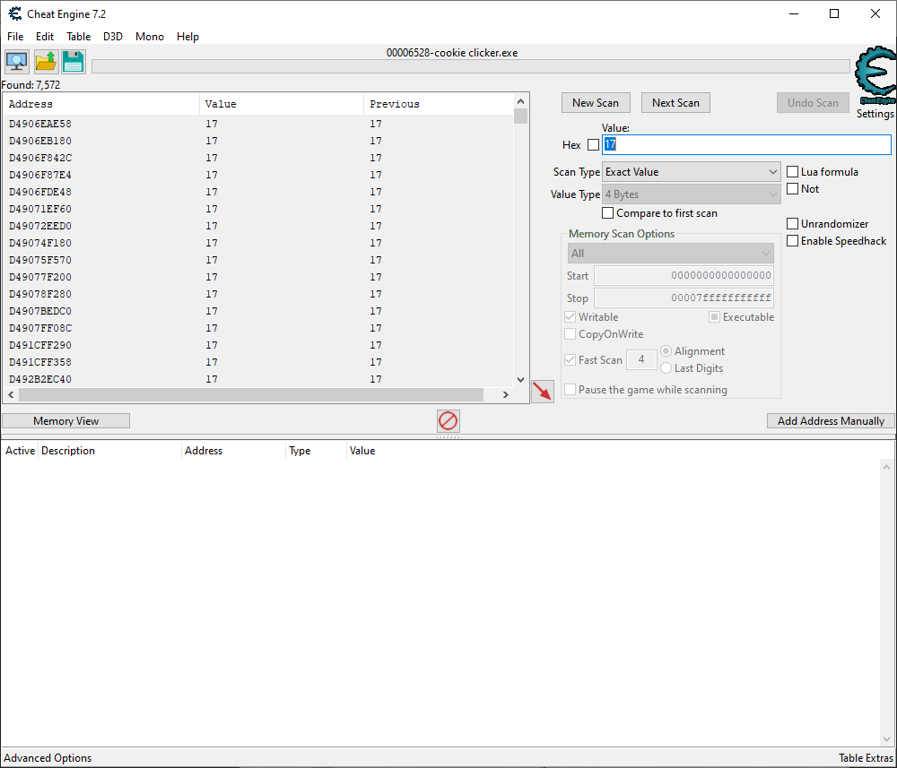
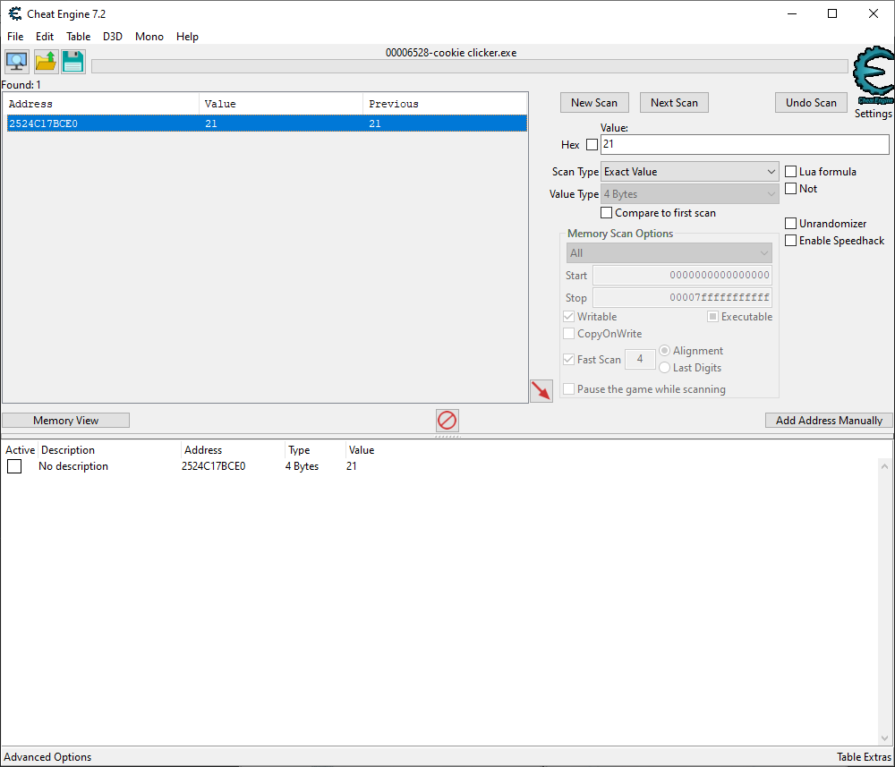
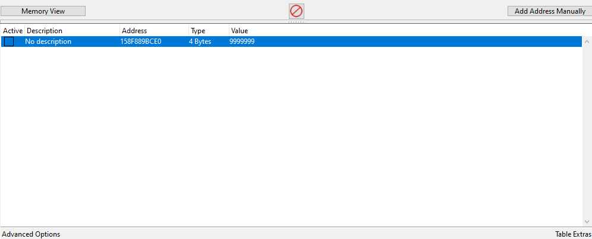
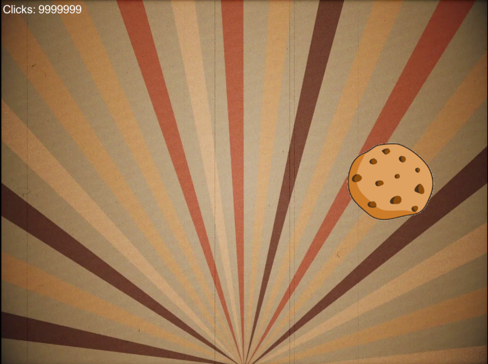

# Cookieee!
**Category:** [Reverse Engineering/Cracking](../README.md)

**Points:** 15

**Description:**

This stupid cookie clicker game...

Legend has it there is a reward when you reach 10000000 or more clicks

Can you think of a way to get that many clicks?

**Files:** cookieclicker_linux.tar, cookieclicker_win.zip

## Write-up
We downloaded the Windows version of the program, and ran it. After the opening screen, you're presented with a screen containing a cookie and a score. Clicking on the cookie increases the score:

This looks like we may need to increase the score value somehow while the program is running, so we can achieve the 10000000 required to get the flag.

To do this, we used [Cheat Engine](https://www.cheatengine.org/).

First we started the Cookie Clicker program, and clicked a few cookies to get a value in the score (17). Then we started Cheat Engine and attached it to the Cookie Clicker process:

Now we can enter 17 (the current score) into the *Value* box, and click *First Scan*. This shows all the memory addresses within the Cookie Clicker program that match the value:

We can now click a few more cookies to change the score (we set it to 21), and then enter that number in the *Value* box in Cheat Engine, and click the *Next Scan* button. This shows any memory addresses from our first scan that now match the new value:

Luckily, this only gave us a single address, so we added that to the address list in the lower box. This enables us to edit the contents of this address.

> Note: While doing the write-up we did find we sometimes ended up with two addresses at this point which seemed to be in sync. In this instance we just picked the top one, and it never failed.

We set the contents of the address to 9999999, so that we can click a cookie and it will show us the flag:

> Note: The address shown above is different than earlier screenshots as it's from a different run

Changing the contents of the address, and clicking a cookie showed the updated score:

One more click on a cookie gave us the flag.
