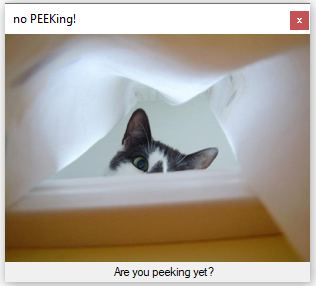
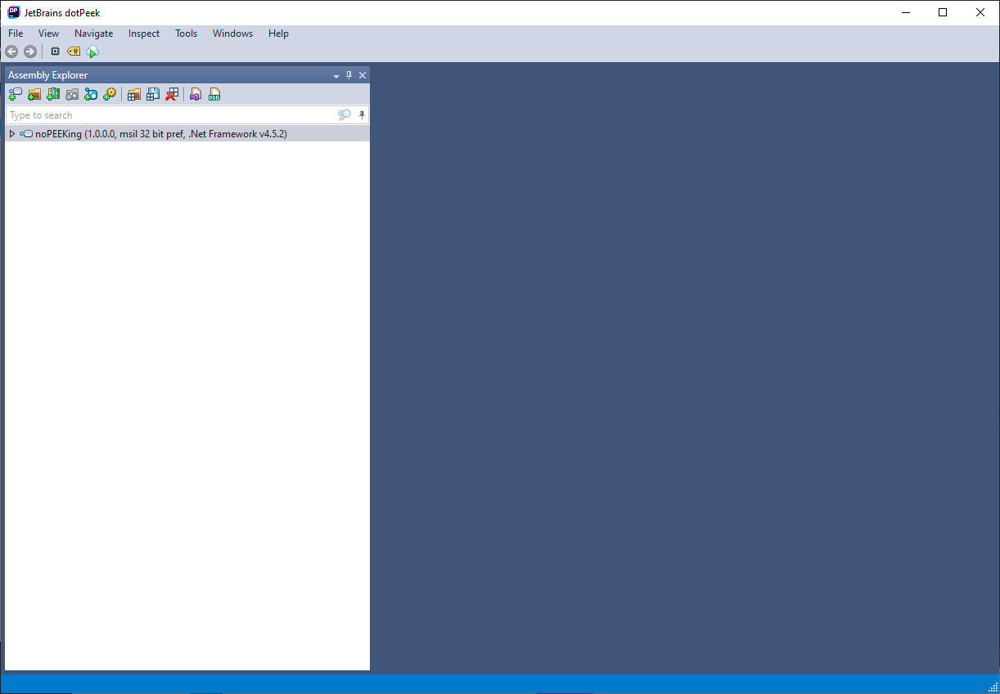

# No Peeking!
**Category:** [Reverse Engineering/Cracking](../README.md)

**Points:** 15

**Description:**

Hidden inside this exe file is a flag

Up to you to find it

**Files:** noPEEKing.exe

## Write-up
We downloaded the program and ran it. It shows a picture of a peeking cat:

This doesn't help us solve this, though. To solve it we need to try to disassemble the program. The name of the executable is a clue - *noPEEKing.exe*. There is a program named [dotPeek](https://www.jetbrains.com/decompiler/) that enables us to decompile .Net programs.

We started *dotPeek*, and opened the *noPEEKing.exe* file:

We searched for the word 'brixelCTF', but that returned nothing. We followed that up with searching for 'flag'. This brought up the `showFlag()` function. 

Double-clicking on the search result shows the content of the `showFlag()` function, which contained the flag.

> Note: In the *Navigate* menu in *dotPeek*, there is a *Go to String...* option, which will enable you to successfully search for *brixelCTF* and find the flag
