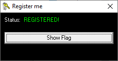

# registerme.exe
**Category:** [Reverse Engineering/Cracking](../README.md)

**Points:** 15

**Description:**
This program needs to be activated

Can you figure out how to do it?

**Files:** registerme.exe

## Write-up
We ran the executable and it showed a window saying it hadn't been registered:

To try to see what's going on, we loaded the program into [Ghidra](https://ghidra-sre.org/).

By double clicking on registerme.exe in that dialog, Ghidra opened the assembly language, and asked us if we wanted to analyse the file.

After the analysis had finished, we searched for the string *NOT REGISTERED* which had appeared in the running program:

We can see the search found a function containing an `if` statement that seperated `NOT REGISTERED` from `REGISTERED`. We need to work out what this function is checking.

Higher up in the same function, we saw the string `activation.key`:

This looks like a file name. Let's create a file of that name alongside the executable, and see if it gives us any more information about what might need to go in that file.

On creating the empty file and running the program, we found the program was now registered:

Clicking the *Show Flag* button gave us the flag.

