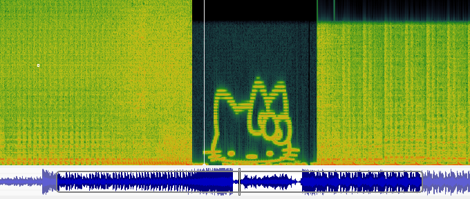

# Limewire Audio
**Category:** [Steganography](../README.md)

**Points:** 10

**Description:**

I downloaded this sweet tune from Limewire, but there's something weird going on

can you find the hidden message?

The flag is the name of the character in English, no spaces!

**This flag is not in the usual format, you can enter it with or without the brixelCTF{flag} format**

**Files:** sweet_tune.wav

## Write-up
We were given an audio *wav* file to analyse for a hidden message. When played, it starts with Darude's Sandstorm, but plays some seemingly random notes in the middle, and then comes back to play a little more of Sandstorm.

Let's open this up in [Sonic Visualiser](https://www.sonicvisualiser.org/) and take a look. We have heard these sorts of random sounds before, and the were due to images written into the spectrogram of the audio.

When opening the file in Sonic Visualise and viewing the spectrogram, we see this:

This is the flag.