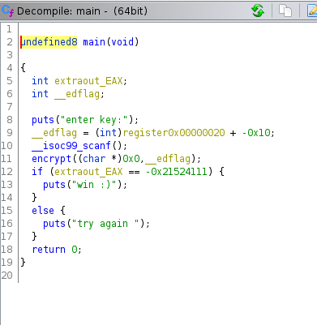
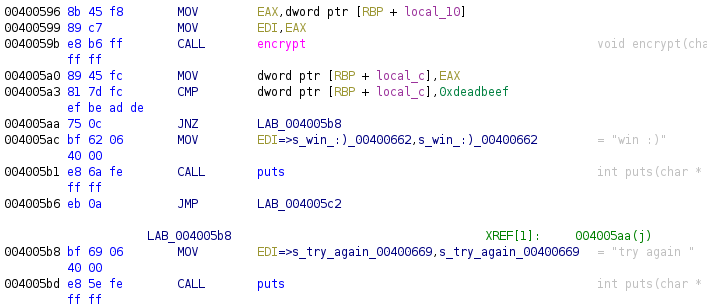
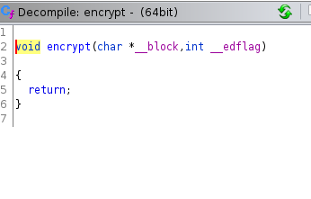
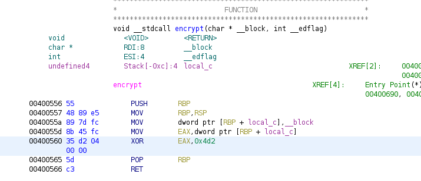

# 64 bit
**Category:** RE

**Points:** 25

**Description:**

Author: kablaa

the flag is the key

NON-STANDARD FLAG FORMAT: signed integer

> **Files:** 64bit

## Write-up
Running the `64bit` program asks you to enter a key:
```
> ./64bit 
enter key:
hello
try again 
```

The description tells us the key is a signed integer, so we can enter a number here:
```
> ./64bit 
enter key:
32
try again
> ./64bit 
enter key:
-32
try again
```
I next looked at the binary file in Ghidra. This allows me to look at its decompilation to C. First I looked at the `main` function:



Here we can see the comparison is with a negative number. However, we can also see that there is an `encrypt()` function called before the comparison.

A look at that comparison in the assembly language shows us that the negative number is equal to `0xdeadbeef` in the 64-bit register:



Again we can see the call to `encrypt()` and we also see that if the comparison with `0xdeadbeef` is non-zero (i.e. not equal to it) then we jump to the `try again` message.

I did try entering the decimal equivalent of `0xdeadbeef` and the decimal equivalent of the negative number from the C code (`0xffffffffdeadbeef`):
```
> ./64bit
enter key:
3735928559
try again
> ./64bit 
enter key:
-559038737
try again
```

They don't work so we need to see what's going on in the `encrypt()` function. The C code is not much use:



But the assembly language helps us out:



We can see that the code performs an `XOR` with the value `0x4d2`. As `XOR` behaves in such a way that if `A XOR B = C` the `A XOR C = B` and `B XOR C = A` we can find the value we need by using `XOR` with `0xdeadbeef` and `0x4d2`. We can do this is `bash` with:
```
> printf '%#x\n' "$((0xdeadbeef ^ 0x4d2))"
0xdeadba3d
```
Converting `0xdeadba3d` to decimal and entering in the `64bit` program gives us the `win :)` message, so that decimal value is the flag.

> Note: An int in C can't always hold large decimal numbers, but in this case it worked. Out of curiosity, I converted the negative equivalent (`0xffffffffdeadba3d`) to decimal and used that negative value. This also gave me the `win :)` message. I don't know if entering it as the flag for the challenge will accept it as a correct answer, though. However, there are two answers to this challenge.


