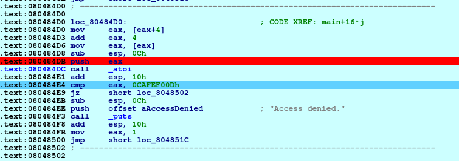
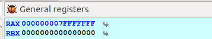
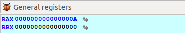
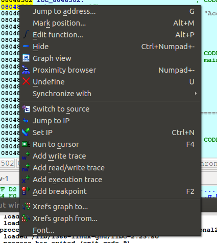

# Conditional 2
**Category:** RE

**Points:** 10

**Description:**

Let me introduce you to my good friend, IDA Pro.

> **Files:** conditional2

## Write-up
After doing Conditional1, I used strings to look at the executable, but wasn't hopeful of getting anything useful. I didn't.

Running the executable gives similar output to Conditional1:
```bash
> ./conditional2 
Usage: ./conditional2 password
```

Trying with the password from Conditional1 just gave me:
```bash
> ./conditional2 super_secret_password
Access denied.
```

The hint suggested using IDA Pro, so I downloaded the freeware version [from here](https://www.hex-rays.com/products/ida/support/download_freeware/).

Once installed I ran it and loaded conditional2. I couldn't find any decent instructions on how to use IDA Pro, but it looked pretty straightforward. I added 'super_secret_password' as a parameter to the program (Debugger menu's Process Options) and ran it.

Debugging through, I found this section of critical code:



Here we can see that our input ends up running through `atoi()` and is compared to the value `0CAFEF00Dh`. I need to end up with `0xcafef00d` in the `eax` register (shown as `RAX` in the register list of IDA Pro). I tried entering `0xcafefood` as the password, but that left 0 in the `eax`.

I tried converting `0xcafef00d` into decimal (3,405,705,229) and passing that as the password. This seemed to overflow the value coming out of `atoi()`, setting `eax (RAX)`:



To test further, I just put 10 in as the password to see what happened. Sure enough, the `eax (RAX)` register contained `0x0A`:



So how was I to get a value that was too big for an `int` into the register?

While looking about IDA Pro I suddenly noticed I can make the code jump anywhere, either by specifying the address, or right clicking where I want to be and selecting 'Set IP':



So I can jump into the `giveFlag()` function without knowing the password.

> Note: I couldn't see where the output from the program could be seen, so I redirected to a file in the Process Options | Parameters (e.g. `10 > out.txt`)
> Note2: The program has to run to the end to flush the output buffer or the output file is empty!

This worked and sent the flag to the `out.txt` file.
