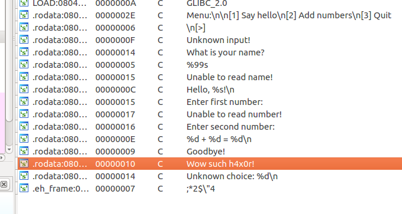
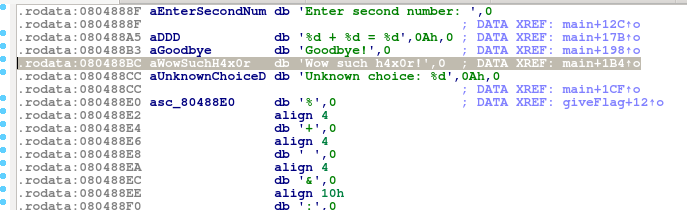
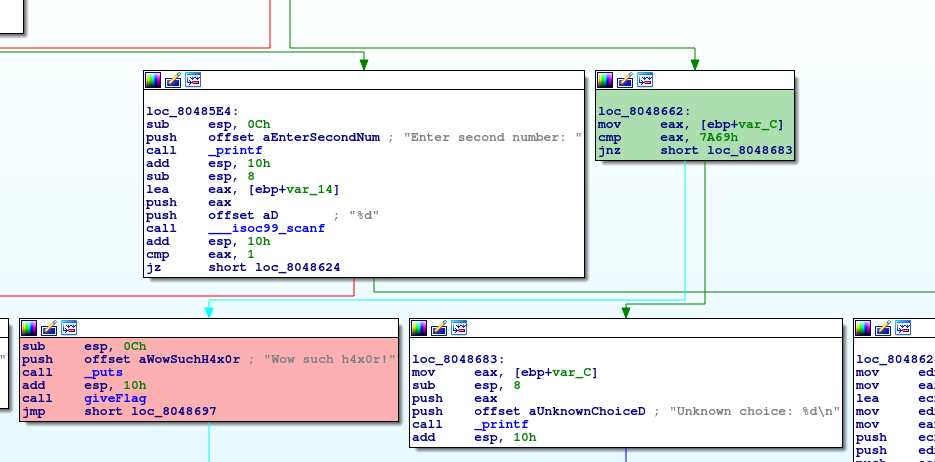
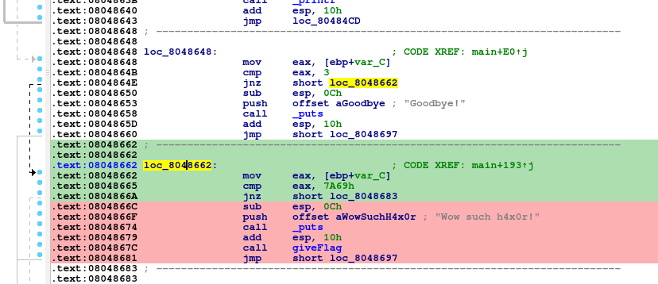

# Loop 1
**Category:** RE

**Points:** 15

**Description:**

I learned how to write menus in C using loops!

> **Files:** loop1

## Write-up
When running the program, you are presented with a menu and 3 choices:
```bash
./loop1 
Menu:

[1] Say hello
[2] Add numbers
[3] Quit

[>] 
```

The first option just greets you once you enter your name, then reshows the menu:
```bash
[>] 1
What is your name? Fred
Hello, Fred!
Menu:

[1] Say hello
[2] Add numbers
[3] Quit

[>] 
```

The second choice asks for two numbers and gives you their sum. Then it reshows the menu:
```bash
[>] 2
Enter first number: 5
Enter second number: 9
5 + 9 = 14
Menu:

[1] Say hello
[2] Add numbers
[3] Quit

[>] 
```

The third option just quits:
```bash
[>] 3
Goodbye!
```

I ran `strings` over the executable to see if it gave me anything interesting:
```bash
> strings loop1
...
t$,U
[^_]
Menu:
[1] Say hello
[2] Add numbers
[3] Quit
[>] 
Unknown input!
What is your name? 
%99s
Unable to read name!
Hello, %s!
Enter first number: 
Unable to read number!
Enter second number: 
%d + %d = %d
Goodbye!
Wow such h4x0r!
Unknown choice: %d
;*2$"4
...
```

The interesting strings are shown above - especially `Wow such h4x0r!` which is likely to be a message printed when you get into the right bit of code.

First I took a look at strings in IDA Pro to find where the `h4x0r` string was:



Double clicking on this string showed me it in the executable and where it's referenced:



Here it can be seen that the string is referenced in the main function. Double clicking on the DATA XREF showed me the code in the Graph View:



We can see from this that the function is call goes back to the green coloured box. If we jump to Text View, we can see the code compares `eax` to 0x7A69:



If we look where the green code is called from, we can see it is above when `eax` is not 3. If `eax` is 3, then we get the `Goodbye!` message, so I assume `eax` contains the menu option selected.

I converted 0x7A69 to decimal, and tried entering it as a menu option:
```bash
> ./loop1 
Menu:

[1] Say hello
[2] Add numbers
[3] Quit

[>] 31337
Wow such h4x0r!
```
This also gave the flag.


