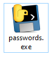

# Source Protection
**Category:** RE

**Points:** 50

**Description:**

People said I shouldn't use Python to write my password vault because they would be able to read my source code, but they underestimated how smart I am. In fact, I'm so confident in my source code protection that I'm going to upload my password vault and challeng a bunch of nerds to hack it. Good luck :)

Author: dmaria

>**Files:** passwords.exe

## Write-up
The file downloaded was an EXE. However, because the description hinted at some obfuscation, I wanted to inspect if first - I did this on Linux.

First I ran `strings`. This showed me a few interesting things. It seems to actually be a Windows executable. It contained the 'cannot be run in DOS mode' message, and included some DLLs:
```
> strings passwords.EXE
!This program cannot be run in DOS mode.
b.Q{
b.Q4<*P
...
MultiByteToWideChar
WideCharToMultiByte
KERNEL32.dll
WS2_32.dll
UnhandledExceptionFilter
SetUnhandledExceptionFilter
...
bMicrosoft.VC90.CRT.manifest
b_hashlib.pyd
bbz2.pyd
bmsvcm90.dll
bmsvcp90.dll
bmsvcr90.dll
bpasswords.exe.manifest
bpython27.dll
bselect.pyd
bunicodedata.pyd
opyi-windows-manifest-filename passwords.exe.manifest
zout00-PYZ.pyz
python27.dll
```
Note that there is a Python DLL and some `pyd` files. Also note that `msvc90` is referenced as a DLL and `Microsoft.VC90.CRT.manifest`, which are from Visual Studio 2005. Plus, there is a reference to a `pyi.windows.manifest-filename` which is set to `passwords.exe.manifest`. This looks like it's some sort of Python built into a Windows EXE. Therfore, I moved the analysis to Windows.

Looking at the icon on Windows, it looks like this is definitely Python inside a Windows EXE:



I ran the program on Windows, and it asks for a 'magic phrase':
```
Welcome to my super secret password vault!
What's the magic phrase?: fred
Wrong!
Press enter to exit...
```
Looking back at the strings on Linux, I couldn't find anything that may be a magic phrase, but it did see:
```
pyi-windows-manifest-filename
...
pyi-runtime-tmpdir
...
inflate 1.2.8 Copyright 1995-2013 Mark Adler
```
The `inflate` message comes form the `zlib` compression library. I did a search for `pyi-windows-manifest-filename` and found it belongs to PyInstaller. This rolls Python code into a Windows (or Linux) executable. I also found that something created with PyInstaller can be reversed with [python-exe-unpacker](https://github.com/countercept/python-exe-unpacker).

I installed the code on Linux:
```
> git clone https://github.com/countercept/python-exe-unpacker.git
Cloning into 'python-exe-unpacker'...
remote: Enumerating objects: 12, done.
remote: Total 12 (delta 0), reused 0 (delta 0), pack-reused 12
Unpacking objects: 100% (12/12), done.
Checking connectivity... done.
> cd python-exe-unpacker
> pip install -r requirements.txt
```
Then I ran the unpacker against `passwords.exe`:
```
> python python-exe-unpacker/python_exe_unpack.py -i passwords.exe
[*] On Python 2.7
[*] Processing passwords.exe
[*] Pyinstaller version: 2.1+
[*] This exe is packed using pyinstaller
[*] Unpacking the binary now
[*] Python version: 27
[*] Length of package: 3188825 bytes
[*] Found 18 files in CArchive
[*] Beginning extraction...please standby
[*] Found 194 files in PYZ archive
[*] Successfully extracted pyinstaller exe.
```
This created a directory named `unpacked/passwords.exe/` which contained:
```
> ls
bz2.pyd
_hashlib.pyd
Microsoft.VC90.CRT.manifest
msvcm90.dll
msvcp90.dll
msvcr90.dll
out00-PYZ.pyz
out00-PYZ.pyz_extracted
passwords
passwords.exe.manifest
pyiboot01_bootstrap
pyimod01_os_path
pyimod02_archive
pyimod03_importers
pyi-windows-manifest-filename passwords.exe.manifest
python27.dll
select.pyd
struct
unicodedata.pyd
``` 
The file named `passwords` looked interesting, so I checked the file type and it was `data` (which is usually binary) and so I ran `strings` over it:
```
GHn3
GHx+
GHqY
Zuck3rb3rg_is_dr34myt
Facebookt
SwiftOnSecurity15l1f3t
Twittert
I_Before_E_Except_After_Ct
Schools'
sun{<flag was here>}t
SunshineCTFs*
Welcome to my super secret password vault!s
What's the magic phrase?: s
I hate when I'm on a flight and I wake up with a water bottle next to me like oh great now I gotta be responsible for this water bottle - Kanye Wests
Wrong!s(
Welcome back! Here are your passwords...s
Site: {}, Password: {}s
Press enter to exit...(
raw_inputt	
iteritemst
format(
passwordst
passwords.pyt
main
__main__N(
__name__(
passwords.pyt
<module>
```
A flag appeared in the `strings` output, but at the time I wasn't sure it was the right one, so I copied the Kanye West phrase and tried it in the program:
```
Welcome to my super secret password vault!
What's the magic phrase?: I hate when I'm on a flight and I wake up with a water bottle next to me like oh great now I gotta be responsible for this water bottle - Kanye West
Welcome back! Here are your passwords...
Site: Twitter, Password: SwiftOnSecurity15l1f3
Site: SunshineCTF, Password: sun{<flag_was_here>}
Site: Facebook, Password: Zuck3rb3rg_is_dr34my
Site: School, Password: I_Before_E_Except_After_C
Press enter to exit...
```
> Note: The `s` on the end of the Kanye West quote denotes it's a string, so I cut that off when copying the phrase

This worked and also gave me the same flag.
