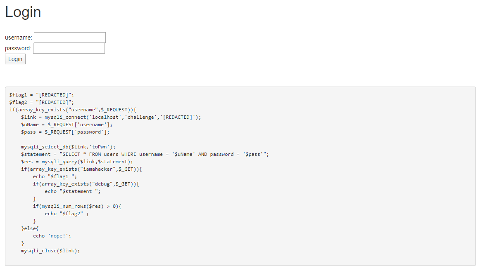

# Superhacker Part 1
**Category:** Web

**Points:** 25

**Description:**

Are you a hacker? Let's find out

http://ctf.hackucf.org:4001/

Author: kablaa

## Write-up
This is a web exploit where you are shown username and password boxes and given the PHP used for the web page:



We can see from the code that to get the first key we just need `username` and `iamahacker` to exist:
```php
...
if(array_key_exists("username",$_REQUEST)){
...
    if(array_key_exists("iamahacker",$_GET)){
        echo "$flag1 ";
...
```  

We can simply pass these through the URL, so entering
```
http://ctf.hackucf.org:4001?username=fred&iamahacker=1
``` 
in a browser address bar should show us the flag.

And it does.

> Note: flag2 is for Superhacker Part 2
