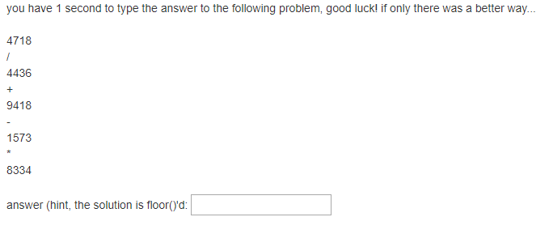
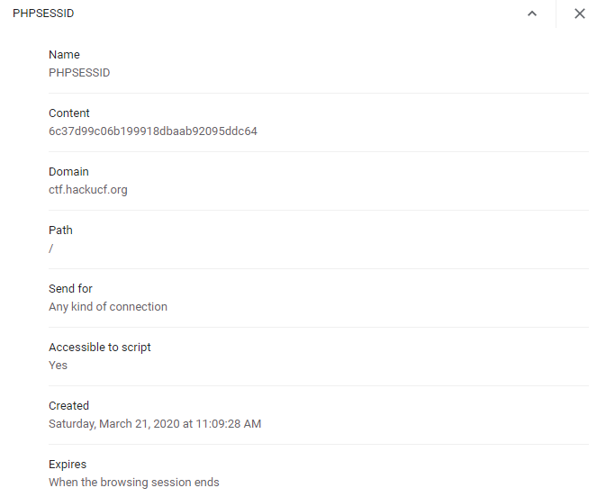

# calc
**Category:** Web

**Points:** 50

**Description:**

http://ctf.hackucf.org:4000/calc/calc.php

## Write-up
This is a web exploit where you are shown a calculation and are asked to solve it within 1 second:



Entering a number gives the following text:
```
the answer: 3746
your answer: 10
too slow
```
I think we need to write a script to scrape the web page, do the calculation, and send the result.

If we look at the source code for the page, we can see the calculation is within an `<expression>` tag:
```html

<link rel="stylesheet" href="//maxcdn.bootstrapcdn.com/bootstrap/3.2.0/css/bootstrap.min.css">

<div class="container">
you have 1 second to type the answer to the following problem, good luck! if only there was a better way...<br/></br><expression>8647<br/>+<br/>2875<br/>/<br/>2045<br/>-<br/>2927<br/>*<br/>6835</expression>
  <form action="calc.php" method="POST">
   <br/> answer (hint, the solution is floor()'d:
	 <input type="text" name="answer" class="input" value=""/><br/>
  </form>
	</br>
</div>
```
> Note: There are a couple of errors in this html - two `</br>` tags that should be `<br/>`. This may affect some parsers.

 We can start by trying to scrape the page and get the info between the expression tags. Let's start in Bash using curl:
 ```bash
 #!/bin/bash

# Get the web page
page=$(curl http://ctf.hackucf.org:4000/calc/calc.php)
echo Page is: $page

# Get everything between the expression tags
exp=$(echo $page | sed 's/.*expression>\(.*\)<\/expression.*/\1/')
echo Expression is: $exp
```
This outputs:
```
> ./calc_scraper.sh 
  % Total    % Received % Xferd  Average Speed   Time    Time     Time  Current
                                 Dload  Upload   Total   Spent    Left  Speed
  0     0    0     0    0     0      0      0 --:--:-- --:--:-100   511  100   511    0     0   2092      0 --:--:-- --:--:-- --:--:--  2094
Page is: <link rel="stylesheet" href="//maxcdn.bootstrapcdn.com/bootstrap/3.2.0/css/bootstrap.min.css"> <div class="container"> you have 1 second to type the answer to the following problem, good luck! if only there was a better way...<br/></br><expression>5349<br/>+<br/>2729<br/>/<br/>3019<br/>-<br/>4588<br/>*<br/>3960</expression> <form action="calc.php" method="POST"> <br/> answer (hint, the solution is floor()'d: <input type="text" name="answer" class="input" value=""/><br/> </form> </br> </div>
Expression is: 5349<br/>+<br/>2729<br/>/<br/>3019<br/>-<br/>4588<br/>*<br/>3960
```
Now we can extract the calculation by removing the `<br/>` tags and pass the result to `bc` to get our final answer:
```bash
#!/bin/bash

# Get the web page
page=$(curl http://ctf.hackucf.org:4000/calc/calc.php)
echo Page is: $page

# Get everything between the expression tags
exp=$(echo $page | sed 's/.*expression>\(.*\)<\/expression.*/\1/')
echo Expression is: $exp

# Remove the <br/> elements so we're left with the calculation
calc=$(echo $exp | sed 's/<br\/>//g')
echo Calc is: $calc

# Get the answer
ans=$(echo "$calc" | bc)
echo Answer is: $ans
```
Now, when we run this, we get:
```
> ./calc_scraper.sh
   % Total    % Received % Xferd  Average Speed   Time    Time     Time  Current
                                 Dload  Upload   Total   Spent    Left  Speed
  0     0    0     0    0     0      0      0 --:--:-- --:--:-100   511  100   511    0     0   2177      0 --:--:-- --:--:-- --:--:--  2183
Page is: <link rel="stylesheet" href="//maxcdn.bootstrapcdn.com/bootstrap/3.2.0/css/bootstrap.min.css"> <div class="container"> you have 1 second to type the answer to the following problem, good luck! if only there was a better way...<br/></br><expression>6003<br/>-<br/>2309<br/>/<br/>2793<br/>*<br/>5611<br/>+<br/>4799</expression> <form action="calc.php" method="POST"> <br/> answer (hint, the solution is floor()'d: <input type="text" name="answer" class="input" value=""/><br/> </form> </br> </div>
Expression is: 6003<br/>-<br/>2309<br/>/<br/>2793<br/>*<br/>5611<br/>+<br/>4799
Calc is: 6003-2309/2793*5611+4799
Answer is: 10802
```
Good so far. However, we now need to `POST` our answer back to the server. I tried just sending the answer to the server, using `curl -d <field-name>=<field-value>` to fill the form:
```bash
...
# Get the answer
ans=$(echo "$calc" | bc)
echo Answer is: $ans

# Send it back
curl -d answer=$ans http://ctf.hackucf.org:4000/calc/calc.php
```
but this didn't work:
```
> ./calc_scraper.sh 
  % Total    % Received % Xferd  Average Speed   Time    Time     Time  Current
                                 Dload  Upload   Total   Spent    Left  Speed
  0     0    0     0    0     0      0      0 --:--:-- --:--:-100   511  100   511    0     0   2164      0 --:--:-- --:--:-- --:--:--  2165
Page is: <link rel="stylesheet" href="//maxcdn.bootstrapcdn.com/bootstrap/3.2.0/css/bootstrap.min.css"> <div class="container"> you have 1 second to type the answer to the following problem, good luck! if only there was a better way...<br/></br><expression>5697<br/>/<br/>2442<br/>-<br/>1976<br/>*<br/>1032<br/>+<br/>1004</expression> <form action="calc.php" method="POST"> <br/> answer (hint, the solution is floor()'d: <input type="text" name="answer" class="input" value=""/><br/> </form> </br> </div>
Expression is: 5697<br/>/<br/>2442<br/>-<br/>1976<br/>*<br/>1032<br/>+<br/>1004
Calc is: 5697/2442-1976*1032+1004
Answer is: -2038226
the answer: <br/>your answer: -2038226<br/>too slow
```
You can see that it doesn't show what the correct answer is like it does on the website. It doesn't know what calculation we were solving. I suspect there's a session cookie somewhere that contains the correct answer and the time of the request so it can check whether it took longer than a second. I looked in my browser and found this:



So we can add cookie handling to our `curl` commands. `-c <file-name>` enables us to save cookies to a file, and `-b <file-name>` lets us send that cookie back. Therefore, our final script is:
```bash
#!/bin/bash

# Get the web page
page=$(curl -c cookie-jar.txt http://ctf.hackucf.org:4000/calc/calc.php)
echo Page is: $page

# Get everything between the expression tags
exp=$(echo $page | sed 's/.*expression>\(.*\)<\/expression.*/\1/')
echo Expression is: $exp

# Remove the <br/> elements so we're left with the calculation
calc=$(echo $exp | sed 's/<br\/>//g')
echo Calc is: $calc

# Get the answer
ans=$(echo "$calc" | bc)
echo Answer is: $ans

# Send it back
curl -b cookie-jar.txt -d answer=$ans http://ctf.hackucf.org:4000/calc/calc.php
```
I ran this, and it worked!
```
> ./calc_scraper.sh 
  % Total    % Received % Xferd  Average Speed   Time    Time     Time  Current
                                 Dload  Upload   Total   Spent    Left  Speed
  0     0    0     0    0     0      0      0 --:--:-- --:--:-100   511  100   511    0     0   2064      0 --:--:-- --:--:-- --:--:--  2068
Page is: <link rel="stylesheet" href="//maxcdn.bootstrapcdn.com/bootstrap/3.2.0/css/bootstrap.min.css"> <div class="container"> you have 1 second to type the answer to the following problem, good luck! if only there was a better way...<br/></br><expression>4460<br/>/<br/>6863<br/>-<br/>6737<br/>+<br/>1063<br/>*<br/>7380</expression> <form action="calc.php" method="POST"> <br/> answer (hint, the solution is floor()'d: <input type="text" name="answer" class="input" value=""/><br/> </form> </br> </div>
Expression is: 4460<br/>/<br/>6863<br/>-<br/>6737<br/>+<br/>1063<br/>*<br/>7380
Calc is: 4460/6863-6737+1063*7380
Answer is: 7838203
the answer: 7838203<br/>your answer: 7838203<br/>flag{<flag here>}<br/><br/>
```
That also gave me the flag.

> Note: Very occasionally during testing my script gave a different answer to the webpage. Sometimes off by 1, and sometimes completely different. I never got to the bottom of why. However, it works most of the time. It may just need running a couple of times.

